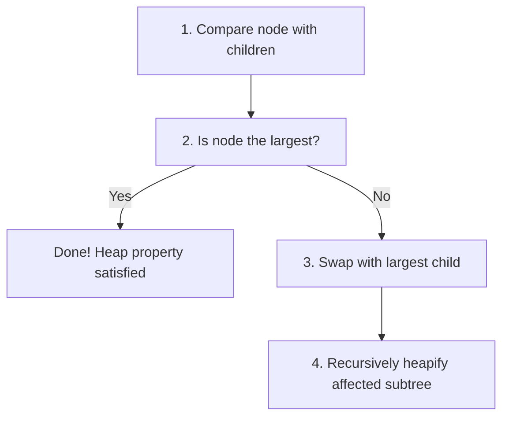

# 🔄 Heapify: The Core Operation

## What is Heapify? 🤔

**Heapify** is the fundamental operation that maintains the max heap property. It ensures that for a given node, the value is greater than or equal to its children.

> [!NOTE]
> Think of heapify as a "bubble down" process where a potentially misplaced value at the root of a subtree sinks down to its correct position.

## The Heapify Algorithm Step-by-Step 📝

Let's walk through the heapify process:

1. Start with a node at index `i` in the array
2. Find the largest value among the node and its two children
3. If the largest value is not the node itself, swap it with the largest child
4. Recursively apply heapify to the affected subtree



## Heapify in Action: A Visual Example 🎬

Let's see the heapify operation in action on a small subtree:

**Starting state**: We have a node with value 3 at the root, and children with values 7 and 4.

```
    3
   / \
  7   4
```

This violates the max heap property because 7 > 3.

**Step 1**: We identify the largest value (7) among the node and its children.
**Step 2**: Since the largest value is not at the root, we swap 3 and 7.

```
    7
   / \
  3   4
```

**Step 3**: We recursively apply heapify to the affected subtree (which is now rooted at index where 3 is).

The subtree with root 3 has no children, so we're done!

## The Code Behind Heapify 💻

Here's how the heapify function looks in JavaScript:

```javascript
heapify(array, n, i) {
  let largest = i;          // Initialize largest as root
  const left = 2 * i + 1;   // Left child index
  const right = 2 * i + 2;  // Right child index

  // If left child exists and is larger than root
  if (left < n && array[left] > array[largest]) {
    largest = left;
  }

  // If right child exists and is larger than largest so far
  if (right < n && array[right] > array[largest]) {
    largest = right;
  }

  // If largest is not the root
  if (largest !== i) {
    // Swap
    [array[i], array[largest]] = [array[largest], array[i]];
    
    // Recursively heapify the affected subtree
    this.heapify(array, n, largest);
  }
}
```

> [!TIP]
> Notice how the code directly mirrors our step-by-step description. The heapify operation is elegant in its simplicity!

## Common Pitfalls to Avoid ⚠️

- **Forgetting the recursion**: After swapping, you must continue heapifying down the affected subtree.
- **Index errors**: Be careful with array bounds when calculating child indices.
- **Checking the wrong children**: Always compare both children (if they exist) to find the largest.

## Think About It 🤔

**Question**: In a max heap with 15 elements, what's the maximum number of swaps that might occur during a single heapify operation starting from the root?

<details>
<summary>Hint</summary>

Consider the height of a complete binary tree with 15 elements and how many levels a value might need to "sink" through.
</details>

<details>
<summary>Answer</summary>

The height of a complete binary tree with 15 elements is 3 (levels: 0, 1, 2, 3).

In the worst case, a value at the root might need to sink all the way down to a leaf, which would require at most 3 swaps (one per level it passes through).
</details>

In the next lesson, we'll learn how to build a max heap from an unordered array using the heapify operation! 