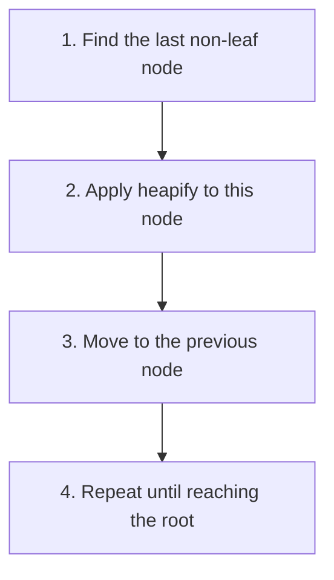

# 🏗️ Building a Max Heap

## The Challenge: From Chaos to Order 🧩

Now that we understand the heapify operation, let's tackle a bigger challenge: **transforming an unordered array into a max heap**.

> [!NOTE]
> The `buildMaxHeap` operation takes any array and rearranges it to satisfy the max heap property throughout the entire structure.

## A Naive Approach (That Doesn't Work Well) ❌

You might initially think: "Let's just start at the beginning of the array and heapify each element!"

Unfortunately, this approach doesn't work efficiently because:
1. Heapify assumes that the subtrees of the node are already valid max heaps
2. Processing elements from the beginning doesn't ensure this prerequisite is met

## The Correct Approach: Bottom-Up Construction 🏆

The key insight is to **start from the bottom of the tree and work our way up**. Here's why this works:

- Leaf nodes (which make up about half of the nodes in a complete binary tree) are already valid one-element heaps
- By starting from the last non-leaf node and moving upward, we ensure that when we heapify a node, its children are already proper max heaps



## Finding the Last Non-Leaf Node 🔍

In a heap with `n` elements:
- Leaf nodes are at indices from `Math.floor(n/2)` to `n-1`
- Non-leaf nodes are at indices from `0` to `Math.floor(n/2)-1`

So we start at index `Math.floor(n/2)-1` and work our way back to index `0`.

## The BuildMaxHeap Algorithm in Code 💻

```javascript
buildMaxHeap(array) {
  const n = array.length;
  // Start from the last non-leaf node and move up
  for (let i = Math.floor(n / 2) - 1; i >= 0; i--) {
    this.heapify(array, n, i);
  }
}
```

> [!TIP]
> This algorithm has a time complexity of O(n), which is more efficient than the O(n log n) you might initially expect!

## Let's See It in Action: A Step-by-Step Example 🎬

Let's transform the array `[3, 1, 6, 5, 2, 4]` into a max heap:

**Initial array as a complete binary tree:**
```
      3
     / \
    1   6
   / \ /
  5  2 4
```

**Step 1**: Find the last non-leaf node.
- With 6 elements, our last non-leaf is at index `Math.floor(6/2)-1 = 2`
- The value at index 2 is 6

**Step 2**: Apply heapify to index 2 (value 6).
- Children are at indices 5 and 6, but only 5 exists with value 4
- 6 > 4, so no change needed

**Step 3**: Move to index 1 (value 1).
- Children are at indices 3 and 4, with values 5 and 2
- 5 > 1, so swap 1 and 5:

```
      3
     / \
    5   6
   / \ /
  1  2 4
```

**Step 4**: Move to index 0 (value 3).
- Children are at indices 1 and 2, with values 5 and 6
- 6 > 3, so swap 3 and 6:

```
      6
     / \
    5   3
   / \ /
  1  2 4
```

- We need to heapify the subtree at index 2 (value 3)
- Children are at indices 5 and 6, but only 5 exists with value 4
- 4 > 3, so swap 3 and 4:

```
      6
     / \
    5   4
   / \ /
  1  2 3
```

And we're done! The array is now `[6, 5, 4, 1, 2, 3]`, which satisfies the max heap property.

## Common Mistakes to Avoid ⚠️

- **Starting from the wrong end**: Always start from the last non-leaf node, not the beginning.
- **Incorrect index calculation**: Double-check your formula for finding the last non-leaf node.
- **Forgetting to heapify all the way down**: Each heapify operation might require multiple swaps down the tree.

## Think About It 🤔

**Question**: Why is the buildMaxHeap operation O(n) time complexity instead of O(n log n)?

<details>
<summary>Hint</summary>

Consider that not all heapify operations will require traversing the full height of the tree.
</details>

<details>
<summary>Answer</summary>

While a single heapify operation on the root might take O(log n) time, most nodes are closer to the leaves.

Mathematically, the sum of all heapify operations follows a pattern that converges to linear time O(n). The formal proof involves a geometric series that shows the total work is bounded by 2n operations in the worst case.
</details>

In the next lesson, we'll explore how to insert new elements into our max heap! 