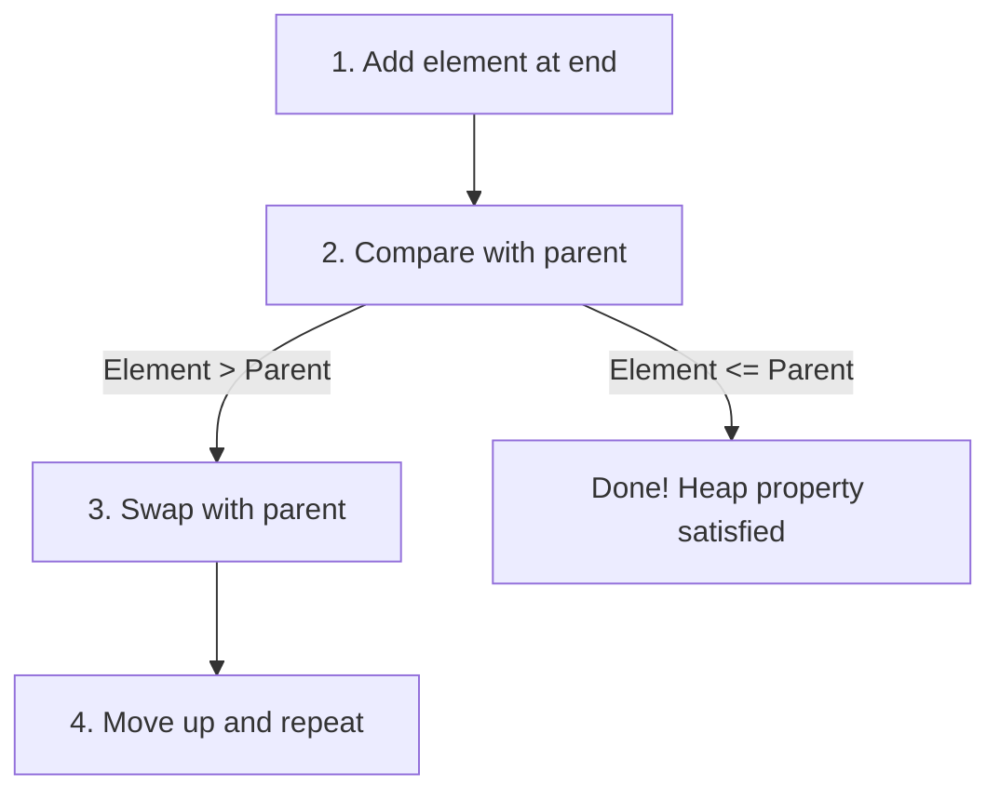

# 📥 Inserting New Elements

## The Insert Operation: Growing Your Heap 🌱

After building a max heap, you'll often need to add new elements to it. The **insert** operation allows us to add a new value while maintaining the max heap property.

> [!NOTE]
> Unlike building the heap, insertion works from the bottom up, starting with the new element at the end of the array.

## The "Bubble-Up" Approach 🛁

While heapify "bubbles down" values, insertion uses a "bubble-up" approach:

1. Add the new element at the end of the array (last level of the tree)
2. Compare the element with its parent
3. If the element is greater than its parent, swap them
4. Continue this process until the element is in its correct position



## The HeapifyUp Algorithm in Code 💻

This "bubble-up" process is often implemented as a `heapifyUp` function:

```javascript
insert(value) {
  // 1. Add the new element to the end
  this.heap.push(value);
  
  // 2. Restore the heap property by bubbling up
  this.heapifyUp(this.heap, this.heap.length - 1);
}

heapifyUp(array, i) {
  // Calculate parent index
  const parent = Math.floor((i - 1) / 2);

  // If we're not at the root and parent is smaller than current element
  if (i > 0 && array[i] > array[parent]) {
    // Swap with parent
    [array[i], array[parent]] = [array[parent], array[i]];
    
    // Continue bubbling up
    this.heapifyUp(array, parent);
  }
}
```

> [!TIP]
> The insert operation has a time complexity of O(log n) because in the worst case, the new element might need to bubble up from a leaf to the root.

## Let's See It in Action: A Step-by-Step Example 🎬

Let's insert the value `8` into our existing max heap `[6, 5, 4, 1, 2, 3]`:

**Initial max heap:**
```
      6
     / \
    5   4
   / \ /
  1  2 3
```

**Step 1**: Add 8 to the end of the array.
- Array becomes `[6, 5, 4, 1, 2, 3, 8]`
- As a tree:
```
      6
     / \
    5   4
   / \ / \
  1  2 3  8
```

**Step 2**: Compare 8 with its parent at index `Math.floor((6-1)/2) = 2`, which is 4.
- 8 > 4, so swap them
- Array becomes `[6, 5, 8, 1, 2, 3, 4]`
- As a tree:
```
      6
     / \
    5   8
   / \ / \
  1  2 3  4
```

**Step 3**: Compare 8 with its new parent at index `Math.floor((2-1)/2) = 0`, which is 6.
- 8 > 6, so swap them
- Array becomes `[8, 5, 6, 1, 2, 3, 4]`
- As a tree:
```
      8
     / \
    5   6
   / \ / \
  1  2 3  4
```

**Step 4**: Now 8 is at the root (index 0), so we're done!

## Iterative vs. Recursive Implementation 🔄

The `heapifyUp` function can be implemented either recursively (as shown above) or iteratively:

```javascript
// Iterative implementation
heapifyUp(array, i) {
  let current = i;
  
  while (current > 0) {
    const parent = Math.floor((current - 1) / 2);
    
    if (array[current] > array[parent]) {
      [array[current], array[parent]] = [array[parent], array[current]];
      current = parent;
    } else {
      break;
    }
  }
}
```

> [!TIP]
> The iterative version avoids the overhead of recursive function calls, which can be beneficial for large heaps.

## Common Mistakes to Avoid ⚠️

- **Incorrect parent index calculation**: Double-check your formula for finding the parent node.
- **Forgetting the base case**: Make sure to stop when the element reaches the root or is in the correct position.
- **Swapping without updating the current index**: When implementing iteratively, always update the current index after swapping.

## Think About It 🤔

**Question**: If we insert 10 elements into an initially empty max heap, what's the maximum number of swaps that might occur across all insertions?

<details>
<summary>Hint</summary>

Consider the maximum number of swaps needed for each insertion and how many levels each element might need to bubble up.
</details>

<details>
<summary>Answer</summary>

For a heap with 10 elements, the maximum height is ⌊log₂(10)⌋ = 3.

- 1st insertion: 0 swaps (single element is already a valid heap)
- 2nd insertion: up to 1 swap (to bubble up to the root)
- 3rd insertion: up to 1 swap
- 4th insertion: up to 2 swaps
- 5th-6th insertion: up to 2 swaps
- 7th-10th insertion: up to 3 swaps

Adding these up: 0 + 1 + 1 + 2 + 2 + 2 + 3 + 3 + 3 + 3 = 20 swaps maximum.
</details>

In the next lesson, we'll learn how to extract the maximum element from our max heap! 