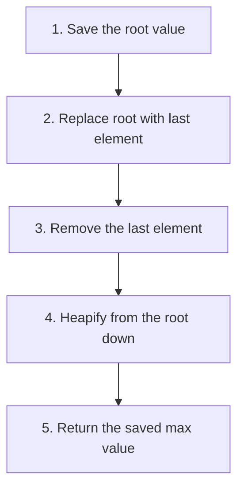

# 📤 Extracting the Maximum Element

## The Extract-Max Operation: Harvesting the Top 🏆

One of the primary advantages of a max heap is the ability to efficiently retrieve the maximum element. The **extractMax** operation allows us to remove and return the largest value while maintaining the heap property.

> [!NOTE]
> The maximum element in a max heap is always at the root, which is the first element of the array (index 0).

## The Extract-Max Algorithm Step-by-Step 📝

Extracting the maximum value involves several steps:

1. Store the maximum value (root) to return later
2. Move the last element in the heap to the root position
3. Remove the last element from the heap (it's now at the root)
4. Restore the max heap property using the heapify operation
5. Return the stored maximum value



## Special Cases to Handle ⚠️

Before implementing the main algorithm, we need to handle a few special cases:

1. **Empty heap**: If the heap is empty, return undefined (or throw an error)
2. **Single element**: If the heap has only one element, simply pop and return it

## The ExtractMax Algorithm in Code 💻

```javascript
extractMax() {
  // Handle empty heap
  if (this.heap.length === 0) {
    return undefined;
  }

  // Handle single element
  if (this.heap.length === 1) {
    return this.heap.pop();
  }

  // Store the maximum value
  const max = this.heap[0];
  
  // Move the last element to the root
  this.heap[0] = this.heap.pop();
  
  // Restore the heap property
  this.heapify(this.heap, this.heap.length, 0);
  
  // Return the maximum value
  return max;
}
```

> [!TIP]
> The extractMax operation has a time complexity of O(log n) because after placing the last element at the root, we need to heapify down, which takes at most log n steps.

## Let's See It in Action: A Step-by-Step Example 🎬

Let's extract the maximum value from our max heap `[8, 5, 6, 1, 2, 3, 4]`:

**Initial max heap:**
```
      8
     / \
    5   6
   / \ / \
  1  2 3  4
```

**Step 1**: Store the maximum value (8) to return later.

**Step 2**: Replace the root with the last element in the heap.
- Move 4 to the root position
- Array becomes `[4, 5, 6, 1, 2, 3]`
- As a tree:
```
      4
     / \
    5   6
   / \ /
  1  2 3
```

**Step 3**: The heap property is violated because 4 < 5 and 4 < 6.

**Step 4**: Apply heapify from the root.
- Compare 4 with its children (5 and 6)
- 6 is the largest, so swap 4 and 6
- Array becomes `[6, 5, 4, 1, 2, 3]`
- As a tree:
```
      6
     / \
    5   4
   / \ /
  1  2 3
```

**Step 5**: Return the maximum value (8).

## Heap Sort: A Powerful Application 🔄

One of the most elegant applications of the extractMax operation is the **Heap Sort** algorithm:

1. Build a max heap from the input array
2. Repeatedly extract the maximum element and place it at the end of the array
3. After all elements are extracted, the array will be sorted in ascending order

```javascript
function heapSort(array) {
  // Build a max heap
  const maxHeap = new MaxHeap([...array]);
  
  // Extract elements one by one
  const sorted = [];
  while (maxHeap.size() > 0) {
    sorted.push(maxHeap.extractMax());
  }
  
  return sorted;
}
```

> [!NOTE]
> Heap Sort has a time complexity of O(n log n), making it an efficient sorting algorithm.

## Common Pitfalls to Avoid ⚠️

- **Forgetting to handle empty or single-element heaps**: These are special cases that need separate handling.
- **Not updating the heap size**: After extracting the maximum, the heap size decreases by one.
- **Incorrect heapify call**: Make sure to call heapify on the root after replacing it with the last element.

## Think About It 🤔

**Question**: If we build a max heap with n elements and then extract all elements one by one, what will be the resulting order of the elements?

<details>
<summary>Hint</summary>

Consider what happens each time you extract the maximum element from a max heap.
</details>

<details>
<summary>Answer</summary>

The elements will be extracted in **descending order** (largest to smallest). This is because each extraction operation removes the current maximum element from the heap.

This property is what makes max heaps perfect for implementing priority queues where we always want to process the highest-priority item first.
</details>

In the next lesson, we'll discuss practical applications and tips for working with max heaps! 