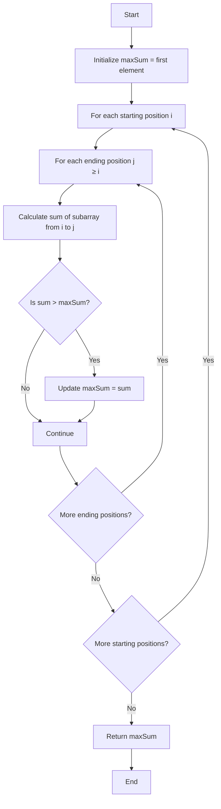

# 🔨 The Naive Approach: Brute Force Solution 🔨

Before discovering more efficient algorithms, let's understand the problem by exploring the most straightforward solution.

## 💡 The Brute Force Idea

The simplest approach is to:
1. Consider all possible subarrays
2. Calculate the sum of each subarray
3. Find the maximum sum

## 🧮 Implementation Steps



## 🚶‍♂️ Step-by-Step Walkthrough

Let's trace through our example array: `[-2, 1, -3, 4, -1, 2, 1, -5, 4]`

We need to check **every possible subarray**:

<details>
<summary>Click to see all the subarrays we need to check</summary>

- `[-2]` → Sum: -2
- `[-2, 1]` → Sum: -1
- `[-2, 1, -3]` → Sum: -4
- `[-2, 1, -3, 4]` → Sum: 0
- `[-2, 1, -3, 4, -1]` → Sum: -1
- ... and so on for all starting at index 0

- `[1]` → Sum: 1
- `[1, -3]` → Sum: -2
- `[1, -3, 4]` → Sum: 2
- ... and so on for all starting at index 1

... continuing for all possible starting positions ...

- `[4]` → Sum: 4 (at the last index)
</details>

In total, for an array of length n, we need to check n(n+1)/2 subarrays!

## 🧠 Understanding the Code

Here's how we would implement this approach:

```javascript
function maxSubarraySumNaive(nums) {
  if (!nums || nums.length === 0) return undefined;
  
  let maxSum = nums[0]; // Initialize with the first element
  
  // Consider all subarrays starting at index i
  for (let i = 0; i < nums.length; i++) {
    let currentSum = 0;
    
    // Consider all subarrays ending at index j
    for (let j = i; j < nums.length; j++) {
      currentSum += nums[j];
      
      // Update maxSum if we found a better solution
      if (currentSum > maxSum) {
        maxSum = currentSum;
      }
    }
  }
  
  return maxSum;
}
```

> [!WARNING]
> This approach works correctly but is inefficient for large arrays!

## ⏱️ Time and Space Complexity

- **Time Complexity**: O(n²) - We have nested loops, with the outer loop running n times and the inner loop running n, n-1, n-2, ... times
- **Space Complexity**: O(1) - We only use a constant amount of extra space

## 🤔 Can We Do Better?

While this solution is correct and easy to understand, it's inefficient for large arrays. There are two key insights we can use to improve it:

1. **Redundant Calculations**: We're recalculating sums of overlapping subarrays multiple times
2. **Smart Decision Making**: We can make better decisions about which subarrays to consider

> [!TIP]
> Think about this: If adding the next element makes our current sum smaller than just the element itself, would you continue with the current subarray or start a new one?

In the next lesson, we'll discover how Kadane's Algorithm elegantly solves this problem in just one pass through the array!

<details>
<summary>Challenge Question</summary>

Can you think of a way to reduce the time complexity from O(n²) to O(n)?

Hint: Consider how you might use information from previous calculations to avoid recomputing sums from scratch.
</details> 