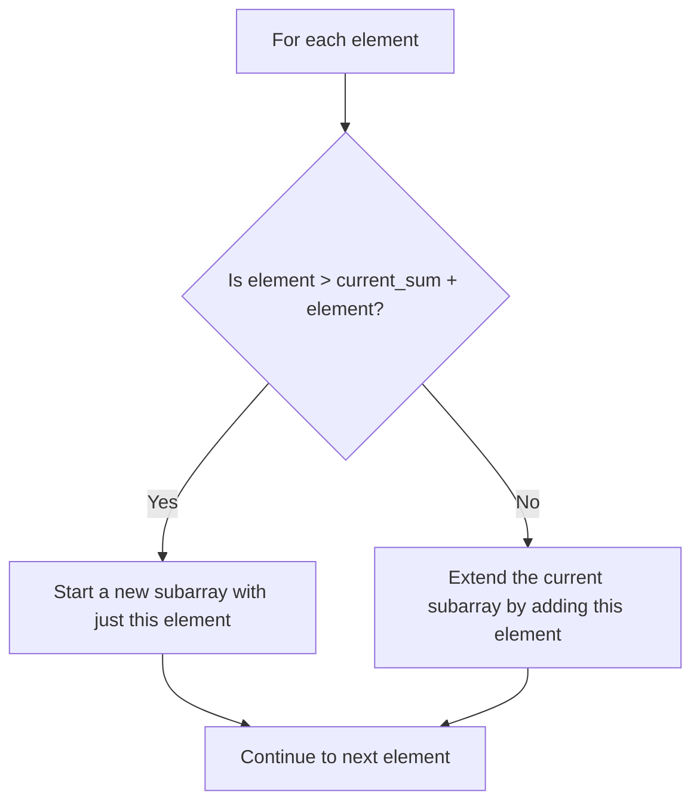

# 💡 Key Insights Leading to Kadane's Algorithm 💡

Before diving into Kadane's Algorithm, let's understand the crucial insights that make it so efficient.

## 🔑 Insight #1: We Don't Need to Recompute Everything

In our naive approach, we recalculated sums for overlapping subarrays multiple times.

> [!NOTE]
> If we've already calculated the sum of `[a, b, c]`, then to find the sum of `[a, b, c, d]`, we just need to add `d` to our previous result.

This insight leads us to a more efficient calculation method, where we can build on previous computations.

## 🔑 Insight #2: The "Keep or Restart" Decision

At each position in the array, we face a critical decision:

1. **Keep going**: Extend our current subarray by including the current element
2. **Restart**: Start a new subarray beginning at the current element

How do we decide? By comparing:
- `currentElement` (starting fresh)
- `currentSum + currentElement` (continuing our current subarray)

We choose whichever option gives us the larger value.

## 🔑 Insight #3: Local vs. Global Maximum

We need to track two important values:

1. **Local Maximum (maxEndingHere)**: The maximum sum of a subarray ending exactly at the current position
2. **Global Maximum (maxSoFar)**: The maximum sum found so far in any subarray

At each step, we:
- Update the local maximum using our "keep or restart" rule
- Check if our new local maximum beats our global maximum

## 🧠 Understanding with a Visual Example

Let's visualize these insights with our example array: `[-2, 1, -3, 4, -1, 2, 1, -5, 4]`

| Index | Element | Decision Making | maxEndingHere | maxSoFar |
|-------|---------|-----------------|---------------|----------|
| 0     | -2      | Start with first element | -2 | -2 |
| 1     | 1       | max(1, -2+1) = 1 Restart with just 1 | 1 | 1 |
| 2     | -3      | max(-3, 1+(-3)) = -2 Continue with 1+(-3) | -2 | 1 |
| 3     | 4       | max(4, -2+4) = 4 Restart with just 4 | 4 | 4 |
| 4     | -1      | max(-1, 4+(-1)) = 3 Continue with 4+(-1) | 3 | 4 |
| 5     | 2       | max(2, 3+2) = 5 Continue with 3+2 | 5 | 5 |
| 6     | 1       | max(1, 5+1) = 6 Continue with 5+1 | 6 | 6 |
| 7     | -5      | max(-5, 6+(-5)) = 1 Continue with 6+(-5) | 1 | 6 |
| 8     | 4       | max(4, 1+4) = 5 Continue with 1+4 | 5 | 6 |

> [!TIP]
> Notice how we're making the optimal choice at each step by deciding whether to start a new subarray or continue the current one.

## 🧩 Putting It All Together

These insights lead us to a simple yet powerful approach:

1. Initialize both maxEndingHere and maxSoFar with the first element
2. For each remaining element:
   - Update maxEndingHere = max(currentElement, maxEndingHere + currentElement)
   - Update maxSoFar = max(maxSoFar, maxEndingHere)
3. Return maxSoFar as our result

This forms the core of Kadane's Algorithm, which we'll implement in the next lesson!

> [!WARNING]
> These insights only work if we process the array in order, from left to right. The dynamic programming approach relies on building solutions to subproblems in sequence.

Why does this work?

This approach works because at each step, we're solving the subproblem: "What is the maximum subarray sum ending at position i?"

By tracking both the local maximum (ending at the current position) and the global maximum (found anywhere), we ensure we don't miss the optimal solution.

This is a classic example of dynamic programming, where we break down a complex problem into simpler subproblems and build up the solution.

## 🤔 Think About This

Before moving on, consider:

1. How do these insights reduce our time complexity from O(n²) to O(n)?
2. In what scenarios might the "restart" decision be better than the "continue" decision?
3. Can you trace through another example array using these insights? 