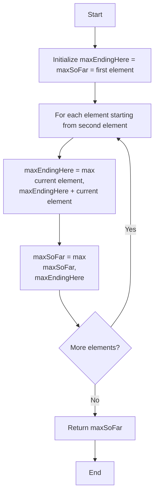

# 🚀 Kadane's Algorithm: Elegant and Efficient Solution 🚀

Now that we understand the key insights, let's put them together into Kadane's Algorithm - an elegant solution to the maximum subarray problem.

## ⚙️ The Algorithm

Kadane's Algorithm is a dynamic programming approach that finds the maximum subarray sum in just a single pass through the array.



## 💻 Implementation

Here's the algorithm implemented in JavaScript:

```javascript
function maxSubarraySum(nums) {
  // Handle edge case of empty array
  if (!nums || nums.length === 0) {
    return undefined;
  }
  
  // Initialize both variables with the first element
  let maxEndingHere = nums[0];
  let maxSoFar = nums[0];
  
  // Start from the second element (if it exists)
  for (let i = 1; i < nums.length; i++) {
    // Decide whether to start a new subarray or extend the existing one
    maxEndingHere = Math.max(nums[i], maxEndingHere + nums[i]);
    
    // Update the global maximum if needed
    maxSoFar = Math.max(maxSoFar, maxEndingHere);
  }
  
  return maxSoFar;
}
```

## 🔍 Line-by-Line Explanation

Let's break down this implementation:

1. **Handle edge cases**:
   ```javascript
   if (!nums || nums.length === 0) {
     return undefined;
   }
   ```
   We first check if the array is empty or undefined and return an appropriate value.

2. **Initialize variables**:
   ```javascript
   let maxEndingHere = nums[0];
   let maxSoFar = nums[0];
   ```
   - `maxEndingHere`: Tracks the maximum sum of a subarray ending at the current position
   - `maxSoFar`: Keeps track of the overall maximum subarray sum found so far
   
   We initialize both with the first element since that's our starting point.

3. **Process each element**:
   ```javascript
   for (let i = 1; i < nums.length; i++) {
     // ...
   }
   ```
   We iterate through the array starting from the second element.

4. **The "keep or restart" decision**:
   ```javascript
   maxEndingHere = Math.max(nums[i], maxEndingHere + nums[i]);
   ```
   For each element, we decide whether to:
   - Start a new subarray with just this element (`nums[i]`)
   - Extend our current subarray by adding this element (`maxEndingHere + nums[i]`)
   
   We choose whichever gives us the larger sum.

5. **Update the global maximum**:
   ```javascript
   maxSoFar = Math.max(maxSoFar, maxEndingHere);
   ```
   If our new local maximum is better than our global maximum, we update the global maximum.

6. **Return the result**:
   ```javascript
   return maxSoFar;
   ```
   After processing all elements, `maxSoFar` contains the maximum subarray sum.

## 🔄 Walkthrough Example

Let's trace through our example array again: `[-2, 1, -3, 4, -1, 2, 1, -5, 4]`

| Index | Element | maxEndingHere Calculation | maxEndingHere | maxSoFar |
|-------|---------|---------------------------|---------------|----------|
| 0     | -2      | Initialize with first element | -2 | -2 |
| 1     | 1       | max(1, -2+1) = 1 | 1 | 1 |
| 2     | -3      | max(-3, 1+(-3)) = -2 | -2 | 1 |
| 3     | 4       | max(4, -2+4) = 4 | 4 | 4 |
| 4     | -1      | max(-1, 4+(-1)) = 3 | 3 | 4 |
| 5     | 2       | max(2, 3+2) = 5 | 5 | 5 |
| 6     | 1       | max(1, 5+1) = 6 | 6 | 6 |
| 7     | -5      | max(-5, 6+(-5)) = 1 | 1 | 6 |
| 8     | 4       | max(4, 1+4) = 5 | 5 | 6 |

Final result: **6**

## ⏱️ Time and Space Complexity

- **Time Complexity**: O(n) - We make a single pass through the array
- **Space Complexity**: O(1) - We use only a constant amount of extra space

> [!NOTE]
> This is a significant improvement over the O(n²) time complexity of the naive approach!

## 💭 Understanding the Dynamic Programming Aspect

Kadane's Algorithm is a classic example of dynamic programming:

1. **Optimal Substructure**: The solution to the original problem can be constructed from solutions to its subproblems
2. **Overlapping Subproblems**: The algorithm solves each subproblem just once and stores the result

In this case, the subproblem is: "What's the maximum sum of a subarray ending at position i?"

## 🎯 Tracking the Subarray Indices

The algorithm as shown only returns the maximum sum. What if we want to know which subarray gives us this sum?

We can modify the algorithm to track the start and end indices:

```javascript
function maxSubarrayWithIndices(nums) {
  if (!nums || nums.length === 0) return { sum: undefined, start: -1, end: -1 };
  
  let maxEndingHere = nums[0];
  let maxSoFar = nums[0];
  let startTemp = 0, start = 0, end = 0;
  
  for (let i = 1; i < nums.length; i++) {
    // If it's better to start a new subarray
    if (nums[i] > maxEndingHere + nums[i]) {
      maxEndingHere = nums[i];
      startTemp = i;
    } else {
      // Otherwise extend the existing subarray
      maxEndingHere = maxEndingHere + nums[i];
    }
    
    // Update the global maximum and indices if needed
    if (maxEndingHere > maxSoFar) {
      maxSoFar = maxEndingHere;
      start = startTemp;
      end = i;
    }
  }
  
  return { sum: maxSoFar, start, end };
}
```

> [!TIP]
> This version not only tells you the maximum sum but also where to find it in the array!

## 🤔 When would you use Kadane's Algorithm?

Kadane's Algorithm is perfect for problems involving:
- Finding maximum (or minimum) subarrays
- Stock price analysis (maximum profit in a single buy-sell transaction)
- Signal processing (identifying the strongest segment)
- Any problem that can be reduced to finding a contiguous subarray with optimal properties

In the next lesson, we'll explore common edge cases and variations of the problem! 