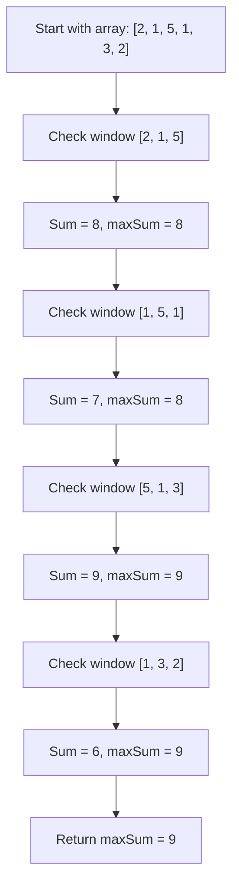

# 🔍 The Naive Approach

> [!NOTE]
> This lesson explores the brute force method of solving the maximum sum subarray problem and helps us understand why we need a more efficient approach.

## 💪 Brute Force Solution

The most straightforward approach to solving this problem is to:
1. Calculate the sum of every possible subarray of size `k`
2. Keep track of the maximum sum found

## 🧮 The Algorithm

Here's how we might implement this approach:

```javascript
function maxSubarraySumNaive(nums, k) {
  if (nums.length < k || k <= 0) {
    return undefined;
  }
  
  let maxSum = -Infinity;
  
  // Check every possible subarray of size k
  for (let i = 0; i <= nums.length - k; i++) {
    let currentSum = 0;
    
    // Calculate the sum of current subarray
    for (let j = 0; j < k; j++) {
      currentSum += nums[i + j];
    }
    
    // Update maxSum if currentSum is greater
    maxSum = Math.max(maxSum, currentSum);
  }
  
  return maxSum;
}
```

## 🔄 How It Works

Let's visualize this with our example: `nums = [2, 1, 5, 1, 3, 2]` and `k = 3`



## ⏱️ Time Complexity Analysis

Let's analyze the time complexity of this approach:
- We have an outer loop that runs `(n - k + 1)` times
- For each iteration of the outer loop, we have an inner loop that runs `k` times
- This gives us a time complexity of O(n * k)

> [!WARNING]
> While this approach is correct, it becomes inefficient for large arrays or large window sizes. For example, if we have an array of 10,000 elements and a window size of 1,000, we would need to perform about 10,000,000 operations!

## 🔄 Redundant Calculations

The key insight is that there's a lot of redundant work in the brute force approach:

<details>
<summary>Let's see the redundancy</summary>

When we move from calculating the sum of `[2, 1, 5]` to calculating the sum of `[1, 5, 1]`:
- We remove the first element (2)
- We add a new element (1)
- But we recalculate the entire sum, which means we add 1 and 5 again unnecessarily

Similarly, for all subsequent windows, we're recalculating sums for elements that we've already processed.
</details>

## 💭 Think About It

Can you think of a way to reuse the sum we've already calculated? 

When we move from one window to the next, we're:
- Removing the first element of the current window
- Adding the next element after the current window

> [!TIP]
> If we already know the sum of the current window, can we use that to calculate the sum of the next window more efficiently?

In the next lesson, we'll explore how the sliding window technique solves this inefficiency by building on this observation. 