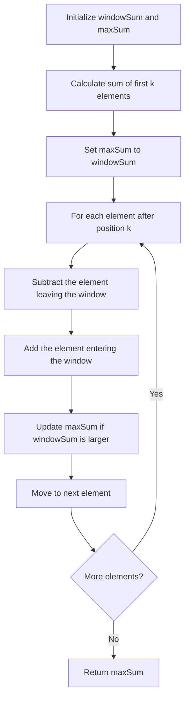

# 🪟 The Sliding Window Technique

> [!NOTE]
> This lesson introduces the sliding window technique and shows how it transforms our solution from O(n*k) to O(n) time complexity.

## 🔑 The Key Insight

Remember the redundancy we identified in the naive approach? The sliding window technique addresses this exact inefficiency.

Instead of recalculating the entire sum for each window, we can:
1. Calculate the sum of the first window
2. For each subsequent window, subtract the element leaving the window and add the element entering the window

## 🎬 The Sliding Window in Action

Let's visualize how the sliding window works with our example: `nums = [2, 1, 5, 1, 3, 2]` and `k = 3`


1. Initial window: [2, 1, 5] → Sum = 8
2. Slide window:
   * Remove 2, add 1: [1, 5, 1] → Sum = 8 - 2 + 1 = 7
3. Slide window again:
   * Remove 1, add 3: [5, 1, 3] → Sum = 7 - 1 + 3 = 9
4. Slide window again:
   * Remove 5, add 2: [1, 3, 2] → Sum = 9 - 5 + 2 = 6

The maximum sum we encountered is 9, which is our answer.

## 🧮 The Algorithm

Here's the implementation of the sliding window approach:

```javascript
function maxSubarraySum(nums, k) {
  // Handle edge cases
  if (nums.length < k || k <= 0) {
    return undefined;
  }

  let maxSum = 0;
  let windowSum = 0;

  // Calculate the sum of the first window
  for (let i = 0; i < k; i++) {
    windowSum += nums[i];
  }
  maxSum = windowSum;

  // Slide the window and update maxSum
  for (let i = k; i < nums.length; i++) {
    windowSum = windowSum - nums[i - k] + nums[i];
    maxSum = Math.max(maxSum, windowSum);
  }

  return maxSum;
}
```

## 🔄 How It Works - Step by Step



## ⚖️ Comparing the Approaches

Let's analyze why the sliding window technique is superior:

| Aspect | Naive Approach | Sliding Window |
|--------|---------------|---------------|
| Time Complexity | O(n * k) | O(n) |
| Operations | Recalculates each window sum | Updates sum incrementally |
| Efficiency | Gets slower as k increases | Performance independent of k |

> [!TIP]
> The sliding window technique is particularly powerful when k is large, as it maintains O(n) time complexity regardless of the window size!

## 💭 Understanding the Magic

<details>
<summary>Why does this work?</summary>

The sliding window technique works because it exploits the overlapping nature of consecutive windows:

- When we move the window, only two elements change: the one leaving and the one entering
- All other elements remain the same
- By keeping track of the current window's sum, we can efficiently calculate the next window's sum with just two operations (one subtraction and one addition)

This is a classic example of reusing previous calculations to avoid redundant work - a core principle of dynamic programming.
</details>

## 🧠 Think About It

Why do you think this technique is called "sliding window"? How does the mental model of a window "sliding" through the array help us understand the algorithm?

> [!NOTE]
> The sliding window pattern is useful for many other problems involving arrays or strings, where we need to find a contiguous subarray or substring that satisfies certain conditions.

In the next lesson, we'll analyze the efficiency of the sliding window algorithm and understand its time and space complexity in detail. 