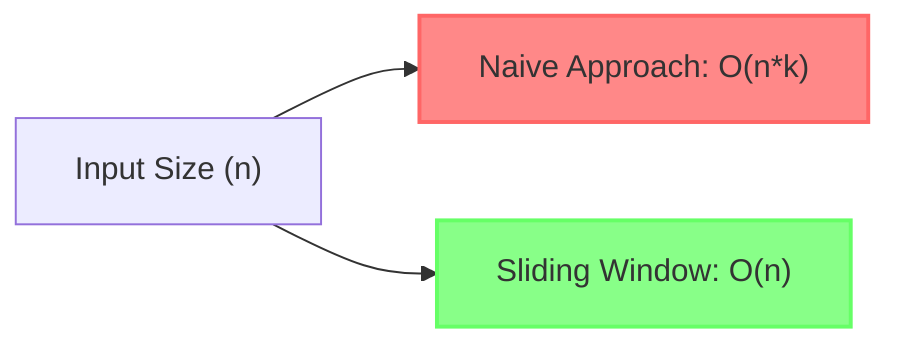

# ⚡ Efficiency Analysis

> [!NOTE]
> This lesson provides a detailed analysis of the time and space complexity of the sliding window solution, helping you understand why it's so efficient.

## ⏱️ Time Complexity

The sliding window algorithm has a time complexity of **O(n)**, where n is the length of the input array.

Let's break down why:

1. First, we calculate the sum of the first k elements: **O(k)** operations
2. Then, we slide the window through the remaining (n-k) elements: **O(n-k)** operations
3. Total: **O(k + (n-k)) = O(n)**

Detailed explanation

In the sliding window approach:
- The initialization phase requires k additions to compute the sum of the first window
- The sliding phase requires (n-k) iterations, each with constant time operations (one subtraction, one addition, and one comparison)
- This gives us a total of k + (n-k) × 3 operations, which simplifies to O(n)

## 🗃️ Space Complexity

The space complexity of our algorithm is **O(1)** or constant space.

Regardless of the input size, we only use a fixed amount of extra space:
- `windowSum`: to store the current window's sum
- `maxSum`: to keep track of the maximum sum found
- A few other variables for the loop

This makes the algorithm very memory-efficient, as it doesn't require any additional data structures that grow with the input size.

## 📊 Scalability Analysis

Let's visualize how the sliding window algorithm scales compared to the naive approach:

As the input size increases, the difference in performance becomes dramatically apparent:

| Input Size (n) | Window Size (k) | Naive Approach Operations | Sliding Window Operations |
|----------------|----------------|---------------------------|--------------------------|
| 100            | 10             | ~1,000                    | ~100                     |
| 1,000          | 100            | ~100,000                  | ~1,000                   |
| 10,000         | 1,000          | ~10,000,000               | ~10,000                  |
| 100,000        | 10,000         | ~1,000,000,000            | ~100,000                 |

> [!TIP]
> For large datasets, the sliding window approach can be thousands or even millions of times faster than the naive approach!

## 🧪 Empirical Performance

If we were to benchmark these algorithms, we'd see something like this:

The naive approach's execution time increases dramatically as the input size grows, while the sliding window approach's execution time increases linearly.

## 💡 Why This Matters

The efficiency gain from using the sliding window technique:

1. **Enables real-time processing**: With O(n) time complexity, even large datasets can be processed quickly
2. **Scales to big data**: Makes it feasible to analyze massive streams of data
3. **Reduces energy consumption**: More efficient algorithms consume less power, important for mobile or battery-powered devices
4. **Improves user experience**: Faster algorithms lead to more responsive applications

> [!WARNING]
> As programmers, we should always be mindful of the algorithmic complexity of our solutions. Even a theoretically correct algorithm might be practically useless if it doesn't scale well!

## 🧠 Think About It

Can you think of other problems where the sliding window technique might be applicable? What characteristics should a problem have for this technique to be useful?

In the next lesson, we'll look at common edge cases and potential pitfalls when implementing the sliding window algorithm. 