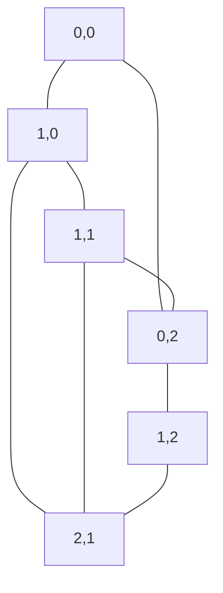

# 🔄 Representing Mazes as Graphs

> [!NOTE]
> Before diving into specific solving techniques, it's important to understand that a maze can be viewed as a graph, which opens up a world of well-established algorithms.

## 📊 From Grid to Graph: A Mental Shift

To solve a maze efficiently, we need to reframe our thinking. Rather than seeing the maze as just a grid of cells, we can view it as a **graph**:

- Each **cell** in the maze (that's not a wall) becomes a **node** in the graph
- Each possible **movement** between adjacent cells becomes an **edge** in the graph
- The **start position** is our source node
- The **end position** is our destination node

## 🔍 Why This Matters

This mental shift is powerful because:

1. It allows us to apply well-studied graph traversal algorithms
2. It helps us think more abstractly about the problem
3. It makes the solution approach more systematic

## 💡 Visualizing the Transformation

Consider this simple maze:

```
⬜⬛⬜
⬜⬜⬜
⬛⬜⬛
```

As a graph, it would look something like this:



Where each node represents a cell with coordinates [row, column].

> [!TIP]
> The transformation doesn't need to be explicit in our code. It's mainly a conceptual tool to help us apply graph algorithms to maze problems.

## 🤔 Questions to Ponder

- How does viewing a maze as a graph change our approach to solving it?
- What graph traversal algorithms might be useful for finding paths in a maze?
- What are the advantages of thinking of a maze as a graph rather than a 2D grid?

<details>
<summary>Thinking about Edge Weights</summary>

In our basic maze, all movements (edges) have equal cost - one step is one step. But what if we extended this concept?

- Different terrain types could have different costs
- Some paths might be faster or slower
- Some edges might be directional (one-way paths)

This is where weighted graph algorithms become valuable!
</details>

## 🔄 Making the Connection

By recognizing that a maze is fundamentally a graph:

1. Finding a path through the maze becomes a graph traversal problem
2. Finding the shortest path becomes a shortest path problem (like Dijkstra's or A*)
3. Checking if a solution exists becomes a graph connectivity problem

In the next lesson, we'll explore our first graph traversal method for solving mazes: Depth-First Search (DFS).

> [!WARNING]
> Remember that while we conceptualize the maze as a graph, we'll still be working with the 2D grid representation in our code. The graph perspective simply guides our algorithm choice. 