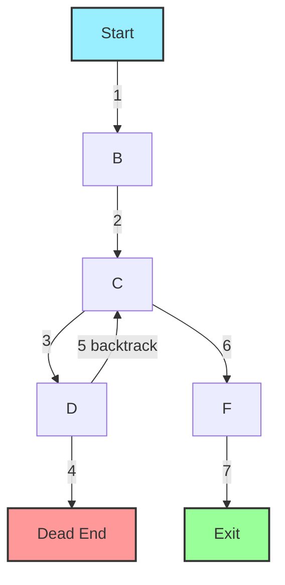

# 🌲 Depth-First Search (DFS) for Maze Solving

> [!NOTE]
> Depth-First Search is like exploring a maze with a single-minded focus: follow one path as far as it will go before backtracking.

## 🧭 What is Depth-First Search?

Depth-First Search (DFS) is a graph traversal algorithm that explores as far as possible along each branch before backtracking. In maze terms, it's like taking a path and following it until you either:
1. Reach the exit
2. Hit a dead end and need to backtrack

## 💭 Mental Model: The Left-Hand Rule

A classic analogy for DFS is the "left-hand rule" for navigating a maze:
- Place your left hand on the wall
- Keep walking while maintaining contact with the wall
- If the maze is "simply connected" (no detached walls), you'll eventually find the exit

This strategy exemplifies the "follow one path completely" nature of DFS.

## 🔄 How DFS Works for Maze Solving

1. **Start** at the entrance
2. **Mark** the current cell as visited
3. For each adjacent cell that is a path (not a wall) and not yet visited:
   - **Recursively** apply DFS to that cell
4. If the current cell is the exit, we've found a solution
5. If all adjacent cells are walls or already visited, **backtrack**

## 📝 Pseudocode Implementation

```
function DFS(maze, currentPosition, endPosition, visited, path):
    // Base cases
    if currentPosition is out of bounds or is a wall or is already visited:
        return false
        
    // Mark current position as visited and add to path
    visited[currentPosition] = true
    path.add(currentPosition)
    
    // Check if we've reached the end
    if currentPosition equals endPosition:
        return true
        
    // Try all four directions (up, down, left, right)
    if DFS(maze, currentPosition.up, endPosition, visited, path) or
       DFS(maze, currentPosition.down, endPosition, visited, path) or
       DFS(maze, currentPosition.left, endPosition, visited, path) or
       DFS(maze, currentPosition.right, endPosition, visited, path):
        return true
        
    // If no path found, backtrack by removing current position
    path.remove(currentPosition)
    return false
```

## 🧠 Visualizing DFS in Action

Let's visualize DFS traversing a simple maze:



Notice how DFS first follows the path to a dead end before backtracking and finding the correct route.

## 💪 Strengths of DFS

- **Memory Efficient**: Only needs to store the current path and visited cells
- **Simplicity**: The recursive implementation is elegant and intuitive
- **Guaranteed to Find a Solution**: If one exists, DFS will eventually find it

## 🚧 Limitations of DFS

- **May Not Find the Shortest Path**: DFS finds *a* path, not necessarily the *shortest* path
- **Can Be Slow on Large Mazes**: Might explore many dead ends before finding the exit
- **Risk of Stack Overflow**: Deep recursion on large mazes can cause stack overflow

> [!TIP]
> DFS is like an adventurous explorer who commits fully to each path, whereas BFS (which we'll cover next) is like a cautious explorer who checks all nearby options first.

<details>
<summary>Interactive Example: Try It Yourself</summary>

Here's a small maze. Try tracing through it using DFS by hand:

```
S 0 0
0 1 0
0 0 E
```

Where S is the start, E is the end, 0 is a path, and 1 is a wall.

1. Start at S and mark it as visited
2. Which direction would DFS try first? (typically up, right, down, left)
3. Follow that path and continue with the algorithm
4. What happens when you hit a wall or previously visited cell?
</details>

## 🤔 Questions to Consider

- Why does DFS use a stack (either explicitly or through recursion)?
- In which scenarios might DFS be preferable to other maze-solving algorithms?
- How would you modify DFS to find the shortest path through a maze?

In our next lesson, we'll explore Breadth-First Search (BFS), an alternative approach that is guaranteed to find the shortest path in unweighted graphs. 