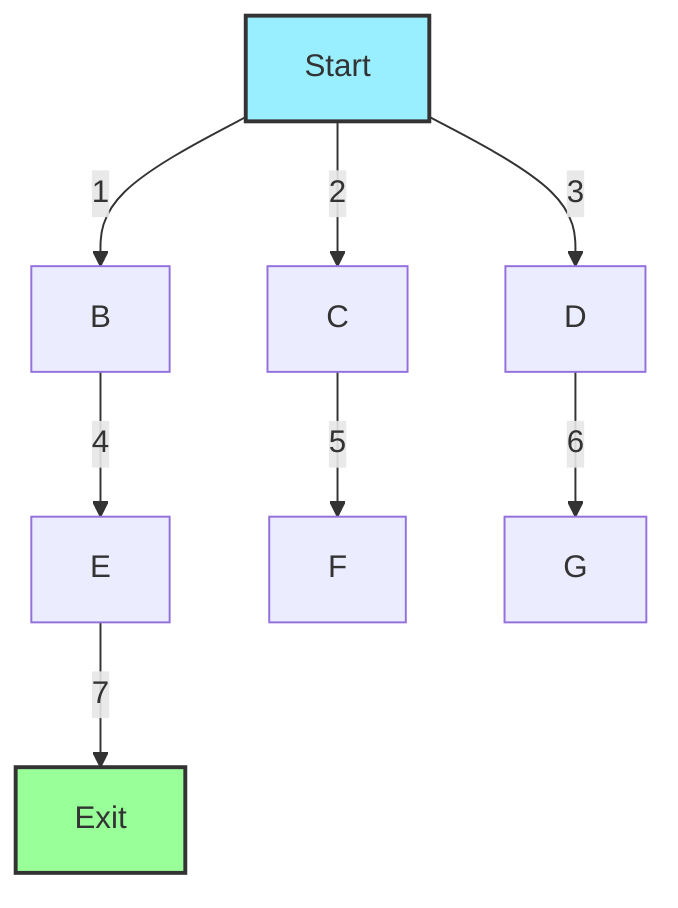

# 🌊 Breadth-First Search (BFS) for Maze Solving

> [!NOTE]
> Breadth-First Search explores the maze by radiating outward from the start position, like ripples on a pond, ensuring the shortest path will be found first.

## 🔍 What is Breadth-First Search?

Breadth-First Search (BFS) is a graph traversal algorithm that explores all neighbor nodes at the present depth before moving on to nodes at the next depth level. In maze terms:

- It explores all cells that are 1 step away from the start
- Then all cells that are 2 steps away
- Then all cells that are 3 steps away
- And so on, until it finds the exit

## 💭 Mental Model: Ripples in a Pond

Imagine dropping a pebble into a pond at the start position. The ripples spread outward in all directions evenly. The first ripple to reach the exit represents the shortest path.

## 🔄 How BFS Works for Maze Solving

1. **Initialize** a queue with the start position and mark it as visited
2. **Loop** until the queue is empty:
   - **Dequeue** a cell
   - If it's the exit, we've found the solution (and it's guaranteed to be the shortest)
   - Otherwise, **enqueue** all unvisited, valid neighboring cells and mark them as visited
3. If the queue empties without finding the exit, no solution exists

## 🛤️ Tracking the Path

Unlike DFS, BFS doesn't naturally build the path during traversal. We need to track the path explicitly:

- For each cell, store a reference to its parent cell (the one that led to it)
- When we reach the exit, we can reconstruct the path by following parent references back to the start

## 📝 Pseudocode Implementation

```
function BFS(maze, start, end):
    // Initialize queue with start position
    queue = new Queue()
    queue.enqueue({point: start, path: [start]})
    
    // Initialize visited array
    visited = new Boolean[maze.rows][maze.cols] (all false)
    visited[start.row][start.col] = true
    
    while queue is not empty:
        current = queue.dequeue()
        
        // Check if we've reached the end
        if current.point equals end:
            return current.path
            
        // Try all four directions
        for each direction (up, down, left, right):
            newRow = current.point.row + direction.row
            newCol = current.point.col + direction.col
            
            // Check if the new position is valid
            if newPosition is valid and not a wall and not visited:
                visited[newRow][newCol] = true
                newPath = current.path + [newRow, newCol]
                queue.enqueue({point: [newRow, newCol], path: newPath})
    
    // If we get here, no solution exists
    return null
```

## 🧠 Visualizing BFS in Action

Let's visualize BFS traversing a simple maze:



Notice how BFS explores all cells at distance 1 from the start before moving to distance 2, and so on. The numbers represent the order of exploration.

## 💪 Strengths of BFS

- **Finds the Shortest Path**: Guaranteed to find the shortest path in unweighted graphs (mazes)
- **Complete**: If a solution exists, BFS will find it
- **Systematic**: Explores all possibilities at each distance level

## 🚧 Limitations of BFS

- **Memory Intensive**: Must store all nodes at the current "frontier" of the search
- **Slower on Large Mazes**: Needs to explore many cells, even in irrelevant directions
- **Not as Intuitive**: The implementation is less straightforward than DFS

> [!TIP]
> Think of BFS as a thorough explorer who checks every nearby path before venturing further. This thoroughness ensures the shortest path is found, but at the cost of exploring many cells.

## 🔄 BFS vs. DFS: A Comparison

| Feature | BFS | DFS |
|---------|-----|-----|
| **Path Found** | Shortest path | Any path |
| **Memory Usage** | Higher (stores all frontier nodes) | Lower (stores only the current path) |
| **Implementation** | Queue | Stack or recursion |
| **Traversal Pattern** | Level by level, radiating outward | One path at a time, deep exploration |
| **Best Use Case** | Finding shortest paths | Memory-constrained environments |

<details>
<summary>Interactive Example: Try It Yourself</summary>

Here's a small maze. Try tracing through it using BFS by hand:

```
S 0 0
0 1 0
0 0 E
```

Where S is the start, E is the end, 0 is a path, and 1 is a wall.

1. Start at S and add it to the queue
2. Explore all unvisited neighbors of S (typically in order: up, right, down, left)
3. Add them to the queue and mark them as visited
4. Continue the algorithm, moving level by level
5. Notice how the search pattern differs from DFS
</details>

## 🤔 Questions to Consider

- Why does BFS guarantee finding the shortest path in unweighted graphs?
- In what real-world scenarios would BFS be preferable to DFS?
- How would the memory requirements of BFS scale with the size of the maze?

In our next lesson, we'll explore the A* algorithm, which combines the best features of BFS and DFS with heuristic guidance. 