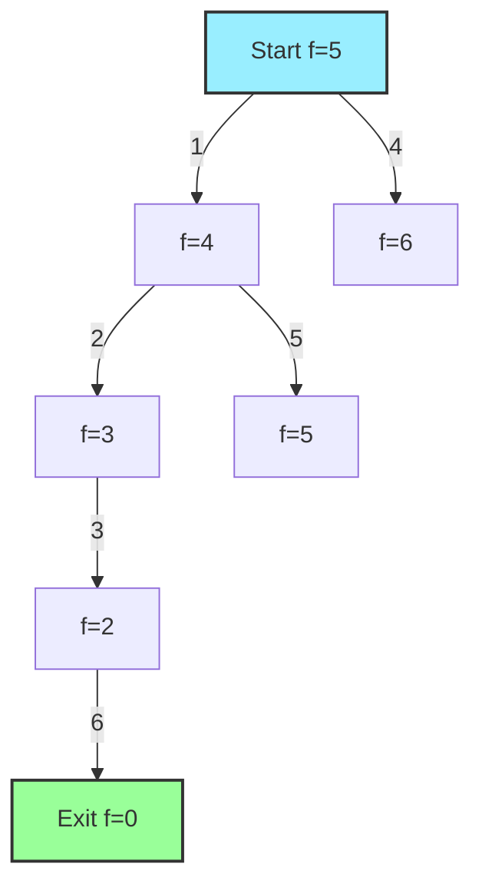

# 🌟 A* Algorithm: Smart Maze Solving

> [!NOTE]
> The A* (pronounced "A-star") algorithm combines the completeness of BFS with the efficiency of a heuristic-guided search, making it one of the most powerful maze-solving techniques.

## 🧠 What is A*?

A* is an informed search algorithm that finds the shortest path from start to end by using a heuristic function to guide its exploration. It elegantly combines:

- **Breadth-First Search's** guarantee of finding the shortest path
- **Depth-First Search's** efficiency in exploring promising directions
- **Heuristic guidance** to prioritize paths that seem more likely to lead to the goal

## 💡 The Key Insight: Combining Current Cost with Estimated Cost

A* assigns each cell a score that combines:
- **g(n)**: The cost to reach this cell from the start (actual distance traveled)
- **h(n)**: The estimated cost to reach the goal from this cell (heuristic)
- **f(n)**: The total estimated cost of the path through this cell (f(n) = g(n) + h(n))

The algorithm always expands the cell with the lowest f(n) value.

## 🧮 Common Heuristics for Maze Solving

1. **Manhattan Distance**: |x₁ - x₂| + |y₁ - y₂|
   - Sum of horizontal and vertical distances
   - Perfect for mazes where you can only move up, down, left, and right

2. **Euclidean Distance**: √((x₁ - x₂)² + (y₁ - y₂)²)
   - Straight-line distance
   - Better if diagonal movement is allowed

3. **Chebyshev Distance**: max(|x₁ - x₂|, |y₁ - y₂|)
   - Maximum of horizontal and vertical distances
   - Useful when diagonal movement costs the same as cardinal directions

> [!TIP]
> The choice of heuristic significantly impacts A*'s performance. A good heuristic never overestimates the true cost to reach the goal.

## 🔄 How A* Works for Maze Solving

1. **Initialize** an open set with the start position
2. **Loop** until the open set is empty:
   - **Select** the cell with the lowest f(n) score from the open set
   - If it's the goal, we've found the solution
   - Otherwise, **explore** its neighbors:
     - Calculate g, h, and f scores for each neighbor
     - Add unvisited neighbors to the open set
     - Keep track of each cell's parent to reconstruct the path
3. If the open set empties without finding the goal, no solution exists

## 📝 Pseudocode Implementation

```
function AStar(maze, start, goal):
    // Initialize the open and closed sets
    openSet = new PriorityQueue() (prioritized by f score)
    openSet.add(start, 0)
    cameFrom = new Map() // To reconstruct the path
    
    // Initialize scores
    gScore = new Map() with all positions initially set to infinity
    gScore[start] = 0
    
    fScore = new Map() with all positions initially set to infinity
    fScore[start] = heuristic(start, goal)
    
    while openSet is not empty:
        current = openSet.getLowest() // Get node with lowest fScore
        
        if current equals goal:
            return reconstructPath(cameFrom, current)
            
        openSet.remove(current)
        
        for each neighbor of current:
            if neighbor is not a valid position:
                continue
                
            // tentative_gScore is the distance from start to the neighbor through current
            tentative_gScore = gScore[current] + 1
            
            if tentative_gScore < gScore[neighbor]:
                // This path to neighbor is better than any previous one
                cameFrom[neighbor] = current
                gScore[neighbor] = tentative_gScore
                fScore[neighbor] = gScore[neighbor] + heuristic(neighbor, goal)
                
                if neighbor is not in openSet:
                    openSet.add(neighbor, fScore[neighbor])
    
    // No solution found
    return null
    
function reconstructPath(cameFrom, current):
    path = [current]
    while current in cameFrom:
        current = cameFrom[current]
        path.prepend(current)
    return path
    
function heuristic(a, b):
    // Manhattan distance
    return |a.x - b.x| + |a.y - b.y|
```

## 🧠 Visualizing A* in Action

Let's visualize A* exploring a maze:



Notice how A* prioritizes cells with lower f scores (shown next to each node). The exploration numbers show the order cells are processed based on their f scores.

## 💪 Strengths of A*

- **Optimal**: Guaranteed to find the shortest path if the heuristic is admissible
- **Efficient**: Explores far fewer cells than BFS by focusing on promising directions
- **Flexible**: Can be adapted to different types of mazes and constraints
- **Powerful**: Works well even in very large mazes

## 🚧 Limitations of A*

- **Memory Usage**: Still requires storing all frontier nodes
- **Heuristic Dependency**: Performance heavily depends on the quality of the heuristic
- **Complexity**: More complex to implement than DFS or BFS
- **Computational Cost**: Calculating heuristics and maintaining the priority queue adds overhead

> [!WARNING]
> If your heuristic overestimates costs, A* may not find the shortest path. This is why Manhattan distance is ideal for standard mazes—it never overestimates.

## 🤔 Questions to Consider

- How does the choice of heuristic affect A*'s performance?
- In what scenarios might A* perform worse than BFS or DFS?
- How would you adapt A* to handle mazes with weighted paths (where some moves cost more than others)?

<details>
<summary>A* in Real-World Applications</summary>

A* isn't just for solving paper mazes—it's used in:

- **Video Game Pathfinding**: NPCs finding their way around obstacles
- **Robotics**: Planning robot movements in complex environments
- **GPS Navigation**: Finding optimal routes through road networks
- **Network Routing**: Efficiently routing data through networks
- **Puzzle Solving**: Solving sliding puzzle games like the 15-puzzle

This wide applicability makes A* one of the most important algorithms to understand in computer science.
</details>

In our next lesson, we'll implement the maze solver algorithm and handle edge cases. 