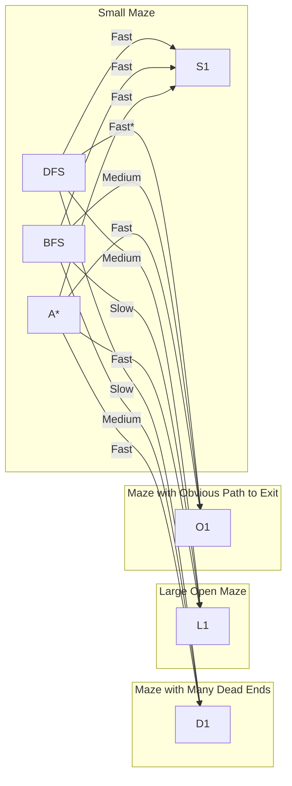
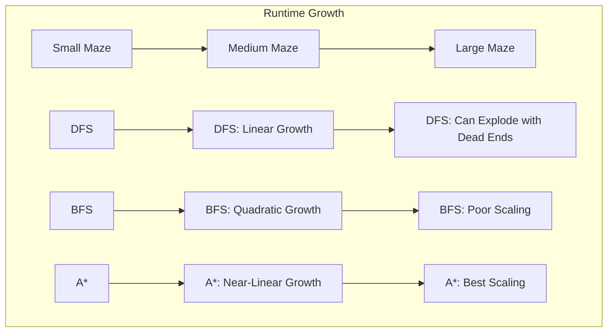

# 🏁 Algorithm Showdown: Comparing Maze Solvers

> [!NOTE]
> Different maze-solving algorithms have unique strengths and weaknesses. Choosing the right one depends on your specific requirements and constraints.

## 📊 Side-by-Side Comparison

| Feature | DFS | BFS | A* |
|---------|-----|-----|-----|
| **Finds Shortest Path** | ❌ | ✅ | ✅ |
| **Memory Usage** | 🟢 Low | 🟠 High | 🟠 High |
| **Speed on Large Mazes** | 🟠 Medium | 🔴 Slow | 🟢 Fast |
| **Implementation Complexity** | 🟢 Simple | 🟢 Simple | 🟠 Complex |
| **Handles Dead Ends** | 🟠 Explores many | 🟢 Avoids deep exploration | 🟢 Avoids with good heuristic |
| **Works in All Mazes** | ✅ | ✅ | ✅ |

## 🎯 Which Algorithm for Which Situation?

### Choose DFS When:
- Memory is severely constrained
- Finding any solution quickly is more important than finding the optimal one
- The maze has few or short dead ends
- Implementing a recursive solution is preferred for simplicity

### Choose BFS When:
- Finding the shortest path is crucial
- Memory constraints are not severe
- The maze has many branching paths
- The exit is likely to be close to the entrance

### Choose A* When:
- Finding the shortest path efficiently is important
- The maze is large and complex
- You have additional information about the maze's structure
- Performance needs to be optimized for large problem spaces

## 💯 Empirical Performance Analysis

Let's visualize the relative performance of these algorithms on different maze types:



> *DFS can be very fast if it happens to choose the correct path first, but this is not guaranteed.

## 🧪 Time Complexity Analysis

| Algorithm | Worst Case | Average Case | Best Case |
|-----------|------------|--------------|-----------|
| DFS | O(V + E) | O(V + E) | O(1)* |
| BFS | O(V + E) | O(V + E) | O(1)* |
| A* | O(E) | O(E) | O(1)* |

Where:
- V = number of cells in the maze
- E = number of possible moves (typically 4V for a standard maze)

> *Best case is O(1) if the start and end are adjacent or the same.

## 🧠 Space Complexity Analysis

| Algorithm | Worst Case | Typical Case |
|-----------|------------|--------------|
| DFS | O(V) | O(d) where d = max depth |
| BFS | O(V) | O(b^d) where b = branching factor |
| A* | O(V) | O(b^d) with better constants than BFS |

## 📈 Runtime Growth with Maze Size

Here's how the running time grows with maze size for each algorithm:



## 🦾 Optimizing for Specific Maze Types

### Long, Winding Maze with Few Branches
```
###S#############
#   #     #     #
# # # ### # ### #
# # #   # # #   #
# ##### # # # ###
#     # # # #   #
##### # # # ### #
#   # #   #     #
# # ####### ### #
# #       # #   #
# ####### # #####
#     #   #     #
##### # ##### # #
#     #     # # #
# ######### # # #
#           #  E#
################
```
**Best Algorithm**: DFS does well here due to fewer branches.

### Open Maze with Many Possible Paths
```
###S##########
#            #
# ########## #
# #        # #
# # ###### # #
# # #    # # #
# # # ## # # #
# # # #E # # #
# # # #### # #
# # #      # #
# # ######## #
# #          #
##############
```
**Best Algorithm**: A* shines here due to its heuristic guidance.

### Maze with Obvious Wrong Paths
```
###S###########
#   #         #
# # # ####### #
# # #       # #
# # ####### # #
# #         # #
# ########### #
#             #
############E##
```
**Best Algorithm**: A* will quickly avoid the obvious wrong paths.

## 🤔 Questions to Consider

- How does the shape and structure of the maze affect algorithm performance?
- In what real-world scenarios would each algorithm be most appropriate?
- How could you create a hybrid algorithm that combines the strengths of multiple approaches?

<details>
<summary>Advanced Optimization: Bidirectional Search</summary>

For extremely large mazes, consider bidirectional search:

- Start searching from both the start and end simultaneously
- When the two searches meet, you've found a path
- This can dramatically reduce the search space
- Works well with BFS and A*
- Requires additional memory but can be much faster
</details>

In our next lesson, we'll explore real-world applications of maze-solving algorithms. 