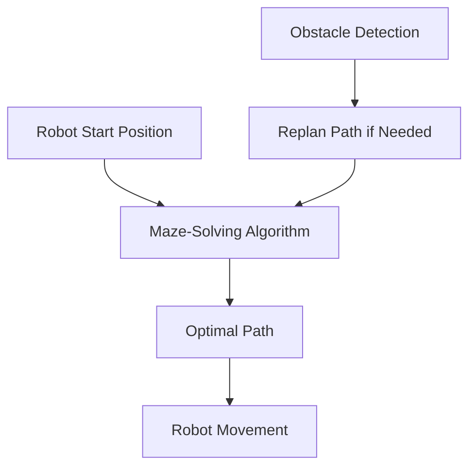
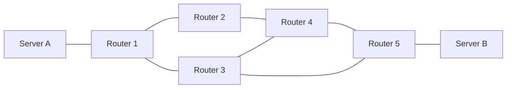
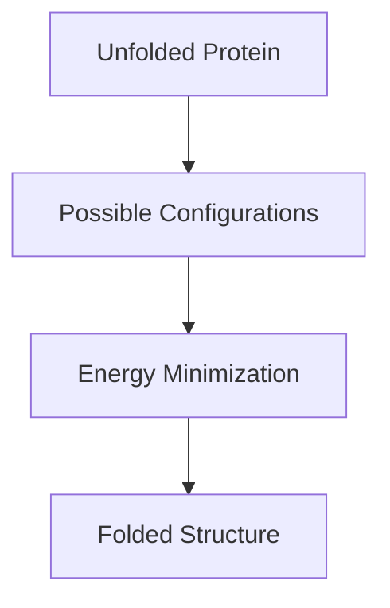
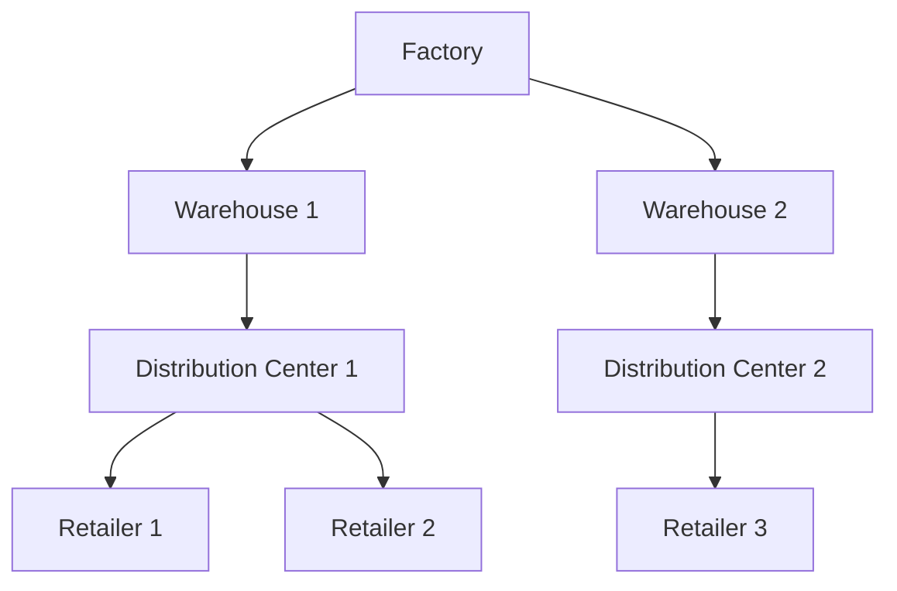
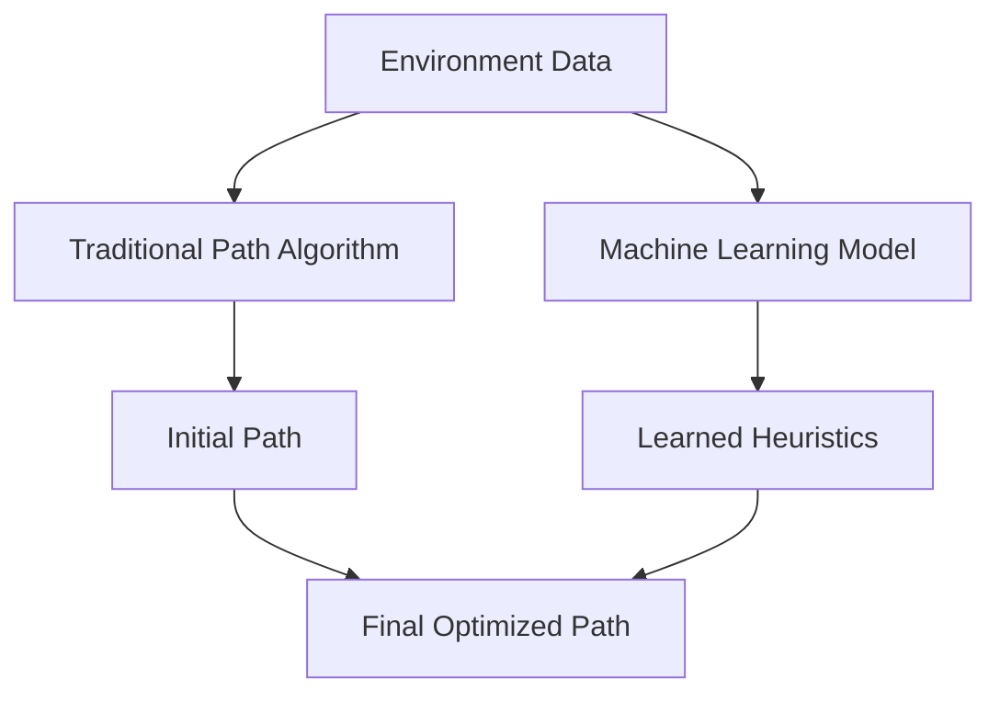

# 🌎 Beyond Paper Mazes: Real-World Applications

> [!NOTE]
> Maze-solving algorithms extend far beyond puzzles. They solve critical problems in robotics, networking, game development, and many other fields.

## 🤖 Robotics and Autonomous Navigation

### Path Planning for Robots
Robots need to navigate complex environments while avoiding obstacles:



### Real-Life Example: Warehouse Robots
Amazon's warehouse robots use variants of maze-solving algorithms to navigate through dynamic warehouse layouts, determining the most efficient path to pick items while avoiding collisions with other robots.

> [!TIP]
> In robotics, the "maze" is usually represented as an occupancy grid where each cell indicates whether that space is occupied by an obstacle.

## 🎮 Video Game Development

### Non-Player Character (NPC) Pathfinding
NPCs in games need to find paths through complex game worlds:

```
+----------------+
|                |
|    🧟‍♂️  🏃‍♀️        |
|        🧱🧱🧱🧱  |
|                |
|  🧱🧱     🧟‍♂️    |
|  🧱     🧱🧱🧱   |
|  🧱🧱🧱🧱        |
+----------------+
```

A* is the algorithm of choice for most game pathfinding, as it efficiently finds good paths while avoiding obstacles.

### Dynamic Path Replanning
When game environments change (like a bridge collapsing), algorithms must quickly recalculate paths:

<details>
<summary>Example: UnityEngine Pathfinding</summary>

```csharp
using UnityEngine;
using UnityEngine.AI;

public class EnemyAI : MonoBehaviour {
    public Transform player;
    private NavMeshAgent agent;
    
    void Start() {
        agent = GetComponent<NavMeshAgent>();
    }
    
    void Update() {
        // Set destination using A* pathfinding under the hood
        agent.SetDestination(player.position);
    }
}
```

Unity's `NavMeshAgent` uses a variant of A* to navigate game environments.
</details>

## 🧠 Circuit Design

### Routing on Printed Circuit Boards (PCBs)
Connecting components on circuit boards requires finding paths that avoid other components and traces:

```
+----------------------------+
| +-+                   +-+  |
| |C|                   |R|  |
| +-+                   +-+  |
|  |                     |   |
|  |     +------+        |   |
|  +-----|  IC  |--------+   |
|        +------+            |
|                            |
| +-+                   +-+  |
| |R|                   |C|  |
| +-+                   +-+  |
+----------------------------+
```

Lee's algorithm (a variant of BFS) is often used in PCB routing to find the shortest paths for electrical connections.

## 📱 Network Routing

### Data Packet Routing
Routing data through computer networks is essentially a maze-solving problem:



Routing protocols like OSPF (Open Shortest Path First) use Dijkstra's algorithm, a variant of the approaches we've studied.

## 🏙️ Urban Planning

### Traffic Optimization
Planning efficient roads and traffic patterns uses maze-solving principles:

```
🏢🏢🏢  🏠🏠🏠
🛣️🛣️🛣️  🛣️🛣️🛣️
🏢🏢🏢  🏠🏠🏠
🛣️🛣️🚧🚧🚧🛣️🛣️
🏢🏢🏢  🏠🏠🏠
🛣️🛣️🛣️  🛣️🛣️🛣️
🏢🏢🏢  🏠🏠🏠
```

A* and other algorithms help city planners design optimal traffic flow and emergency evacuation routes.

### GPS Navigation
Your car's GPS uses maze-solving algorithms to find the best route to your destination:

> [!NOTE]
> Modern GPS systems use weighted graphs where the "weights" incorporate factors like:
> - Distance
> - Expected travel time
> - Traffic conditions
> - Road types (highways vs. local roads)

## 🧪 Scientific Applications

### Protein Folding
Understanding how proteins fold into their 3D structures:



While more complex than typical mazes, protein folding algorithms use similar principles to navigate the vast space of possible configurations.

### Molecule Design
Finding paths through the chemical space of possible molecules:

```
H   H
 \ /
  C
 / \
H   OH
```

Drug discovery often uses maze-solving algorithms to explore chemical modifications that might improve a drug's properties.

## 💼 Business Applications

### Supply Chain Optimization
Optimizing the movement of goods through a supply network:



BFS and other algorithms help find the most cost-effective paths through supply chains.

### Resource Allocation
Efficiently allocating resources across different projects:

```
Project A: 5 engineers, 3 months
Project B: 3 engineers, 2 months
Project C: 7 engineers, 4 months
```

Optimization algorithms based on maze-solving principles help businesses allocate limited resources efficiently.

## 📝 Learning From Real-World Applications

Each application domain adapts maze-solving algorithms to its specific needs:

| Domain | Algorithm | Key Modifications |
|--------|-----------|------------------|
| Robotics | A* with dynamic replanning | Handles changing environments |
| Video Games | Hierarchical A* | Uses abstraction for large worlds |
| Networks | Dijkstra's/Bellman-Ford | Accounts for changing link states |
| PCB Design | Lee's algorithm | Optimizes for parallel traces |
| GPS | Contraction Hierarchies | Preprocesses road networks for speed |

## 🚀 Future Directions

### Quantum Path Finding
Quantum computers may solve certain path-finding problems exponentially faster:

<details>
<summary>Quantum vs. Classical</summary>

Classical computers need to explore paths one at a time or in limited parallel.

Quantum computers could theoretically explore all possible paths simultaneously through quantum superposition, potentially revolutionizing how we solve complex routing problems.
</details>

### AI and Machine Learning Integration
Modern systems combine traditional algorithms with machine learning:



## 🤔 Questions to Consider

- How could maze-solving algorithms help in your field of work or study?
- What modifications would you need to make to these algorithms for your specific application?
- How might emerging technologies like quantum computing change our approach to path-finding problems?

In our next lesson, we'll implement a complete maze solver and test it on various maze configurations. 