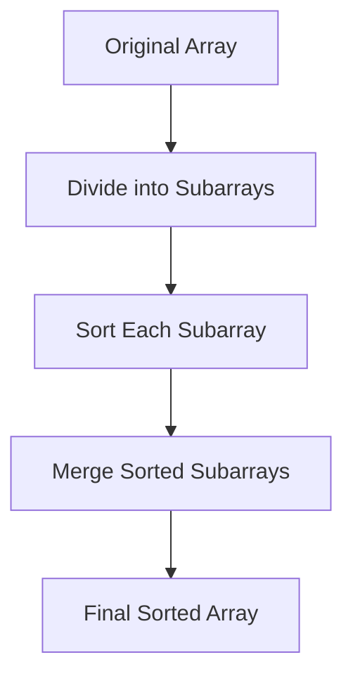

# 🔄 Divide and Conquer

> [!NOTE]
> Divide and conquer is a powerful problem-solving technique that breaks down complex problems into simpler, more manageable subproblems.

## The Three-Step Process

Merge Sort is a classic example of the divide and conquer paradigm, which follows three key steps:

1. 📌 **Divide**: Break the problem into smaller subproblems
2. 🧩 **Conquer**: Solve each subproblem independently
3. 🔄 **Combine**: Merge the solutions to get the final result

Let's see how this applies to sorting an array:



## The Power of Breaking It Down

> [!TIP]
> When a problem feels overwhelming, breaking it down can reveal surprising simplicity!

Consider this analogy:

Imagine sorting books on a large bookshelf. Instead of trying to sort all books at once:

1. Divide the shelf into smaller sections
2. Sort each section independently
3. Merge adjacent sorted sections together

This approach is often more manageable and efficient than trying to tackle the entire shelf at once.

## Why Is This Approach Effective?

<details>
<summary>🧠 The psychology of problem-solving</summary>

Our brains are wired to handle smaller, focused tasks more effectively than large, complex ones. Divide and conquer leverages this natural tendency, making difficult problems more approachable.
</details>

For sorting specifically, divide and conquer offers key advantages:

- 📊 **Simplified Logic**: Sorting a small array is easier than sorting a large one
- ⚡ **Efficiency**: Can lead to optimal time complexity (O(n log n) for Merge Sort)
- 🔄 **Recursion**: Naturally fits a recursive implementation pattern

## Applying to Merge Sort

In Merge Sort, we divide our array until we reach the simplest possible case:

> [!NOTE]
> An array with 0 or 1 elements is already sorted! This is our **base case**.

Starting from this insight:

1. We recursively split the array in half until we reach arrays of size 1
2. Each single-element array is already sorted by definition
3. We then merge these tiny sorted arrays back together

Let's visualize this with a small example:

```
[38, 27, 43, 3]
```

First, we divide:
```
[38, 27] [43, 3]
```

Divide again:
```
[38] [27] [43] [3]
```

Now we merge back up, comparing elements:
```
[27, 38] [3, 43]
```

Final merge:
```
[3, 27, 38, 43]
```

## Thinking Questions

> [!TIP]
> Try to answer these questions before moving to the next lesson:

1. Why do we consider an array with a single element to be "already sorted"?
2. How might dividing the problem help with parallel processing?
3. What other problems might benefit from a divide and conquer approach?

In the next lesson, we'll examine the "divide" step of Merge Sort in detail! 