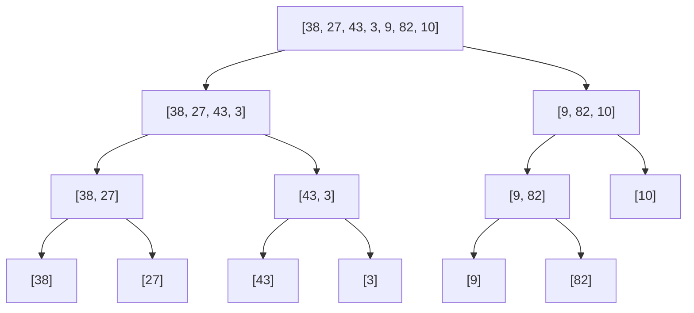

# 🪓 The Divide Phase

> [!NOTE]
> The first step in Merge Sort is to break down the problem into smaller, more manageable pieces.

## Dividing the Array

The divide step is conceptually simple but forms the foundation of Merge Sort's effectiveness:

1. Find the middle point of the array
2. Split the array into two halves: left and right
3. Recursively apply this division to each half until reaching single-element arrays

Let's visualize this recursive division:



## The Recursive Pattern

The divide phase follows a recursive pattern, which can be expressed in code:

```javascript
function mergeSort(nums) {
  // Base case: already sorted
  if (nums.length <= 1) return nums;
  
  // Find the middle point
  const mid = Math.floor(nums.length / 2);
  
  // Recursively sort left and right halves
  const left = mergeSort(nums.slice(0, mid));
  const right = mergeSort(nums.slice(mid));
  
  // ...merge step will come later
}
```

## Understanding Recursion in Divide and Conquer

> [!TIP]
> Recursion might seem complex, but it elegantly expresses the divide and conquer pattern!

Think of recursion as a stack of tasks:

1. The original function call divides the array and creates two new tasks (left and right)
2. These new tasks are put on hold until their subtasks are completed
3. As we reach the base case (arrays of length 0 or 1), we start completing tasks from the bottom up

<details>
<summary>🧩 How recursion works in practice</summary>

When sorting `[38, 27, 43, 3]`:

1. We first call `mergeSort([38, 27, 43, 3])`
2. This calls `mergeSort([38, 27])` and `mergeSort([43, 3])`
3. `mergeSort([38, 27])` calls `mergeSort([38])` and `mergeSort([27])`
4. Single-element arrays are returned as-is
5. We then merge `[38]` and `[27]` to get `[27, 38]`
6. Meanwhile, `mergeSort([43, 3])` follows a similar process to get `[3, 43]`
7. Finally, we merge `[27, 38]` and `[3, 43]` to get `[3, 27, 38, 43]`

</details>

## Base Case: The Foundation of Recursion

Every recursive algorithm needs a base case to avoid infinite recursion:

> [!NOTE]
> In Merge Sort, the base case is an array with 0 or 1 elements, which is trivially sorted.

```javascript
if (nums.length <= 1) return nums;
```

This line is crucial - it tells our algorithm when to stop dividing and start combining.

## Finding the Middle: Balancing the Division

The effectiveness of Merge Sort relies on balanced division:

```javascript
const mid = Math.floor(nums.length / 2);
```

By consistently splitting the array at its midpoint:
- We ensure roughly equal-sized subarrays
- We achieve a predictable O(log n) depth to the recursion
- We maintain the algorithm's efficiency regardless of input arrangement

## Practical Considerations

> [!WARNING]
> The divide step creates new subarrays, which requires additional memory.

This is a key characteristic of Merge Sort. While efficient in time complexity, it is not an in-place sorting algorithm. We trade space for speed.

## Thinking Questions

1. What would happen if we divided the array unevenly (e.g., 25% and 75% instead of half-and-half)?
2. How many levels of recursion would be needed to sort an array of 16 elements?
3. Could we implement the divide step iteratively instead of recursively? What would that look like?

In the next lesson, we'll explore the "conquer" phase where we merge our divided arrays back together in sorted order. 