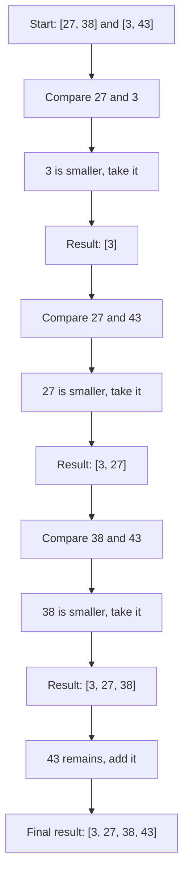

# 🔄 The Merge Phase

> [!NOTE]
> The merge phase is where the magic happens! This is where we combine our sorted subarrays to create a larger sorted array.

## The Heart of Merge Sort

After dividing the array into single elements, we need to merge them back together in sorted order. The merge operation takes two sorted arrays and combines them into a single sorted array.

This process is like having two sorted piles of cards and combining them into one sorted pile.

## The Merge Algorithm

Here's how the merge step works:

1. Create an empty result array to hold the merged elements
2. Compare the first elements of both input arrays
3. Take the smaller element and add it to the result array
4. Repeat until one array is empty
5. Add any remaining elements from the non-empty array to the result

Let's visualize this with an example, merging `[27, 38]` and `[3, 43]`:



## Implementation in Code

The merge function can be implemented as follows:

```javascript
function merge(left, right) {
  const result = [];
  let i = 0, j = 0;
  
  // Compare elements from both arrays and add the smaller one to result
  while (i < left.length && j < right.length) {
    if (left[i] <= right[j]) {
      result.push(left[i++]);
    } else {
      result.push(right[j++]);
    }
  }
  
  // Add any remaining elements
  while (i < left.length) result.push(left[i++]);
  while (j < right.length) result.push(right[j++]);
  
  return result;
}
```

> [!TIP]
> The expression `result.push(left[i++])` both adds the element at index `i` to the result and then increments `i` for the next comparison.

## Understanding the Merge Logic

Let's analyze the merge logic step-by-step:

<details open>
<summary>The Comparison Loop</summary>

```javascript
while (i < left.length && j < right.length) {
  if (left[i] <= right[j]) {
    result.push(left[i++]);
  } else {
    result.push(right[j++]);
  }
}
```

This loop runs as long as both arrays have elements left to compare. At each step:
- We compare the current elements from each array
- We take the smaller element and add it to our result
- We advance the pointer of the array from which we took the element
</details>

<details open>
<summary>Handling Remaining Elements</summary>

```javascript
while (i < left.length) result.push(left[i++]);
while (j < right.length) result.push(right[j++]);
```

These loops ensure that if one array is exhausted but the other still has elements, we add all remaining elements to the result. Since each input array is already sorted, any remaining elements must be larger than everything in our result so far.
</details>

## Stability of Merge Sort

> [!NOTE]
> Merge Sort is a **stable** sorting algorithm, meaning it preserves the relative order of equal elements.

This stability comes from the comparison in our merge function:

```javascript
if (left[i] <= right[j]) {
```

By using `<=` instead of `<`, we ensure that when comparing equal elements, we take the one from the left array first, preserving their original order.

## Step-by-Step Walkthrough

Let's trace the merge of two small sorted arrays, `[1, 5]` and `[2, 4]`:

1. Initialize `result = []`, `i = 0`, `j = 0`
2. Compare `left[0] = 1` and `right[0] = 2`: `1 < 2`, so add `1` to result
   - `result = [1]`, `i = 1`, `j = 0`
3. Compare `left[1] = 5` and `right[0] = 2`: `5 > 2`, so add `2` to result
   - `result = [1, 2]`, `i = 1`, `j = 1`
4. Compare `left[1] = 5` and `right[1] = 4`: `5 > 4`, so add `4` to result
   - `result = [1, 2, 4]`, `i = 1`, `j = 2`
5. Since `j = 2 = right.length`, the second while loop runs
   - Add remaining element `left[1] = 5` to result
   - `result = [1, 2, 4, 5]`, `i = 2`
6. Return `result = [1, 2, 4, 5]`

## Practical Considerations

> [!WARNING]
> The merge operation requires additional space proportional to the size of the input arrays.

This is why Merge Sort is not an in-place sorting algorithm. The space complexity is O(n), where n is the total number of elements being sorted.

## Thinking Questions

1. What would happen if we modified the merge function to take elements from the right array first when elements are equal?
2. How would you modify the merge function to sort in descending order instead of ascending order?
3. Can you think of a way to optimize the merge function to use less additional space?

In the next lesson, we'll put everything together and analyze the complete Merge Sort algorithm! 