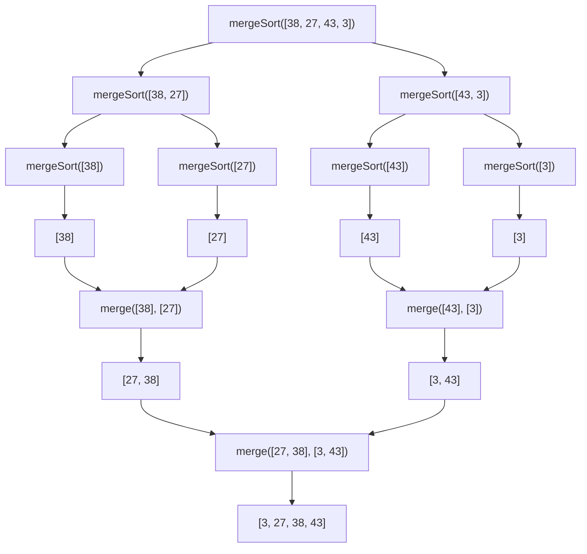

# 🧩 The Complete Merge Sort Algorithm

> [!NOTE]
> Now that we understand both the divide and merge phases, let's put everything together to see the full Merge Sort algorithm in action.

## The Complete Algorithm

Here's the complete Merge Sort implementation combining both phases:

```javascript
function merge(left, right) {
  const result = [];
  let i = 0, j = 0;
  
  while (i < left.length && j < right.length) {
    if (left[i] <= right[j]) {
      result.push(left[i++]);
    } else {
      result.push(right[j++]);
    }
  }
  
  while (i < left.length) result.push(left[i++]);
  while (j < right.length) result.push(right[j++]);
  
  return result;
}

function mergeSort(nums) {
  // Base case: already sorted
  if (nums.length <= 1) return nums;
  
  // Divide phase: split the array in half
  const mid = Math.floor(nums.length / 2);
  const left = mergeSort(nums.slice(0, mid));
  const right = mergeSort(nums.slice(mid));
  
  // Merge phase: combine the sorted halves
  return merge(left, right);
}
```

## Tracing the Algorithm

Let's trace the execution of Merge Sort on a small array `[38, 27, 43, 3]`:

### Step 1: Initial Call
- Call `mergeSort([38, 27, 43, 3])`
- `mid = 2`
- Recursively call:
  - `left = mergeSort([38, 27])` 
  - `right = mergeSort([43, 3])`

### Step 2: First Level of Recursion
- For `mergeSort([38, 27])`:
  - `mid = 1`
  - Recursively call:
    - `left = mergeSort([38])` → returns `[38]` (base case)
    - `right = mergeSort([27])` → returns `[27]` (base case)
  - Merge `[38]` and `[27]` → `[27, 38]`

- For `mergeSort([43, 3])`:
  - `mid = 1`
  - Recursively call:
    - `left = mergeSort([43])` → returns `[43]` (base case)
    - `right = mergeSort([3])` → returns `[3]` (base case)
  - Merge `[43]` and `[3]` → `[3, 43]`

### Step 3: Back to Initial Call
- Merge `[27, 38]` and `[3, 43]` → `[3, 27, 38, 43]`
- Return final sorted array: `[3, 27, 38, 43]`

> [!TIP]
> Notice how we work our way down to the base cases, then back up, merging as we go.

## Visual Representation of the Process

Let's visualize the entire process:



## Alternative Approach: Iterative Merge Sort

While the recursive approach is elegant and intuitive, Merge Sort can also be implemented iteratively:

<details>
<summary>Iterative Merge Sort Implementation</summary>

```javascript
function mergeSort(nums) {
  if (nums.length <= 1) return nums;
  
  // Start with arrays of size 1
  let work = nums.map(n => [n]);
  
  // Repeatedly merge neighboring subarrays
  while (work.length > 1) {
    const temp = [];
    for (let i = 0; i < work.length; i += 2) {
      if (i + 1 < work.length) {
        temp.push(merge(work[i], work[i + 1]));
      } else {
        temp.push(work[i]);
      }
    }
    work = temp;
  }
  
  return work[0];
}
```

This "bottom-up" approach avoids recursion by starting with single-element arrays and iteratively merging neighboring arrays.
</details>

## Key Characteristics of Merge Sort

Let's summarize the key properties of Merge Sort:

- ⏱️ **Time Complexity**: O(n log n) in all cases (best, average, worst)
- 🧠 **Space Complexity**: O(n) due to the need for temporary arrays
- ⚖️ **Stability**: Stable (preserves relative order of equal elements)
- 📊 **Adaptivity**: Not adaptive (doesn't take advantage of existing order)
- 🖥️ **Parallelizability**: Highly parallelizable due to divide-and-conquer approach

## When to Use Merge Sort

Merge Sort is ideal for:

- Sorting linked lists (can be adapted to use O(1) extra space)
- When stability matters
- When predictable O(n log n) performance is required
- External sorting (when data doesn't fit in memory)
- Parallel computing environments

> [!WARNING]
> Merge Sort might not be the best choice when:
> - Memory is severely constrained
> - The data set is very small (simpler algorithms may be faster)
> - The data is already partially sorted (adaptive algorithms perform better)

## Thinking Questions

1. How would you modify Merge Sort to count the number of inversions in an array?
2. Can you implement Merge Sort for a linked list instead of an array?
3. What optimizations could be applied to improve the performance of Merge Sort on nearly-sorted data?

In the next lesson, we'll analyze the algorithmic complexity of Merge Sort in detail! 