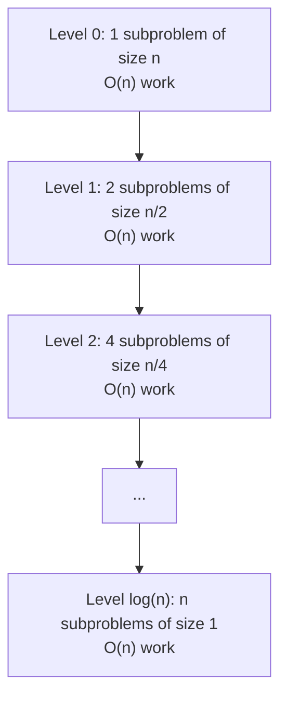

# 📊 Understanding Merge Sort Complexity

> [!NOTE]
> Analyzing an algorithm's complexity helps us understand its efficiency and performance characteristics. Let's dive into the time and space complexity of Merge Sort.

## Time Complexity

Merge Sort has a consistent time complexity across all scenarios:

| Case | Time Complexity |
|------|----------------|
| Best | O(n log n) |
| Average | O(n log n) |
| Worst | O(n log n) |

### Breaking Down the Analysis

Let's understand why Merge Sort has O(n log n) time complexity:

1. **Division Process**: We repeatedly divide the array into halves until we reach single elements.
   - Starting with n elements, we need log₂(n) divisions to reach arrays of size 1.
   - This gives us the "log n" part of the complexity.

2. **Merge Process**: At each level of recursion, we merge all elements.
   - Each level involves comparing and copying all n elements.
   - This gives us the "n" part of the complexity.

Let's visualize this with a tree diagram:

At each level:
- The total size of all subarrays is n
- The total work at each level is O(n)
- There are log₂(n) levels

Therefore, the total time complexity is: O(n) × O(log n) = O(n log n)

> [!TIP]
> Unlike some other sorting algorithms, Merge Sort's time complexity remains the same regardless of the initial order of elements. This predictability is a significant advantage in applications where consistent performance is crucial.

## Space Complexity

Merge Sort has a space complexity of **O(n)**.

### Why O(n) Space?

There are two main contributors to Merge Sort's space usage:

1. **Auxiliary Arrays**: During the merge phase, we need a temporary array to store the merged result. This requires O(n) extra space.

2. **Recursion Stack**: In the recursive implementation, the call stack can grow up to O(log n) in depth. However, this is dominated by the O(n) from the auxiliary arrays.

Recursion Stack Illustration

For an array of size 8, the recursive call stack might look like:
- `mergeSort([1,3,5,7,2,4,6,8])`
  - `mergeSort([1,3,5,7])`
    - `mergeSort([1,3])`
      - `mergeSort([1])`
      - `mergeSort([3])`
    - `mergeSort([5,7])`
      - `mergeSort([5])`
      - `mergeSort([7])`
  - `mergeSort([2,4,6,8])`
    - ...and so on

At its deepest point, this stack has log₂(8) = 3 levels.

### Can We Improve the Space Complexity?

While the standard implementation uses O(n) extra space, variations of Merge Sort exist that attempt to reduce this:

- **In-place Merge Sort**: There are algorithms that try to perform the merge operation in-place, but they typically increase time complexity or lose stability.

- **Natural Merge Sort**: Takes advantage of existing order in the data, potentially reducing both time and space complexity for partially sorted arrays.

## Comparing with Other Sorting Algorithms

How does Merge Sort stack up against other popular sorting algorithms?

| Algorithm | Best Time | Average Time | Worst Time | Space | Stable |
|-----------|-----------|--------------|------------|-------|--------|
| Merge Sort | O(n log n) | O(n log n) | O(n log n) | O(n) | Yes |
| Quick Sort | O(n log n) | O(n log n) | O(n²) | O(log n) | No |
| Heap Sort | O(n log n) | O(n log n) | O(n log n) | O(1) | No |
| Insertion Sort | O(n) | O(n²) | O(n²) | O(1) | Yes |
| Bubble Sort | O(n) | O(n²) | O(n²) | O(1) | Yes |

> [!WARNING]
> While Merge Sort offers consistent O(n log n) performance, its O(n) space requirement might be a limiting factor in memory-constrained environments.

## Practical Performance Considerations

Beyond theoretical complexity, several factors affect Merge Sort's real-world performance:

- **Constant Factors**: Though often hidden in big O notation, implementation details can significantly impact actual runtime.

- **Cache Performance**: Merge Sort's memory access patterns can lead to cache misses, potentially slowing performance on modern hardware.

- **Small Arrays**: For small arrays (typically less than 10-20 elements), the overhead of recursion might make simpler algorithms like Insertion Sort more efficient.

Hybrid Sorting Approaches

Many practical sorting implementations use a hybrid approach:
- Use Merge Sort for the overall algorithm to ensure O(n log n) worst-case performance
- Switch to Insertion Sort for small subarrays to leverage its efficiency with small datasets
- This approach is used in languages like Java for its `Arrays.sort()` implementation (though technically using TimSort, a Merge Sort variant)

## Thinking Questions

1. How would the time complexity change if we consistently divided the array unevenly (e.g., 1/4 and 3/4 instead of half and half)?

2. Can you think of a scenario where Merge Sort would outperform Quick Sort despite Quick Sort's better space complexity?

3. If memory is a concern, would it be better to use an in-place sorting algorithm like Heap Sort, or could the predictable performance of Merge Sort justify the extra space usage?

In the next lesson, we'll explore real-world applications and variations of Merge Sort! 