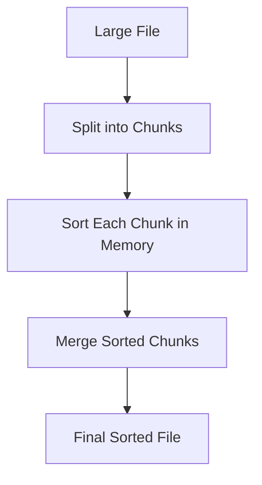

# 🌍 Merge Sort in the Real World

> [!NOTE]
> Merge Sort isn't just a theoretical concept—it's widely used in real-world applications and has inspired several important variations. Let's explore where and how it's applied.

## Real-World Applications

Merge Sort shines in many practical scenarios:

### 1. Database Systems 💾

Database management systems often use Merge Sort for:
- Efficiently sorting large datasets during query execution
- External sorting when data exceeds available memory
- Index creation and maintenance

For example, PostgreSQL uses a variation of Merge Sort for its external sorting operations.

### 2. External Sorting 📁

When dealing with data too large to fit in memory:



This approach is used in:
- Big data processing frameworks
- Log file analysis systems
- Large-scale data export/import operations

### 3. Parallel Computing ⚡

Merge Sort's divide-and-conquer approach makes it naturally parallelizable:
- Different processors can sort different subarrays simultaneously
- The merge operation can also be parallelized with careful implementation

This makes it valuable in:
- Multi-core processor systems
- Distributed computing frameworks
- High-performance computing applications

### 4. Programming Language Standard Libraries 📚

Many language standard libraries implement sorting algorithms based on Merge Sort:
- Java's `Collections.sort()` and `Arrays.sort()` use TimSort, a Merge Sort variant
- Python's `sorted()` and `list.sort()` also use TimSort
- The C++ Standard Library's `std::stable_sort()` typically uses a Merge Sort variant

## Popular Variations of Merge Sort

Over time, developers have created several variations to address specific needs:

### 1. TimSort 🕒

> [!TIP]
> TimSort is a hybrid sorting algorithm derived from Merge Sort and Insertion Sort, designed to perform well on many kinds of real-world data.

Key features:
- Exploits natural runs (sequences that are already sorted) in the data
- Uses Insertion Sort for small subarrays
- Employs a sophisticated merging strategy to maintain stability
- Minimizes temporary space usage through clever buffer management

TimSort is now the standard sorting algorithm in:
- Python
- Java
- Android's Java implementation
- Swift standard library

### 2. Natural Merge Sort 🌱

This variation improves efficiency when the input is partially sorted:
- Instead of blindly dividing the array, it identifies "natural runs" (already sorted sequences)
- It then merges these natural runs
- This reduces the number of comparisons and copies for partially sorted data

### 3. Bottom-Up (Iterative) Merge Sort 🔄

As we saw earlier, Merge Sort can be implemented iteratively:
- Avoids recursion overhead
- Starts with single-element arrays and repeatedly merges adjacent subarrays
- Can be more efficient in practice due to reduced function call overhead
- Often easier to parallelize

### 4. In-Place Merge Sort 📏

Standard Merge Sort requires O(n) extra space, but variations exist that use less:
- Block merge algorithms
- Rotation-based merge operations
- These typically trade some time efficiency for reduced space requirements

### 5. Parallel Merge Sort 🖥️

Specifically designed for multi-processor or multi-core systems:
- Divides the sorting task across multiple processors
- Uses sophisticated merging techniques to combine results efficiently
- Can achieve near-linear speedup with additional processors

<details>
<summary>Simple Parallel Merge Sort Pseudocode</summary>

```
function parallelMergeSort(array):
    if array.length <= THRESHOLD:
        return sequentialMergeSort(array)
    
    mid = array.length / 2
    
    // Spawn a new thread to sort the left half
    leftTask = async sortLeft(array[0...mid-1])
    
    // Sort the right half in the current thread
    right = parallelMergeSort(array[mid...array.length-1])
    
    // Wait for left half to complete
    left = await leftTask
    
    // Merge the results
    return merge(left, right)
```
</details>

## Specialized Adaptations and Optimizations

### Memory-Efficient Variations

For memory-constrained environments:
- **Tape Merge Sort**: Originally designed for tape storage systems, minimizes the number of passes over data
- **Polyphase Merge Sort**: Efficiently distributes data across multiple tapes/storage units

### Merge Sort for Linked Lists 🔗

Merge Sort is particularly well-suited for linked lists:
- The merge operation becomes very efficient - simply redirecting pointers
- Can be implemented with O(1) extra space (beyond recursion stack)
- Often the preferred choice for sorting linked lists

```javascript
function mergeSortLinkedList(head) {
    // Base case
    if (!head || !head.next) return head;
    
    // Find the middle
    let slow = head, fast = head.next;
    while (fast && fast.next) {
        slow = slow.next;
        fast = fast.next.next;
    }
    
    // Split the list
    const right = slow.next;
    slow.next = null;
    
    // Recursively sort both halves
    const sortedLeft = mergeSortLinkedList(head);
    const sortedRight = mergeSortLinkedList(right);
    
    // Merge the sorted halves
    return mergeLinkedLists(sortedLeft, sortedRight);
}
```

### Multi-Key Sorting

Merge Sort can be adapted for:
- **Multi-level sorting**: Sort by primary key, then secondary key, etc.
- **Lexicographical sorting**: Comparing strings character by character
- **Attribute-based sorting**: Sorting objects by specific properties

## Beyond Sorting: Other Applications

Merge Sort's principles apply to other problems:

### 1. Counting Inversions 🔢

An inversion in an array is a pair of elements that are out of order. Merge Sort can be modified to count inversions while sorting:

```javascript
function countInversions(arr) {
    let count = 0;
    
    function mergeSortAndCount(arr) {
        if (arr.length <= 1) return arr;
        
        const mid = Math.floor(arr.length / 2);
        const left = mergeSortAndCount(arr.slice(0, mid));
        const right = mergeSortAndCount(arr.slice(mid));
        
        return mergeAndCount(left, right);
    }
    
    function mergeAndCount(left, right) {
        const result = [];
        let i = 0, j = 0;
        
        while (i < left.length && j < right.length) {
            if (left[i] <= right[j]) {
                result.push(left[i++]);
            } else {
                // Found an inversion - all remaining elements in left
                // are greater than right[j]
                count += left.length - i;
                result.push(right[j++]);
            }
        }
        
        return result.concat(left.slice(i)).concat(right.slice(j));
    }
    
    mergeSortAndCount(arr);
    return count;
}
```

### 2. External Memory Algorithms 🧠

The principles of Merge Sort inform many algorithms that handle data too large to fit in memory:
- Database join operations
- External graph algorithms
- Large-scale data processing systems like MapReduce

## Thinking Questions

1. How might you implement a multi-threaded version of Merge Sort for a specific application in your preferred language?

2. Can you design a variation of Merge Sort optimized for nearly-sorted data that would outperform standard Merge Sort?

3. In what scenarios might the memory overhead of Merge Sort be worthwhile despite the additional space requirements?

In our final lesson, we'll review what we've learned about Merge Sort and discuss how to apply these concepts to other algorithmic problems! 