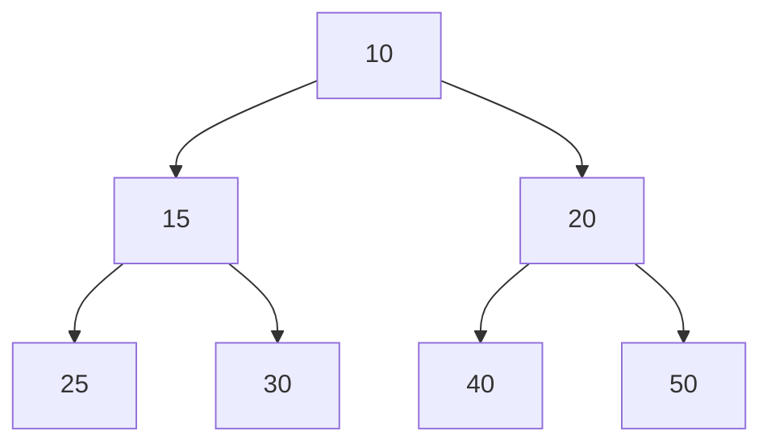

# The Magic of Array Representation 🧙‍♂️

> [!NOTE]
> In this lesson, we'll discover how a tree-like Min Heap structure can be elegantly stored using a simple array.

## From Tree to Array: A Clever Mapping 🗺️

One of the most beautiful aspects of a Min Heap is how we can represent this tree-like structure using a simple, flat array—no pointers or complex references needed!

Here's how we map a binary tree to an array:

1. Start with the root node at index 0
2. For any node at index `i`:
   - Its left child is at index `2*i + 1`
   - Its right child is at index `2*i + 2`
   - Its parent is at index `Math.floor((i-1)/2)`

Let's visualize this with an example:



This Min Heap would be represented in an array as:

`[10, 15, 20, 25, 30, 40, 50]`

In the array, each position directly corresponds to a node in the tree:
- Index 0: Root node (10)
- Index 1: Left child of root (15)
- Index 2: Right child of root (20)
- And so on...

> [!TIP]
> This array representation is extremely memory-efficient and takes advantage of the complete binary tree property of heaps!

## Calculating Relationships ➗

The array mapping allows us to navigate the tree structure using simple arithmetic:

For a node at index `i`:

| Relationship | Formula | Example for i=1 |
| ------------ | ------- | --------------- |
| Parent | `Math.floor((i-1)/2)` | Parent of index 1 is at index 0 |
| Left Child | `2*i + 1` | Left child of index 1 is at index 3 |
| Right Child | `2*i + 2` | Right child of index 1 is at index 4 |

<details>
<summary>Why does this math work?</summary>

These formulas are derived from the way complete binary trees fill up:
- Level 0 has 2^0 = 1 node (the root)
- Level 1 has 2^1 = 2 nodes
- Level 2 has 2^2 = 4 nodes
- And so on...

By filling the tree level by level, left to right, we create a pattern where the left child is always at position 2i+1 and the right child at 2i+2.
</details>

## Try It Yourself! 🧩

Let's practice understanding this representation:

Given the array `[4, 8, 6, 10, 15, 9, 7]`, try to:

1. Draw the corresponding Min Heap tree
2. Identify the parent of the node with value 10
3. Find the children of the node with value 6

<details open>
<summary>Solution</summary>

1. The tree would look like:
```
       4
     /   \
    8     6
   / \   / \
  10 15 9   7
```

2. The node with value 10 is at index 3. Its parent is at index `Math.floor((3-1)/2) = 1`, which contains the value 8.

3. The node with value 6 is at index 2. Its children are at indices:
   - Left child: 2*2+1 = 5, which contains the value 9
   - Right child: 2*2+2 = 6, which contains the value 7
</details>

## Why Array Representation Matters 🎯

The array representation enables:

- **Simplicity**: No pointers or complex data structures needed
- **Memory Efficiency**: Compact storage with no overhead for pointers
- **Cache Efficiency**: Continuous memory access patterns
- **Simplifies Implementation**: Makes coding heap operations straightforward

> [!WARNING]
> While the array representation is elegant, remember that it only works for complete binary trees. A partially filled binary tree cannot be efficiently represented this way!

In the next lesson, we'll learn how to insert elements into our Min Heap while maintaining the critical heap property. 