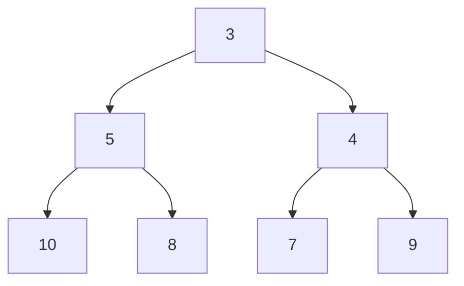
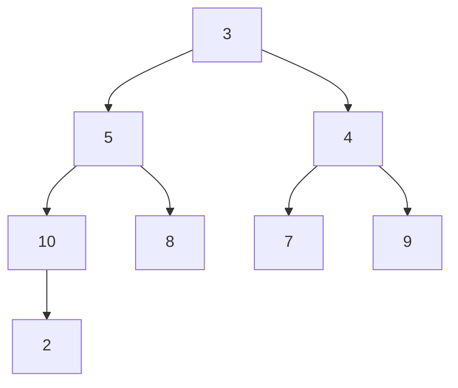
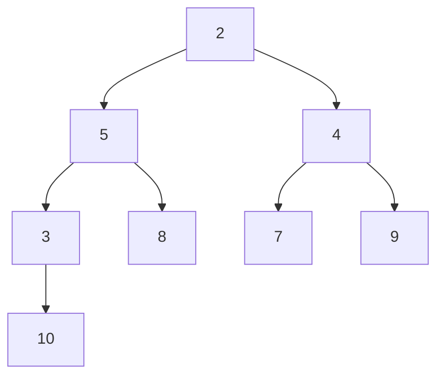

# Adding Elements to Your Min Heap 🔼

> [!NOTE]
> In this lesson, we'll learn how to add new elements to a Min Heap while maintaining its essential properties.

## The Insertion Challenge 🎯

When inserting a new element into a Min Heap, we face an interesting challenge: we need to add the element in a way that preserves both the **complete binary tree structure** and the **min heap property** (each parent is smaller than its children).

Let's break this down into a step-by-step process!

## Insertion Process: Step-by-Step 📝

Adding a new element to our Min Heap follows this elegant process:

1. **Append the element** to the end of the array (this maintains the complete binary tree property)
2. **Bubble up** the new element to its correct position (this restores the min heap property)

Let's see how this works with a visual example:

### Step 1: Add to the End 📌

Suppose we have this Min Heap: `[3, 5, 4, 10, 8, 7, 9]`



Now, we want to insert the value `2`. First, we add it to the end of the array:

`[3, 5, 4, 10, 8, 7, 9, 2]`

This gives us:



But wait! Now the min heap property is violated because `2` is smaller than its parent `10`.

### Step 2: Bubble Up ⬆️

Now we need to "bubble up" the new element to restore the min heap property:

1. Compare the new element with its parent
2. If the new element is smaller, swap them
3. Repeat until the element is in the correct position

For our example:
- Compare `2` (index 7) with its parent `10` (index 3)
- Since 2 < 10, swap them: `[3, 5, 4, 2, 8, 7, 9, 10]`
- Now compare `2` (index 3) with its parent `3` (index 0)
- Since 2 < 3, swap again: `[2, 5, 4, 3, 8, 7, 9, 10]`

Our final Min Heap is:



> [!TIP]
> The "bubble up" operation is also called "heapify-up" or "sift-up" in some texts.

## The Code Behind Insertion 💻

Here's how insertion might look in JavaScript:

```javascript
insert(value) {
  // Step 1: Add the element to the end
  this.heap.push(value);
  
  // Step 2: Bubble up the element to its correct position
  this.bubbleUp(this.heap.length - 1);
}

bubbleUp(index) {
  while (index > 0) {
    // Calculate the parent index
    const parentIndex = Math.floor((index - 1) / 2);
    
    // If the element is in the right place, break
    if (this.heap[index] >= this.heap[parentIndex]) {
      break;
    }
    
    // Otherwise, swap with the parent
    [this.heap[index], this.heap[parentIndex]] = 
      [this.heap[parentIndex], this.heap[index]];
    
    // Continue from the parent's position
    index = parentIndex;
  }
}
```

## Insertion Time Complexity ⏱️

Let's analyze the efficiency of our insertion operation:

- **Best case**: O(1) - When the new element is already in the correct position (larger than its parent)
- **Worst case**: O(log n) - When the new element needs to bubble all the way up to the root
- **Average case**: O(log n) - On average, we expect to do some bubbling

> [!NOTE]
> The logarithmic time complexity comes from the height of a complete binary tree with n nodes, which is log(n).

## Exercise: Try It Yourself! 🧠

Given the Min Heap `[4, 8, 6, 10, 15, 9, 7]`, simulate the insertion of the value `5`.

<details>
<summary>Solution</summary>

Initial heap: `[4, 8, 6, 10, 15, 9, 7]`

1. Add to the end: `[4, 8, 6, 10, 15, 9, 7, 5]`
2. Start bubbling up from index 7:
   - Parent is at index 3 with value 10
   - Since 5 < 10, swap: `[4, 8, 6, 5, 15, 9, 7, 10]`
   - New parent is at index 1 with value 8
   - Since 5 < 8, swap: `[4, 5, 6, 8, 15, 9, 7, 10]`
   - New parent is at index 0 with value 4
   - Since 5 > 4, stop bubbling

Final heap: `[4, 5, 6, 8, 15, 9, 7, 10]`
</details>

## Common Pitfalls to Avoid ⚠️

When implementing insertion, watch out for these common mistakes:

- **Off-by-one errors** when calculating parent/child indices
- **Forgetting to update the index** after swapping
- **Incorrect comparison** direction (remember: in a min heap, we want smaller values to move up)
- **Infinite loops** if the termination condition is incorrect

Next up, we'll learn the complementary operation: how to extract the minimum element from our Min Heap! 