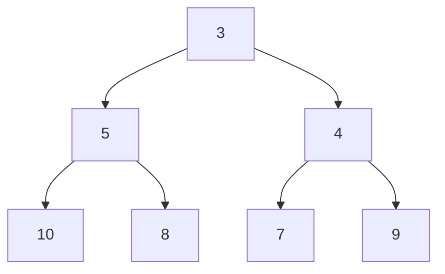
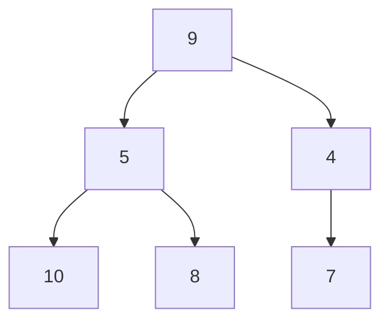
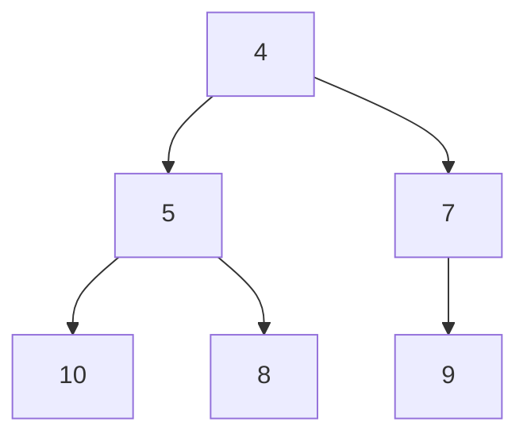

# Extracting the Minimum: The Heart of Min Heap Functionality 🔍

> [!NOTE]
> In this lesson, we'll learn how to remove and return the smallest element from our Min Heap—one of its most powerful operations.

## The Extract-Min Operation 🎯

One of the main reasons we use a Min Heap is its ability to efficiently provide the minimum element in the collection. The `extractMin()` operation:

1. Returns the minimum element (always at the root)
2. Removes it from the heap
3. Reorganizes the heap to maintain both the complete binary tree structure and the min heap property

Let's see how this works step-by-step!

## Extract-Min Process: Step-by-Step 📝

### Step 1: Save the Root Value 💾

First, we save the root value (at index 0) since this is our minimum element that we'll return.

### Step 2: Replace Root with Last Element 🔄

To maintain the complete binary tree property, we:
1. Take the last element from the array
2. Move it to the root position
3. Remove the last element from the array

This operation maintains the "shape" of our heap but likely violates the min heap property.

### Step 3: Sink Down (Heapify) ⬇️

Now we need to restore the min heap property by moving the new root down to its correct position:

1. Compare the element with its children
2. Swap with the smallest child if it's smaller than the element
3. Repeat until the element is in the correct position or becomes a leaf

Let's visualize this with an example:

Starting with this Min Heap: `[3, 5, 4, 10, 8, 7, 9]`



### Step 1: Save the minimum (3)

### Step 2: Replace root with last element
New heap array: `[9, 5, 4, 10, 8, 7]`



### Step 3: Sink down
- Compare `9` with its children `5` and `4`
- `4` is the smallest, so swap `9` and `4`: `[4, 5, 9, 10, 8, 7]`
- Now compare `9` with its children `7` and no right child
- `7` is smaller, so swap `9` and `7`: `[4, 5, 7, 10, 8, 9]`
- `9` has no children, so we're done

Final heap:



And we return the saved minimum value `3`.

## The Code Behind Extract-Min 💻

Here's how the extract-min operation might look in JavaScript:

```javascript
extractMin() {
  // Handle edge cases
  if (this.heap.length === 0) {
    return undefined; // Heap is empty
  }
  
  if (this.heap.length === 1) {
    return this.heap.pop(); // Only one element
  }
  
  // Step 1: Save the minimum value
  const min = this.heap[0];
  
  // Step 2: Replace root with last element
  this.heap[0] = this.heap.pop();
  
  // Step 3: Restore heap property by sinking down
  this.sinkDown(0);
  
  return min;
}

sinkDown(index) {
  const heapSize = this.heap.length;
  while (true) {
    let smallest = index;
    const leftIdx = 2 * index + 1;
    const rightIdx = 2 * index + 2;
    
    // Check if left child is smaller
    if (leftIdx < heapSize && this.heap[leftIdx] < this.heap[smallest]) {
      smallest = leftIdx;
    }
    
    // Check if right child is smaller
    if (rightIdx < heapSize && this.heap[rightIdx] < this.heap[smallest]) {
      smallest = rightIdx;
    }
    
    // If no swap needed, we're done
    if (smallest === index) {
      break;
    }
    
    // Swap with the smallest child
    [this.heap[index], this.heap[smallest]] = 
      [this.heap[smallest], this.heap[index]];
    
    // Continue from the child's position
    index = smallest;
  }
}
```

## Time Complexity Analysis ⏱️

Let's analyze the efficiency of our extract-min operation:

- **Best case**: O(1) - When the heap has 0 or 1 elements (no sinking needed)
- **Worst case**: O(log n) - When the new root needs to sink all the way down to a leaf
- **Average case**: O(log n) - On average, we expect some sinking

> [!TIP]
> The logarithmic time complexity is a key advantage of heaps. Imagine having to find the minimum element in an unsorted array (O(n)) and then removing it—much slower!

## Exercise: Try It Yourself! 🧠

Given the Min Heap `[2, 4, 3, 8, 7, 5, 6]`, simulate the extraction of the minimum element.

<details>
<summary>Solution</summary>

Initial heap: `[2, 4, 3, 8, 7, 5, 6]`

1. Save minimum: `2`
2. Replace root with last element: `[6, 4, 3, 8, 7, 5]`
3. Sink down:
   - Compare `6` with children `4` and `3`
   - `3` is smallest, so swap: `[3, 4, 6, 8, 7, 5]`
   - Compare `6` with children `8` and `5`
   - `5` is smallest, so swap: `[3, 4, 5, 8, 7, 6]`
   - `6` has no children, so we're done

Final heap: `[3, 4, 5, 8, 7, 6]`
Return value: `2`
</details>

## Common Pitfalls to Avoid ⚠️

Be careful of these common mistakes when implementing extract-min:

- **Not handling empty heaps** or heaps with only one element
- **Forgetting to update the heap size** after removing the last element
- **Incorrect comparison logic** when finding the smallest child
- **Off-by-one errors** in index calculations
- **Infinite loops** if the termination condition is incorrect

> [!WARNING]
> The extract-min operation modifies the heap structure. If you need to preserve the heap for future operations, consider using the `peek()` method instead, which returns the minimum without removing it.

In the next lesson, we'll learn how to efficiently build a Min Heap from an unordered array! 