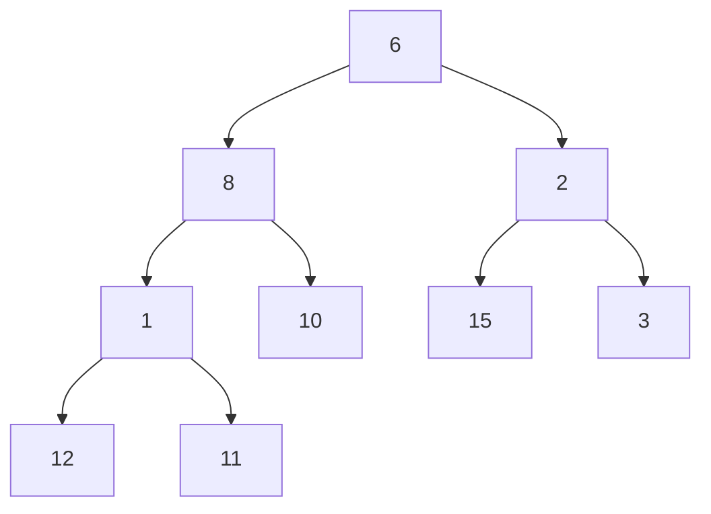
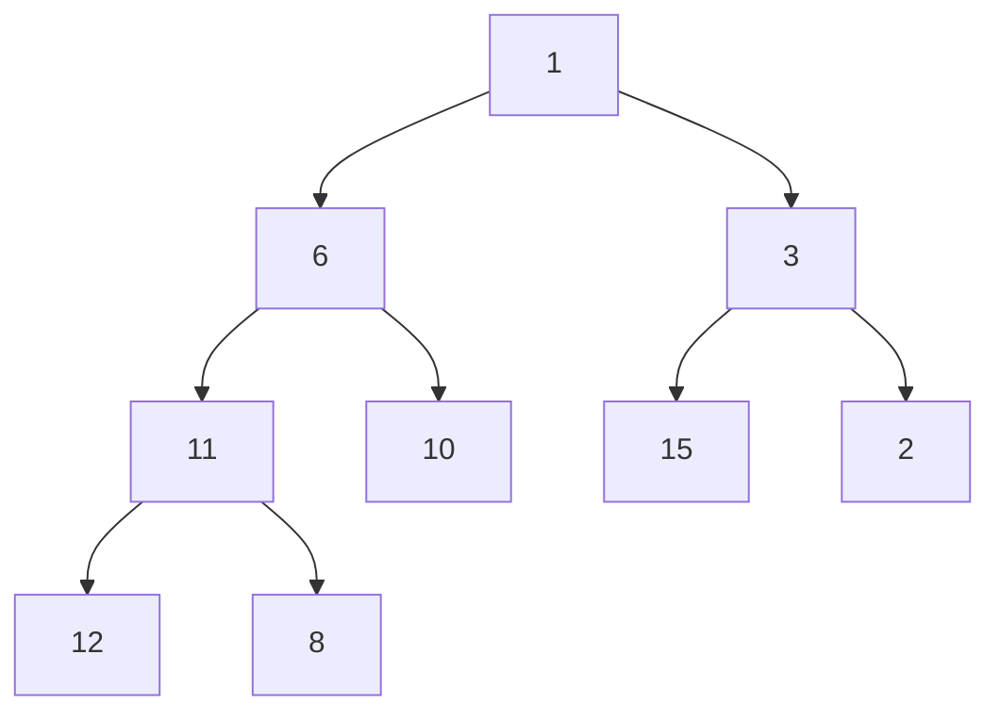

# Building a Min Heap: From Chaos to Order 🏗️

> [!NOTE]
> In this lesson, we'll learn how to efficiently transform an unordered array into a Min Heap—a crucial operation with surprising efficiency.

## The Build Heap Challenge 🎯

When working with heaps, we often need to construct a min heap from an existing array of elements rather than building it one insertion at a time. The challenge:

**How do we efficiently transform an arbitrary array into a valid min heap?**

## Naive Approach vs. Optimal Approach 🔍

There are two ways to build a heap from an array:

### 1. Naive Approach: Insert Elements One by One
- Start with an empty heap
- Insert each element using the `insert` operation
- Time Complexity: O(n log n) - n elements with O(log n) insertion each

### 2. Optimal Approach: Heapify From Bottom Up
- Consider the array as a complete binary tree
- Start from the last non-leaf node and work backward
- Apply the "sink down" (heapify) operation at each step
- **Time Complexity: O(n)** - A surprising result!

We'll focus on the optimal approach, which is much more efficient.

## Build Heap Process: Step-by-Step 📝

Let's break down the optimal approach:

### Step 1: Find the Last Non-Leaf Node ⭐

In a zero-indexed array, the last non-leaf node is at index `Math.floor(n/2) - 1`, where n is the size of the array.

### Step 2: Heapify From Bottom Up ⬆️

- Start from the last non-leaf node
- Apply the "sink down" (heapify) operation
- Move backward through all nodes down to the root
- Each heapify ensures the subtree rooted at that node follows the min heap property

Let's visualize this with an example:

Starting with an unordered array: `[6, 8, 2, 1, 10, 15, 3, 12, 11]`

As a tree, this initially looks like:



The last non-leaf node is at index `Math.floor(9/2) - 1 = 3`, which is the node with value `1`.

Now we heapify from this node up to the root:

1. Heapify node at index 3 (value `1`):
   - Already smaller than its children, no change

2. Heapify node at index 2 (value `2`):
   - Compare with children `15` and `3`
   - `3` is smallest, so swap `2` and `3`: `[6, 8, 3, 1, 10, 15, 2, 12, 11]`
   - `2` has no children, so we're done

3. Heapify node at index 1 (value `8`):
   - Compare with children `1` and `10`
   - `1` is smallest, so swap `8` and `1`: `[6, 1, 3, 8, 10, 15, 2, 12, 11]`
   - `8` has children `12` and `11`
   - `11` is smallest, so swap `8` and `11`: `[6, 1, 3, 11, 10, 15, 2, 12, 8]`
   - `8` has no children, so we're done

4. Heapify node at index 0 (value `6`):
   - Compare with children `1` and `3`
   - `1` is smallest, so swap `6` and `1`: `[1, 6, 3, 11, 10, 15, 2, 12, 8]`
   - `6` has children `11` and `10`
   - `10` is not smaller than `6`, so we're done

Final heap: `[1, 6, 3, 11, 10, 15, 2, 12, 8]`

As a tree:


## The Code Behind Build Heap 💻

Here's how the build heap operation might look in JavaScript:

```javascript
buildMinHeap(array) {
  // Consider the array as a heap
  this.heap = array.slice();
  
  // Find the index of the last non-leaf node
  const startIdx = Math.floor(this.heap.length / 2) - 1;
  
  // Perform heapify from the last non-leaf node up to the root
  for (let i = startIdx; i >= 0; i--) {
    this.sinkDown(i);
  }
  
  return this.heap;
}

// The sinkDown implementation is the same as in the extract-min operation
```

## Why is Build Heap O(n) and Not O(n log n)? 🧮

A common misconception is that the build heap operation is O(n log n) since we're calling the O(log n) sinkDown operation n/2 times. However, a tighter analysis reveals it's actually O(n).

<details>
<summary>The Mathematical Proof (Optional)</summary>

The key insight is that not all heapify operations cost O(log n):

- Nodes at the bottom level may need 0 operations
- Nodes at the second-from-bottom level may need at most 1 operation
- Nodes at the third-from-bottom level may need at most 2 operations
- And so on...

The total cost is:
- Level h (root): 1 node × h operations
- Level h-1: 2 nodes × (h-1) operations
- Level h-2: 2² nodes × (h-2) operations
- And so on...

This forms a mathematical series that converges to O(n), not O(n log n).

For a complete binary tree with n nodes, there are approximately n/2 nodes at the last level, n/4 at the second-to-last level, and so on. The summation of the cost at each level gives us an O(n) result.
</details>

## Exercise: Try It Yourself! 🧠

Given the unordered array `[7, 1, 9, 4, 3, 5, 6, 8, 2]`, transform it into a Min Heap using the bottom-up build heap algorithm.

<details>
<summary>Solution</summary>

Original array: `[7, 1, 9, 4, 3, 5, 6, 8, 2]`

The last non-leaf node is at index: `Math.floor(9/2) - 1 = 3`

Starting from index 3, working backward:

1. Heapify node at index 3 (value `4`):
   - Compare with children `8` and `2`
   - `2` is smallest, so swap: `[7, 1, 9, 2, 3, 5, 6, 8, 4]`
   - `4` has no children, so we're done

2. Heapify node at index 2 (value `9`):
   - Compare with children `6` and nothing (no right child)
   - `6` is smallest, so swap: `[7, 1, 6, 2, 3, 5, 9, 8, 4]`
   - `9` has no children, so we're done

3. Heapify node at index 1 (value `1`):
   - Compare with children `2` and `3`
   - `1` is already smallest, no swap needed

4. Heapify node at index 0 (value `7`):
   - Compare with children `1` and `6`
   - `1` is smallest, so swap: `[1, 7, 6, 2, 3, 5, 9, 8, 4]`
   - Continue with `7`:
     - Compare with children `2` and `3`
     - `2` is smallest, so swap: `[1, 2, 6, 7, 3, 5, 9, 8, 4]`
     - `7` has children `8` and `4`
     - `4` is smallest, so swap: `[1, 2, 6, 4, 3, 5, 9, 8, 7]`
     - `7` has no children, so we're done

Final heap: `[1, 2, 6, 4, 3, 5, 9, 8, 7]`
</details>

## Practical Applications of Build Heap 🌟

The build heap operation is used in:

- **Heap Sort**: Efficient O(n log n) sorting algorithm
- **Priority Queue Initialization**: When creating a priority queue from existing data
- **Graph Algorithms**: Initializing data structures for algorithms like Dijkstra's
- **K-way Merging**: Combining multiple sorted lists efficiently

> [!TIP]
> If you need to create a heap from an existing dataset, always use the bottom-up build heap approach instead of repeated insertions—it's significantly faster!

In the next lesson, we'll explore practical applications of Min Heaps and see how they're used to solve real-world problems. 