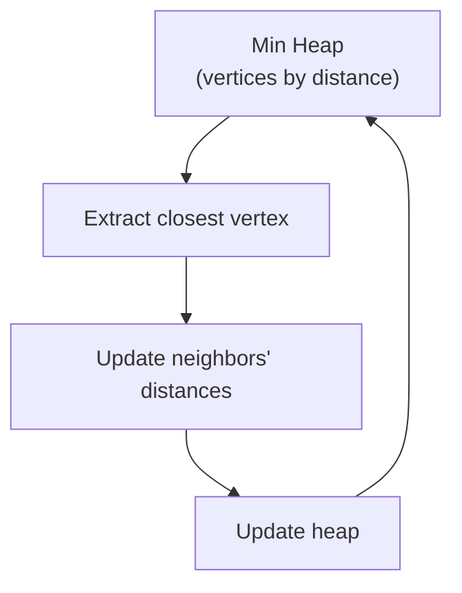
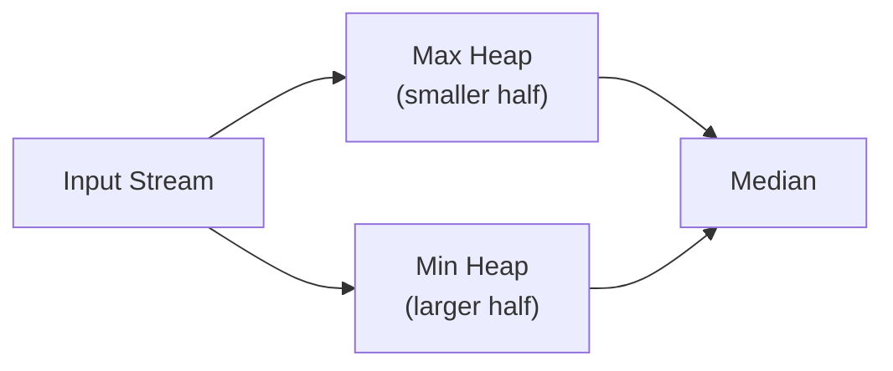

# Real-World Applications: Min Heaps in Action 🚀

> [!NOTE]
> In this lesson, we'll explore how Min Heaps are used to solve real-world problems across various domains of computer science.

## Why Min Heaps Matter 💡

Now that you understand how Min Heaps work, let's see why they're so valuable in practice. Min Heaps aren't just interesting data structures—they're powerful tools that solve important problems with optimal efficiency.

## Priority Queues: The Classic Application 🎖️

The most common application of Min Heaps is implementing **priority queues**. A priority queue is an abstract data type where:
- Each element has a "priority" value
- Elements with higher priority are served before elements with lower priority
- Min Heaps are perfect for this because they always keep the highest priority (lowest value) element at the root

### Real-World Priority Queue Examples:

1. **Operating Systems**: Process scheduling based on priority
2. **Networking**: Packet routing based on priority flags
3. **Print Queue Management**: Critical documents printed first
4. **Hospital Emergency Rooms**: Treating patients based on severity

### Simple Priority Queue Implementation:

```javascript
class PriorityQueue {
  constructor() {
    this.minHeap = new MinHeap();
  }
  
  // Add an element with a priority
  enqueue(element, priority) {
    this.minHeap.insert({ element, priority });
  }
  
  // Remove and return the highest priority element
  dequeue() {
    const highest = this.minHeap.extractMin();
    return highest ? highest.element : null;
  }
  
  // Look at the highest priority element without removing
  peek() {
    const highest = this.minHeap.peek();
    return highest ? highest.element : null;
  }
  
  isEmpty() {
    return this.minHeap.size() === 0;
  }
}
```

## Dijkstra's Shortest Path Algorithm 🗺️

Min Heaps are crucial for efficient implementations of Dijkstra's algorithm, which finds the shortest path in a weighted graph:

1. Maintain a Min Heap of vertices, ordered by their distance from the starting vertex
2. Extract the closest vertex (always at the root of the heap)
3. Update distances to its neighbors and adjust their positions in the heap
4. Repeat until all vertices are processed



> [!TIP]
> Without a Min Heap, Dijkstra's algorithm would be O(V²) for V vertices. With a Min Heap, it improves to O((V+E) log V) for E edges, which is much faster for sparse graphs!

## Heap Sort: Elegant and Efficient Sorting 📊

Heap Sort is a comparison-based sorting algorithm that uses a Min Heap (or Max Heap):

1. Build a Min Heap from the input array (O(n))
2. Repeatedly extract the minimum element and place it at the end of the sorted portion (n extractions, each O(log n))
3. Total time complexity: O(n log n)

```javascript
function heapSort(array) {
  const minHeap = new MinHeap();
  
  // Build heap from array
  minHeap.buildMinHeap(array);
  
  const sorted = [];
  while (minHeap.size() > 0) {
    sorted.push(minHeap.extractMin());
  }
  
  return sorted;
}
```

> [!WARNING]
> While Heap Sort has optimal O(n log n) time complexity, its cache performance is often worse than algorithms like Quick Sort, making it somewhat less practical despite its elegant theory.

## Median Maintenance: Finding Running Medians 📈

A fascinating application of heaps is finding the median of a stream of numbers in O(log n) time per number:

1. Maintain two heaps:
   - A Max Heap for the smaller half of the numbers
   - A Min Heap for the larger half of the numbers
2. Keep the heaps balanced (or nearly balanced)
3. The median is either the top of one heap or the average of both tops



```javascript
class MedianFinder {
  constructor() {
    this.maxHeap = new MaxHeap(); // For smaller half
    this.minHeap = new MinHeap(); // For larger half
  }
  
  addNum(num) {
    // Add to the appropriate heap
    if (this.maxHeap.size() === 0 || num < this.maxHeap.peek()) {
      this.maxHeap.insert(num);
    } else {
      this.minHeap.insert(num);
    }
    
    // Balance the heaps
    if (this.maxHeap.size() > this.minHeap.size() + 1) {
      this.minHeap.insert(this.maxHeap.extractMax());
    } else if (this.minHeap.size() > this.maxHeap.size()) {
      this.maxHeap.insert(this.minHeap.extractMin());
    }
  }
  
  findMedian() {
    if (this.maxHeap.size() > this.minHeap.size()) {
      return this.maxHeap.peek();
    } else {
      return (this.maxHeap.peek() + this.minHeap.peek()) / 2;
    }
  }
}
```

## K-way Merging: Combining Sorted Lists 🔄

When merging k sorted lists, a Min Heap helps select the smallest element efficiently:

1. Initialize a Min Heap with the first element from each list
2. Repeatedly extract the minimum element and add the next element from its list
3. Time complexity: O(n log k) for n total elements across k lists

This is used in:
- External sorting algorithms
- Merging sorted log files
- Database query optimization

## Event Simulation: Modeling Real-Time Systems ⏰

Min Heaps can model event queues in discrete event simulations:
- Events are scheduled with a timestamp (priority)
- The simulation always processes the earliest event next
- New events are inserted with their appropriate future times

Applications include:
- Network simulators
- Game engines
- Manufacturing process simulation
- Traffic flow analysis

## Exercise: Design a Task Scheduler 📝

Design a simple task scheduler that executes tasks based on their priority levels.

<details>
<summary>Solution</summary>

```javascript
class Task {
  constructor(id, name, priority) {
    this.id = id;
    this.name = name;
    this.priority = priority; // Lower number = higher priority
  }
}

class TaskScheduler {
  constructor() {
    this.priorityQueue = new PriorityQueue();
  }
  
  addTask(id, name, priority) {
    const task = new Task(id, name, priority);
    this.priorityQueue.enqueue(task, priority);
    console.log(`Task ${id}: "${name}" added with priority ${priority}`);
  }
  
  executeNextTask() {
    if (this.priorityQueue.isEmpty()) {
      console.log("No tasks in the queue");
      return null;
    }
    
    const task = this.priorityQueue.dequeue();
    console.log(`Executing Task ${task.id}: "${task.name}" (priority: ${task.priority})`);
    return task;
  }
  
  peekNextTask() {
    if (this.priorityQueue.isEmpty()) {
      console.log("No tasks in the queue");
      return null;
    }
    
    const task = this.priorityQueue.peek();
    console.log(`Next task is ${task.id}: "${task.name}" (priority: ${task.priority})`);
    return task;
  }
  
  get taskCount() {
    return this.priorityQueue.minHeap.size();
  }
}
```

Usage example:
```javascript
const scheduler = new TaskScheduler();
scheduler.addTask(1, "Critical security update", 1);
scheduler.addTask(2, "Process payment", 2);
scheduler.addTask(3, "Generate report", 3);
scheduler.addTask(4, "Emergency fix", 1);

scheduler.peekNextTask(); // Should show either task 1 or 4
scheduler.executeNextTask(); // Should execute either task 1 or 4
scheduler.executeNextTask(); // Should execute the other priority 1 task
```
</details>

## Conclusion: Versatility in Simplicity 🌈

Min Heaps showcase how a relatively simple data structure can power a wide range of applications across computer science. Their elegant balance of operations makes them a fundamental tool in an algorithm designer's toolkit.

In the next lesson, we'll wrap up by discussing common variations of heaps and explore performance considerations when implementing Min Heaps in different contexts. 