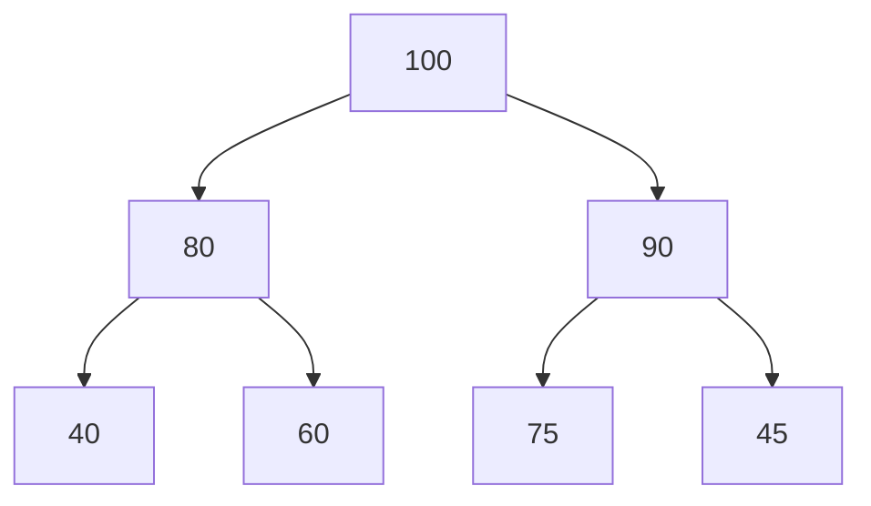
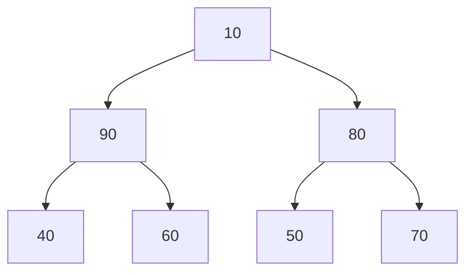
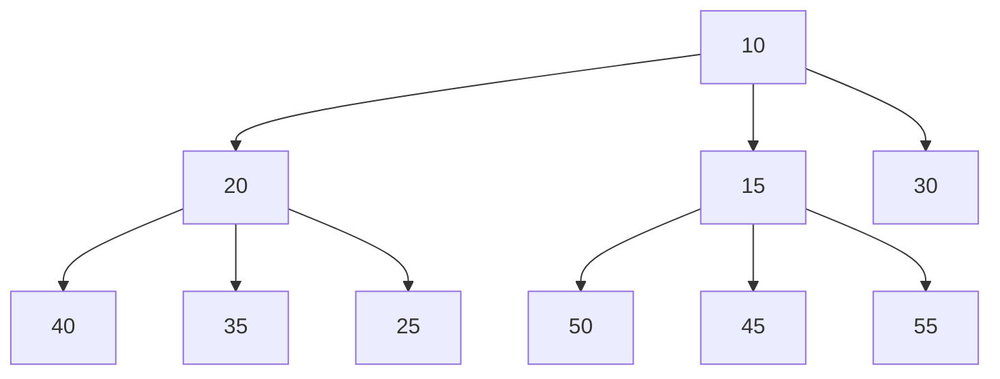

# Beyond Min Heap: Variations and Optimization 🚀

> [!NOTE]
> In this lesson, we'll explore different types of heaps and how to optimize heap implementations for different scenarios.

## The Heap Family Tree 🌳

The Min Heap we've studied is just one member of a larger family of heap data structures. Each variation offers different trade-offs between operations and use cases:

## Max Heap: The Opposite Twin 🔄

A **Max Heap** is the opposite of a Min Heap:
- The parent is always **greater than or equal to** its children
- The maximum element is always at the root
- All operations are similar to Min Heap but with reversed comparisons



> [!TIP]
> To convert a Min Heap into a Max Heap, you only need to invert the comparison operators in your code!

## Min-Max Heap: Best of Both Worlds 🔍

A **Min-Max Heap** efficiently supports both minimum and maximum operations:
- Elements at even levels follow min-heap order (root is minimum)
- Elements at odd levels follow max-heap order
- Allows O(1) access to both minimum and maximum elements
- Insertion and deletion remain O(log n)



In this example, 10 is the minimum (at level 0) and 90 is the maximum (at level 1).

## Binomial Heap: Efficient Merging 🔗

A **Binomial Heap** consists of a collection of binomial trees:
- A key operation is **merging** two heaps in O(log n) time
- Insert, find-min, and delete-min remain O(log n)
- More complex structure than binary heaps
- Particularly useful when merging heaps is common

## Fibonacci Heap: Theoretical Efficiency 🧪

The **Fibonacci Heap** achieves theoretical efficiency for some operations:
- O(1) amortized time for insert, find-min, and decrease-key
- O(log n) amortized time for extract-min
- More complex to implement than binary heaps
- Often used in theoretical algorithm analysis

## D-ary Heap: Generalized Structure 🔢

A **D-ary Heap** generalizes binary heaps to have d children per node:
- Reduces the height of the tree to log_d(n)
- Speeds up decrease-key operations (useful for Dijkstra's algorithm)
- Slows down extract-min operations
- Allows tuning the heap for specific use cases



## Leftist Heap and Skew Heap: Self-Adjusting Structures 🔄

These self-adjusting heaps maintain balance through specialized rules:
- **Leftist Heap**: Maintains a "shortest path to an external node" property
- **Skew Heap**: A self-adjusting version without explicit balance information
- Both support efficient merging operations

## Optimizing Heap Implementations 🔧

Let's explore some practical optimizations for heap implementations:

### 1. Memory Layout Optimization 💾

Use a flat array to improve cache locality:
```javascript
// Instead of node objects
class OptimizedMinHeap {
  constructor() {
    this.heap = []; // Single flat array - better cache performance
  }
}
```

### 2. Reducing Swaps with Hole Technique ⚡

During sinkDown, instead of doing multiple swaps, track a "hole" and fill it at the end:

```javascript
sinkDownOptimized(index) {
  const temp = this.heap[index]; // Save the value
  const heapSize = this.heap.length;
  
  // Find where the hole should go
  let hole = index;
  
  while (true) {
    let smallest = hole;
    const leftIdx = 2 * hole + 1;
    const rightIdx = 2 * hole + 2;
    
    if (leftIdx < heapSize && this.heap[leftIdx] < (smallest === hole ? temp : this.heap[smallest])) {
      smallest = leftIdx;
    }
    
    if (rightIdx < heapSize && this.heap[rightIdx] < (smallest === hole ? temp : this.heap[smallest])) {
      smallest = rightIdx;
    }
    
    if (smallest === hole) break;
    
    // Move the value up, but don't do a full swap
    this.heap[hole] = this.heap[smallest];
    hole = smallest;
  }
  
  // Fill the final hole
  this.heap[hole] = temp;
}
```

### 3. Custom Comparison Functions 🔄

Allow for flexible heap ordering by using a comparator function:

```javascript
class FlexibleMinHeap {
  constructor(comparator = (a, b) => a - b) {
    this.heap = [];
    this.compare = comparator; // Custom comparison function
  }
  
  // Use this.compare(a, b) < 0 instead of a < b
}
```

This allows creating Min Heaps for objects:

```javascript
const taskHeap = new FlexibleMinHeap((a, b) => a.priority - b.priority);
taskHeap.insert({ task: "Important task", priority: 1 });
taskHeap.insert({ task: "Regular task", priority: 3 });
```

### 4. Bounded Heaps 📏

For applications with a known maximum size, use a bounded heap to avoid resizing:

```javascript
class BoundedMinHeap {
  constructor(capacity) {
    this.heap = new Array(capacity);
    this.capacity = capacity;
    this.size = 0;
  }
  
  insert(value) {
    if (this.size >= this.capacity) {
      // Either reject or replace the largest element if appropriate
      if (value >= this.heap[this.size - 1]) return false;
    }
    // Regular insertion logic follows...
  }
}
```

### 5. Index Mapping for Decrease-Key 🔎

For Dijkstra's algorithm and similar applications, maintain a map to find elements quickly:

```javascript
class IndexedMinHeap {
  constructor() {
    this.heap = [];
    this.indexMap = new Map(); // Maps element ID to its index in the heap
  }
  
  decreaseKey(id, newValue) {
    if (!this.indexMap.has(id)) return false;
    
    const index = this.indexMap.get(id);
    if (this.heap[index].value <= newValue) return false; // Not a decrease
    
    this.heap[index].value = newValue;
    this.bubbleUp(index);
    return true;
  }
}
```

## Performance Considerations 📊

When implementing heaps, consider these performance factors:

| Operation | Binary Heap | D-ary Heap (d>2) | Fibonacci Heap |
| --------- | ----------- | ---------------- | -------------- |
| Find Min | O(1) | O(1) | O(1) |
| Extract Min | O(log n) | O(d log_d n) | O(log n) amortized |
| Insert | O(log n) | O(log_d n) | O(1) amortized |
| Decrease Key | O(log n) | O(log_d n) | O(1) amortized |
| Merge | O(n) | O(n) | O(1) amortized |
| Build Heap | O(n) | O(n) | O(n) |

> [!WARNING]
> More complex heap structures like Fibonacci Heaps have excellent theoretical performance but often suffer from high constant factors and implementation complexity, making simpler heaps better in practice.

## Language-Specific Optimizations 💻

Different programming languages offer different optimization opportunities:

- **JavaScript**: Use typed arrays for numeric heaps (Float64Array, Int32Array)
- **Python**: Use the built-in `heapq` module for production code
- **Java**: Consider `PriorityQueue` from the standard library
- **C++**: Use `std::priority_queue` with appropriate comparators

## Exercise: Implementing a Top-K Problem 🧩

The "Top-K" problem involves finding the K largest or smallest elements in a collection. Design a solution using a bounded heap:

<details>
<summary>Solution</summary>

```javascript
function findTopKLargest(nums, k) {
  // Use a min heap of size k to track the k largest elements
  const minHeap = new MinHeap();
  
  for (const num of nums) {
    if (minHeap.size() < k) {
      // Fill the heap until we have k elements
      minHeap.insert(num);
    } else if (num > minHeap.peek()) {
      // If current number is larger than the smallest in our heap,
      // remove the smallest and add the current number
      minHeap.extractMin();
      minHeap.insert(num);
    }
  }
  
  // Extract all elements in ascending order
  const result = [];
  while (minHeap.size() > 0) {
    result.push(minHeap.extractMin());
  }
  
  // Reverse to get descending order (largest first)
  return result.reverse();
}
```

For top-K smallest, we would use a max heap instead.
</details>

## Conclusion: Choosing the Right Heap 🎯

The "best" heap structure depends on your specific requirements:
- **Regular priority queue**: Standard binary Min/Max Heap
- **Need both min and max**: Min-Max Heap
- **Frequent merging**: Binomial or Skew Heap
- **Theoretical guarantees**: Fibonacci Heap
- **Custom priority**: Heap with comparator function

By understanding these variations and optimizations, you can select and implement the most efficient heap for your particular application. 