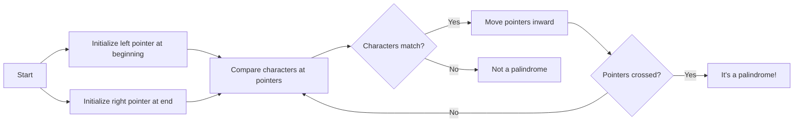
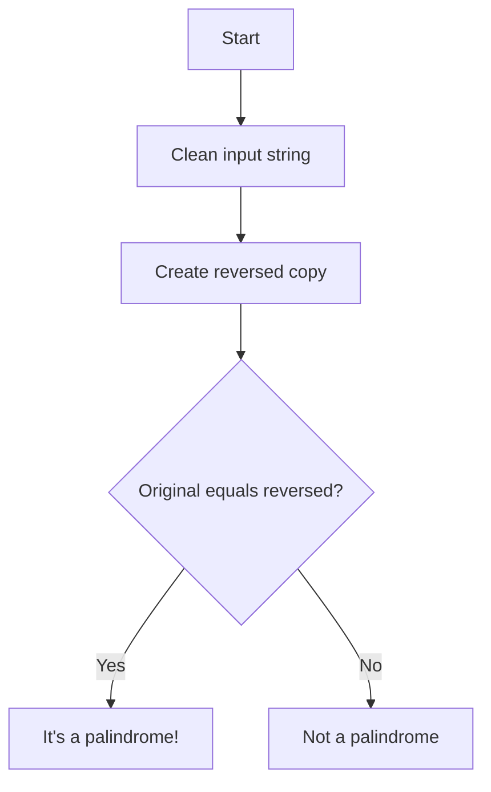

# 🧩 Understanding Our Approach

Before diving into code, let's understand the key approaches we can take to solve the palindrome check problem.

## Comparing Characters: Two Fundamental Approaches 🔄

There are two primary strategies for checking palindromes:

### 1. Two-Pointer Technique 👉👈

This approach uses two pointers that start at opposite ends of the string and move toward each other:



> [!TIP]
> The two-pointer approach is memory efficient as it requires O(1) extra space!

### 2. String Reversal Technique 🔄

This approach creates a reversed copy of the string and compares it with the original:



> [!WARNING]
> While simpler to code, this approach uses O(n) extra space to store the reversed string.

## Preprocessing: A Critical First Step ✨

Before we can check for palindromes, we need to preprocess the string:

1. Convert all characters to the same case (lowercase or uppercase)
2. Remove or ignore all non-alphanumeric characters (spaces, punctuation, etc.)

This preprocessing ensures we only compare the relevant characters.

```javascript
// Example preprocessing in JavaScript
const filtered = s.toLowerCase().replace(/[^a-z0-9]/g, '');
```

## Comparing the Approaches 📊

| Approach | Time Complexity | Space Complexity | Advantages | Disadvantages |
|----------|-----------------|------------------|------------|---------------|
| Two-Pointer | O(n) | O(1) | Memory efficient | Slightly more complex |
| String Reversal | O(n) | O(n) | Simpler to implement | Uses more memory |

## Think About It 🧠

> [!TIP]
> Which approach would you choose? Is memory efficiency or code simplicity more important for your specific application?

<details>
<summary>Food for thought</summary>

The two-pointer approach is generally preferred in interviews and production code due to its memory efficiency. However, for quick prototyping or when memory isn't a concern, the string reversal approach may be more readable.
</details>

In the next lesson, we'll dive into the preprocessing step and learn how to clean our input string! 