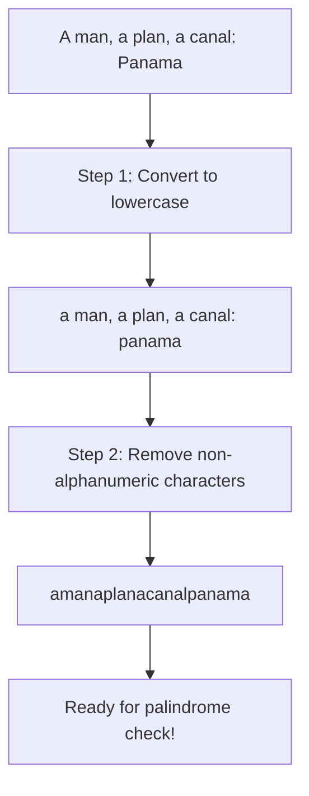

# 🧹 Preprocessing: Clean Before You Check

Before we can check if a string is a palindrome, we need to prepare our input. Let's explore how to properly preprocess strings.

## Why Preprocess? 🤔

According to our problem definition, we need to:
- Ignore letter cases (uppercase/lowercase)
- Ignore non-alphanumeric characters (spaces, punctuation, etc.)

Preprocessing helps us focus on the relevant characters for our palindrome check.

## Preprocessing Steps 📝

### Step 1: Convert to Lowercase (or Uppercase) ⬇️

First, we convert all characters to the same case to ensure case-insensitive comparison.

```javascript
// JavaScript
const lowerCaseString = inputString.toLowerCase();

// Python
lower_case_string = input_string.lower()
```

> [!NOTE]
> You could also convert to uppercase with `.toUpperCase()` or `.upper()` — the important thing is consistency!

### Step 2: Remove Non-Alphanumeric Characters 🚫

Next, we remove or filter out any characters that aren't letters or numbers.

```javascript
// JavaScript: Using regular expression
const filteredString = lowerCaseString.replace(/[^a-z0-9]/g, '');

// Python: Using a filter function
filtered_string = ''.join(char for char in lower_case_string if char.isalnum())
```

## Visual Example of Preprocessing ✨

Let's walk through an example:

Input: `"A man, a plan, a canal: Panama"`

1. Convert to lowercase:
   `"a man, a plan, a canal: panama"`

2. Remove non-alphanumeric characters:
   `"amanaplanacanalpanama"`

Now we have a clean string that we can check for palindrome properties!



## One-Step Preprocessing in Different Languages 💻

Here's how to preprocess in one step across different languages:

### JavaScript
```javascript
const filtered = s.toLowerCase().replace(/[^a-z0-9]/g, '');
```

### Python
```python
filtered = ''.join(char.lower() for char in s if char.isalnum())
```

### Java
```java
String filtered = s.toLowerCase().replaceAll("[^a-z0-9]", "");
```

### Go
```go
import (
    "strings"
    "unicode"
)

filtered := strings.Map(func(r rune) rune {
    if unicode.IsLetter(r) || unicode.IsDigit(r) {
        return unicode.ToLower(r)
    }
    return -1  // drop the character
}, s)
```

## Common Pitfalls to Avoid ⚠️

> [!WARNING]
> Watch out for these common mistakes:

1. **Forgetting to handle case sensitivity**: Always convert to a consistent case.
2. **Using incorrect regex patterns**: Test your pattern with edge cases.
3. **Assuming all spaces need to be removed**: Remember non-alphanumeric includes more than just spaces.
4. **Unicode characters**: Some languages require special handling for international characters.

## Try It Yourself 🧠

What would the preprocessed string look like for these inputs?

1. `"race car"`
2. `"Was it a car or a cat I saw?"`
3. `"No 'x' in Nixon"`

<details>
<summary>Click to see answers</summary>

1. `"racecar"`
2. `"wasitacaroracatisaw"`
3. `"noxinnixon"`
</details>

In the next lesson, we'll implement the two-pointer approach using our preprocessed string! 