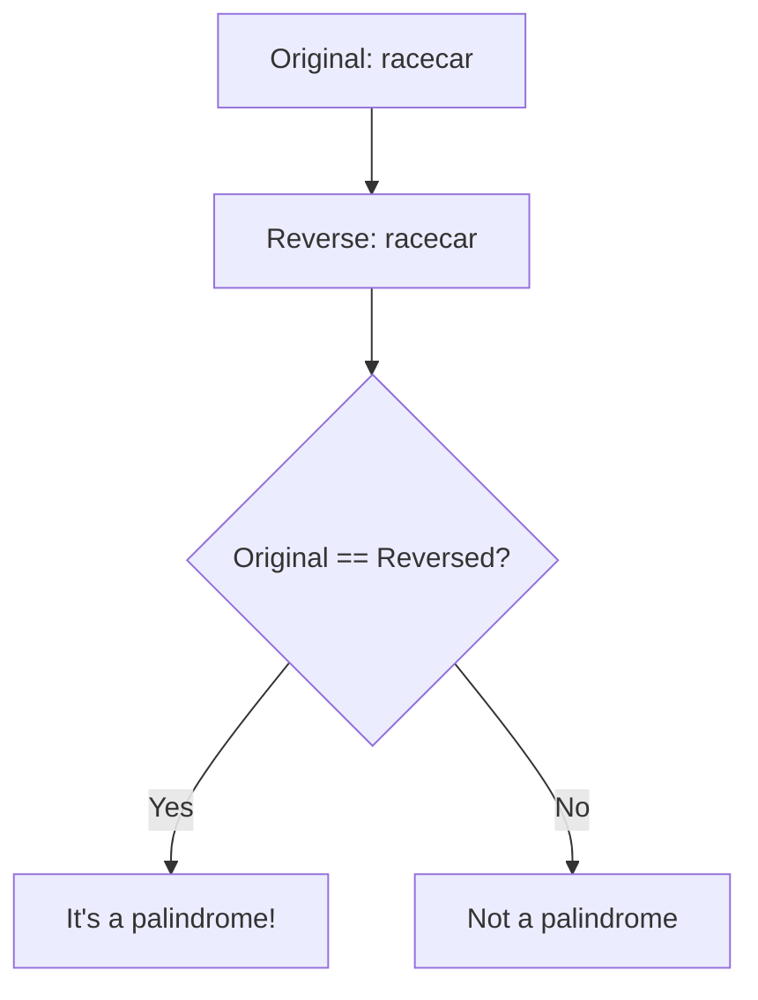
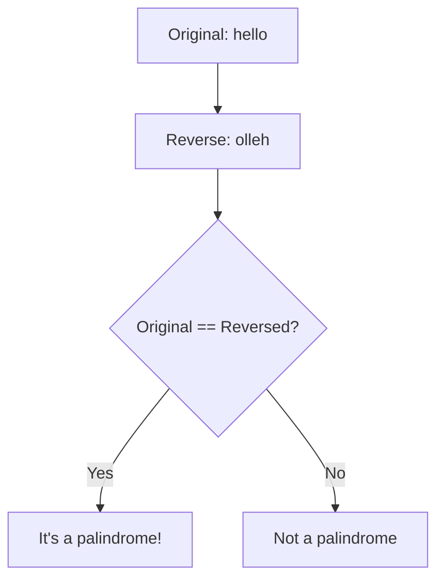

# 🔄 The String Reversal Approach

While the two-pointer approach is memory-efficient, there's another intuitive method for checking palindromes: string reversal. This approach is simpler to understand and implement, making it a good alternative in many situations.

## How Does the String Reversal Approach Work? 🧐

The string reversal method follows a straightforward logic:

1. Preprocess the string (lowercase and remove non-alphanumeric characters)
2. Create a reversed copy of the processed string
3. Compare the original processed string with its reversed version
4. If they're identical, the string is a palindrome; otherwise, it's not

## Visual Illustration 🎬

Let's see how this works with the preprocessed string `"racecar"`:



And with a non-palindrome like `"hello"`:



## Code Implementation 💻

Here's how to implement the string reversal approach:

### JavaScript
```javascript
function isPalindrome(s) {
  // Preprocess the string
  const filtered = s.toLowerCase().replace(/[^a-z0-9]/g, '');
  
  // Create a reversed version
  const reversed = filtered.split('').reverse().join('');
  
  // Compare original with reversed
  return filtered === reversed;
}
```

### Python
```python
def is_palindrome(s):
    # Preprocess the string
    filtered = ''.join(char.lower() for char in s if char.isalnum())
    
    # Create a reversed version and compare
    return filtered == filtered[::-1]  # Python's slice syntax for reversal
```

## Understanding How String Reversal Works 🔍

Let's break down the steps:

1. **Preprocessing** 🧹
   ```javascript
   const filtered = s.toLowerCase().replace(/[^a-z0-9]/g, '');
   ```
   Just like in the two-pointer approach, we prepare our string by converting to lowercase and removing non-alphanumeric characters.

2. **String Reversal** 🔄
   ```javascript
   // JavaScript method to reverse a string
   const reversed = filtered.split('').reverse().join('');
   
   // Python has a simpler method
   reversed_string = filtered[::-1]
   ```
   We create a reversed copy of our preprocessed string. In JavaScript, we need to convert to an array first, while Python has a more direct syntax.

3. **Direct Comparison** ⚖️
   ```javascript
   return filtered === reversed;
   ```
   We simply check if the original matches its reversed version.

## Language-Specific Reversal Techniques 🌐

Different programming languages have different ways to reverse a string:

### JavaScript
```javascript
const reversed = filtered.split('').reverse().join('');
```

### Python
```python
reversed_string = filtered[::-1]  # Using slice notation
# OR
reversed_string = ''.join(reversed(filtered))  # Using reversed() function
```

### Java
```java
StringBuilder sb = new StringBuilder(filtered);
String reversed = sb.reverse().toString();
```

### Go
```go
func reverse(s string) string {
    runes := []rune(s)
    for i, j := 0, len(runes)-1; i < j; i, j = i+1, j-1 {
        runes[i], runes[j] = runes[j], runes[i]
    }
    return string(runes)
}
```

## Pros and Cons Compared to Two-Pointer Approach ⚖️

| Aspect | String Reversal | Two-Pointer |
|--------|----------------|-------------|
| **Readability** | ✅ Very simple and clear | ⚠️ Slightly more complex |
| **Memory Usage** | ❌ O(n) extra space | ✅ O(1) extra space |
| **Performance** | ⚠️ Requires creating a new string | ✅ In-place comparison |
| **Implementation Ease** | ✅ Often just one line of code | ⚠️ Requires a loop structure |

> [!TIP]
> Use string reversal when code clarity is more important than memory optimization. Use the two-pointer approach in memory-constrained environments or when working with very large strings.

## When to Choose String Reversal 📊

The string reversal approach shines in these scenarios:

1. **Quick prototyping** - When you need to implement a solution quickly
2. **Educational contexts** - When teaching the concept of palindromes
3. **Code golf challenges** - When brevity is valued
4. **Small input sizes** - When memory isn't a major concern
5. **Readability priority** - When code clarity trumps optimization

## Try It Yourself 🧠

Trace through these examples using the string reversal approach:

1. `"kayak"` (after preprocessing)
2. `"algorithm"` (after preprocessing)

<details>
<summary>Solution for "kayak"</summary>

- Original: "kayak"
- Reversed: "kayak"
- Comparison: "kayak" == "kayak" ✅
- Result: true (it's a palindrome)
</details>

<details>
<summary>Solution for "algorithm"</summary>

- Original: "algorithm"
- Reversed: "mhtirogla"
- Comparison: "algorithm" != "mhtirogla" ❌
- Result: false (not a palindrome)
</details>

In the next lesson, we'll explore a recursive approach to palindrome checking! 