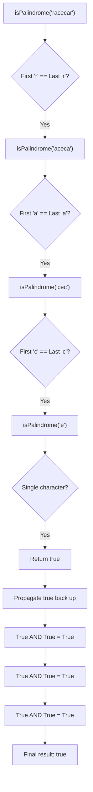

# 🔄 The Recursive Approach

After exploring the iterative methods, let's dive into an elegant alternative: the recursive approach. Recursion allows us to express the palindrome check in a way that closely mirrors its mathematical definition.

## The Recursive Logic 💭

A string is a palindrome if:
1. It's empty or has only one character (base case), OR
2. Its first and last characters are the same AND the substring without these characters is also a palindrome (recursive case)

This naturally leads to a recursive solution!

## Visual Representation 🎬

Let's visualize how recursion works with the string "racecar":



## Code Implementation 💻

Here's how to implement the recursive approach:

### JavaScript
```javascript
function isPalindrome(s) {
  // Preprocess the string
  const filtered = s.toLowerCase().replace(/[^a-z0-9]/g, '');
  
  // Helper function for recursion
  function checkPalindrome(left, right) {
    // Base case: empty string or single character
    if (left >= right) {
      return true;
    }
    
    // Check if current characters match
    if (filtered[left] !== filtered[right]) {
      return false;
    }
    
    // Recursive case: check the substring
    return checkPalindrome(left + 1, right - 1);
  }
  
  // Start the recursion
  return checkPalindrome(0, filtered.length - 1);
}
```

### Python
```python
def is_palindrome(s):
    # Preprocess the string
    filtered = ''.join(char.lower() for char in s if char.isalnum())
    
    # Helper function for recursion
    def check_palindrome(left, right):
        # Base case: empty string or single character
        if left >= right:
            return True
        
        # Check if current characters match
        if filtered[left] != filtered[right]:
            return False
        
        # Recursive case: check the substring
        return check_palindrome(left + 1, right - 1)
    
    # Start the recursion
    return check_palindrome(0, len(filtered) - 1)
```

## Understanding the Recursive Flow 🔍

Let's break down the algorithm:

1. **Preprocessing** 🧹
   Just like in previous approaches, we convert to lowercase and remove non-alphanumeric characters.

2. **Base Case** ⚡
   ```javascript
   if (left >= right) {
     return true;
   }
   ```
   The recursion stops when:
   - We've checked all characters (pointers crossed)
   - We're down to a single character or empty string

3. **Character Comparison** ⚖️
   ```javascript
   if (filtered[left] !== filtered[right]) {
     return false;
   }
   ```
   We check if the current outer characters match.

4. **Recursive Step** 🔄
   ```javascript
   return checkPalindrome(left + 1, right - 1);
   ```
   We recursively check the substring without the first and last characters.

## Recursive Call Stack Example 📚

Let's trace the recursive calls for a short example, "radar":

```
checkPalindrome(0, 4) - Compare 'r' and 'r'
  └── checkPalindrome(1, 3) - Compare 'a' and 'a'
       └── checkPalindrome(2, 2) - Compare 'd' with itself
            └── Base case: return true
       └── Returns true
  └── Returns true
Returns true
```

## Pros and Cons of the Recursive Approach ⚖️

| Advantages | Disadvantages |
|------------|---------------|
| ✅ Elegant and concise | ❌ Stack overflow risk for very long strings |
| ✅ Closely matches the mathematical definition | ❌ Function call overhead |
| ✅ Often used in academic settings | ❌ Generally less efficient than iterative solutions |

> [!WARNING]
> Recursion uses the call stack, which can lead to stack overflow errors for very long strings. Most programming languages have a limit on the depth of recursive calls.

## Efficiency Analysis 📊

- **Time Complexity**: O(n) - We still need to check each character once.
- **Space Complexity**: O(n) - The recursion stack can grow to n/2 calls deep.

> [!NOTE]
> Some languages support tail call optimization, which can reduce the space complexity, but this isn't universally available.

## When to Use Recursion? 🤔

The recursive approach is ideal when:

1. **Educational Contexts**: Teaching the concept of palindromes and recursion
2. **Code Readability**: When the mathematical elegance is valued
3. **Interview Settings**: Demonstrating knowledge of multiple approaches
4. **Short Strings**: When stack overflow isn't a concern

## Try It Yourself 🧠

Trace through these recursive calls for "level":

<details>
<summary>Recursive Trace for "level"</summary>

```
checkPalindrome(0, 4) - Compare 'l' and 'l'
  └── checkPalindrome(1, 3) - Compare 'e' and 'e'
       └── checkPalindrome(2, 2) - Compare 'v' with itself
            └── Base case: return true
       └── 'e' == 'e' AND true = true
  └── 'l' == 'l' AND true = true
Returns true
```
</details>

## Alternative Recursive Formulation 🔄

Another way to express the recursive solution is by using string slicing:

```python
def is_palindrome_recursive(s):
    # Preprocess
    s = ''.join(char.lower() for char in s if char.isalnum())
    
    # Base case
    if len(s) <= 1:
        return True
    
    # Check first and last characters
    if s[0] != s[-1]:
        return False
    
    # Recursive case: check the substring
    return is_palindrome_recursive(s[1:-1])
```

This approach is more concise but less efficient as it creates new string objects with each recursive call.

In the next lesson, we'll analyze and compare the performance of all the approaches we've learned! 