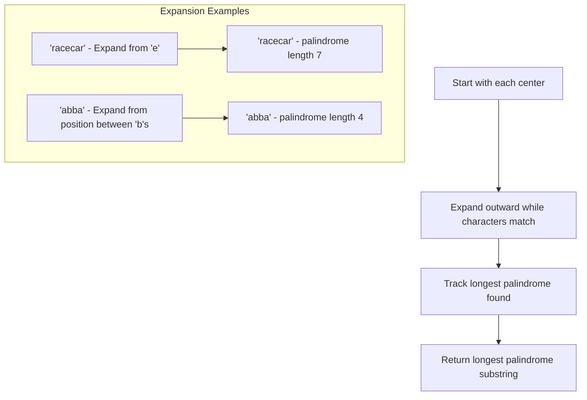

# 🔀 Palindrome Variations and Related Problems

So far, we've focused on the classic palindrome check. But there's a whole world of palindrome-related problems that build on this fundamental concept. Let's explore some variations and see how our knowledge can be extended.

## Almost-Palindromes: One Edit Away 🔄

An "almost-palindrome" is a string that can become a palindrome by removing, changing, or adding just one character.

### Example Problem: Valid Palindrome II

Given a string s, return true if the string can become a palindrome by removing **at most one character**.

```
Input: "abca"
Output: true
Explanation: By removing 'c', the string becomes "aba", which is a palindrome.
```

### Approach:

```javascript
function validPalindrome(s) {
  // Helper function to check if substring is a palindrome
  function isPalindrome(str, left, right) {
    while (left < right) {
      if (str[left] !== str[right]) return false;
      left++;
      right--;
    }
    return true;
  }
  
  // Main function logic
  let left = 0;
  let right = s.length - 1;
  
  while (left < right) {
    if (s[left] !== s[right]) {
      // Try removing character at left or right
      return isPalindrome(s, left + 1, right) || 
             isPalindrome(s, left, right - 1);
    }
    left++;
    right--;
  }
  
  return true;
}
```

> [!TIP]
> The key insight here is that when we encounter a mismatch, we have two options: skip the character on the left or skip the character on the right.

## Longest Palindromic Substring 📏

Finding the longest substring that forms a palindrome is a classic dynamic programming problem.

### Example Problem: Longest Palindromic Substring

Given a string s, return the longest palindromic substring in s.

```
Input: "babad"
Output: "bab" or "aba" (both are valid)
```

### Approach: Expand Around Center

```javascript
function longestPalindrome(s) {
  if (!s || s.length < 1) return "";
  
  let start = 0, end = 0;
  
  for (let i = 0; i < s.length; i++) {
    // Check for odd-length palindromes (like "racecar")
    let len1 = expandAroundCenter(s, i, i);
    // Check for even-length palindromes (like "abba")
    let len2 = expandAroundCenter(s, i, i + 1);
    let len = Math.max(len1, len2);
    
    if (len > end - start) {
      start = i - Math.floor((len - 1) / 2);
      end = i + Math.floor(len / 2);
    }
  }
  
  return s.substring(start, end + 1);
}

function expandAroundCenter(s, left, right) {
  while (left >= 0 && right < s.length && s[left] === s[right]) {
    left--;
    right++;
  }
  return right - left - 1;
}
```



## Palindromic Substrings Count 🔢

Counting all palindromic substrings is another variation.

### Example Problem: Count Palindromic Substrings

Given a string s, count the number of palindromic substrings in it.

```
Input: "abc"
Output: 3
Explanation: Three palindromic strings: "a", "b", "c"

Input: "aaa"
Output: 6
Explanation: Six palindromic strings: "a", "a", "a", "aa", "aa", "aaa"
```

### Approach:

```javascript
function countSubstrings(s) {
  let count = 0;
  
  // Consider each character as a potential center
  for (let i = 0; i < s.length; i++) {
    // Check odd-length palindromes
    expandAndCount(s, i, i);
    // Check even-length palindromes
    expandAndCount(s, i, i + 1);
  }
  
  function expandAndCount(s, left, right) {
    while (left >= 0 && right < s.length && s[left] === s[right]) {
      count++; // Found a palindrome
      left--;
      right++;
    }
  }
  
  return count;
}
```

## Palindrome Partitioning 🧩

Palindrome partitioning involves dividing a string into palindromic substrings.

### Example Problem: Palindrome Partitioning

Given a string s, partition s such that every substring of the partition is a palindrome. Return all possible palindrome partitioning of s.

```
Input: "aab"
Output: [["a","a","b"], ["aa","b"]]
```

### Approach: Backtracking

```javascript
function partition(s) {
  const result = [];
  
  function backtrack(start, current) {
    if (start >= s.length) {
      result.push([...current]);
      return;
    }
    
    for (let end = start; end < s.length; end++) {
      if (isPalindrome(s, start, end)) {
        current.push(s.substring(start, end + 1));
        backtrack(end + 1, current);
        current.pop(); // Backtrack
      }
    }
  }
  
  function isPalindrome(str, start, end) {
    while (start < end) {
      if (str[start] !== str[end]) return false;
      start++;
      end--;
    }
    return true;
  }
  
  backtrack(0, []);
  return result;
}
```

## Palindrome Pairs 👥

Finding pairs of words that, when concatenated, form palindromes.

### Example Problem: Palindrome Pairs

Given a list of unique words, return all pairs of distinct indices `(i, j)` in the list such that the concatenation of the two words `words[i] + words[j]` is a palindrome.

```
Input: ["abcd","dcba","lls","s","sssll"]
Output: [[0,1],[1,0],[3,2],[2,4]]
Explanation: 
"abcd" + "dcba" = "abcddcba" (palindrome)
"dcba" + "abcd" = "dcbaabcd" (palindrome)
"s" + "lls" = "slls" (palindrome)
"sssll" + "s" = "sssllls" (palindrome)
```

### Approach: Trie Data Structure or Hash Map

This is a more complex problem that often uses a trie data structure or hash map for efficient lookup.

## Palindromic Linked List 📋

Checking if a linked list is a palindrome.

### Example Problem: Palindrome Linked List

Given the head of a singly linked list, determine if it's a palindrome.

```
Input: 1->2->2->1
Output: true
```

### Approach: Reverse Half List

```javascript
function isPalindrome(head) {
  if (!head || !head.next) return true;
  
  // Find the middle of the linked list
  let slow = head;
  let fast = head;
  
  while (fast && fast.next) {
    slow = slow.next;
    fast = fast.next.next;
  }
  
  // Reverse the second half
  let prev = null;
  let current = slow;
  while (current) {
    let next = current.next;
    current.next = prev;
    prev = current;
    current = next;
  }
  
  // Compare first and second half
  let left = head;
  let right = prev;
  
  while (right) {
    if (left.val !== right.val) return false;
    left = left.next;
    right = right.next;
  }
  
  return true;
}
```

## Real-World Applications 🌍

Palindrome variations have numerous applications:

1. **Bioinformatics**: DNA sequences often contain palindromic structures that are important for protein binding.

2. **Text Processing**: Identifying palindromes can be useful in natural language processing and text analysis.

3. **Cryptography**: Some encryption techniques use palindromic properties.

4. **Game Development**: Word puzzles and game mechanics often incorporate palindromes.

5. **Database Design**: Optimizing certain types of queries that involve palindromic patterns.

## Challenge Yourself 🧠

Try solving these palindrome-related problems:

1. **Longest Palindromic Subsequence**: Given a string, find the longest subsequence that is a palindrome.

2. **Shortest Palindrome**: Given a string s, find the shortest palindrome that can be formed by adding characters to the beginning of s.

3. **Palindrome Permutation**: Check if a string can be rearranged to form a palindrome.

<details>
<summary>Hints for the challenges</summary>

1. **Longest Palindromic Subsequence**: Use dynamic programming with a 2D array where DP[i][j] is the length of the longest palindromic subsequence in the substring s[i...j].

2. **Shortest Palindrome**: Find the longest palindromic prefix of the string, then add the reverse of the remaining characters to the beginning.

3. **Palindrome Permutation**: A string can be rearranged to form a palindrome if and only if at most one character appears an odd number of times.
</details>

In the next lesson, we'll wrap up with a conclusion and review of everything we've learned about palindrome algorithms! 