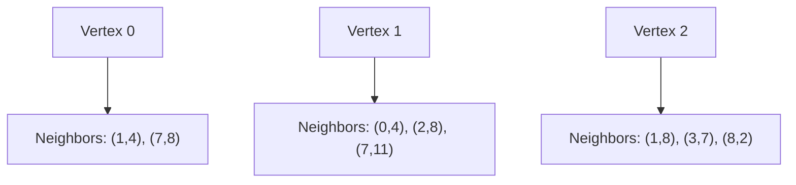

# 📊 Graph Representation: Adjacency Lists

Before diving into Prim's algorithm, it's essential to understand how we represent graphs in code. For Prim's algorithm, we'll use an **adjacency list** representation.

## 🔄 What is an Adjacency List?

An adjacency list represents a graph as a collection of lists or arrays. Each vertex in the graph has its own list that stores all of its adjacent vertices and the weights of the connecting edges.



> [!NOTE]
> In our implementation, each neighbor is represented as a tuple: (vertex, weight).

## 🧩 How We Represent Graphs in Code

In our Python implementation, we use a dictionary where:
- **Keys** are vertex identifiers (usually integers)
- **Values** are lists of tuples `(neighbor, weight)`

Here's what this looks like:

```python
graph = {
    0: [(1, 4), (7, 8)],           # Vertex 0 is connected to vertex 1 with weight 4 and vertex 7 with weight 8
    1: [(0, 4), (2, 8), (7, 11)],  # Vertex 1 is connected to vertices 0, 2, and 7
    2: [(1, 8), (3, 7), (8, 2)],   # And so on...
    # ... more vertices and their connections
}
```

## 🖼️ Visual Example

Let's visualize a simple graph:


The adjacency list representation would be:

```
Vertex 0: [(1,2), (2,3)]
Vertex 1: [(0,2), (2,1), (3,4)]
Vertex 2: [(0,3), (1,1), (3,2)]
Vertex 3: [(1,4), (2,2)]
```

> [!TIP]
> When working with undirected graphs, remember that each edge appears twice in the adjacency list – once for each endpoint.

## 💪 Advantages of Adjacency Lists

Adjacency lists offer several advantages, especially for Prim's algorithm:

1. **Memory Efficiency**: Only stores the edges that exist, making it ideal for sparse graphs
2. **Fast Edge Traversal**: Quickly iterate through a vertex's neighbors
3. **Easy to Modify**: Simple to add or remove edges

<details>
<summary>When would you choose a different representation?</summary>

If your graph is dense (having close to the maximum possible number of edges), an adjacency matrix might be more efficient.

An adjacency matrix is a 2D array where matrix[i][j] contains the weight of the edge from vertex i to vertex j.
</details>

## 🎯 Key Points for Prim's Algorithm

The adjacency list representation is particularly well-suited for Prim's algorithm because:

1. We need to frequently **access the neighbors** of a given vertex
2. We need to **iterate through all edges** connected to a specific vertex
3. We need to **retrieve edge weights** quickly

---

**Think about:** How would the adjacency list representation change if we were dealing with a directed graph? What would be different? 