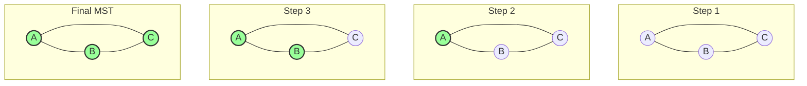

# 💡 The Core Intuition Behind Prim's Algorithm

Now that we understand the problem and how we represent graphs, let's develop an intuition for Prim's algorithm before diving into its implementation.

## 🌱 Growing a Tree: The Garden Analogy

Imagine you're planting a garden where you want to connect all flower beds with the minimum length of walkways. How would you approach it?

> [!TIP]
> Prim's algorithm works like a gardener who starts at one flower bed and always extends the walkway to the nearest unconnected flower bed.

## 🔍 The Key Insight

The fundamental insight of Prim's algorithm is:

> **At each step, add the lightest edge that connects the current tree to a new vertex.**

This greedy approach might seem too simple to work, but it's mathematically proven to find the minimum spanning tree!

## 🚶 Prim's Algorithm: Step by Step

Let's walk through Prim's algorithm visually with a simple example:

1. **Start with any vertex** (let's pick vertex A)
2. **Mark it as visited** (part of our growing MST)
3. **Consider all edges** connecting our visited vertices to unvisited ones
4. **Select the minimum weight edge** from this set
5. **Add the new vertex** to our visited set
6. **Repeat** steps 3-5 until all vertices are visited



## 🧠 Why It Works

Prim's algorithm works because of a key property of minimum spanning trees:

> [!NOTE]
> For any partition of vertices into two sets, the minimum weight edge crossing the partition must be in the MST.

This is called the **Cut Property** and is the mathematical foundation for why Prim's greedy approach works correctly.

<details>
<summary>A deeper explanation of the Cut Property</summary>

Imagine drawing a line that divides the graph into two parts (a cut):
- One part contains all vertices we've already included in our MST
- The other part contains all vertices we haven't included yet

The Cut Property states that the minimum weight edge crossing this cut **must** be part of the MST. If it wasn't, we could improve the MST by replacing some edge with this minimum weight edge.

This is precisely what Prim's algorithm does at each step - it finds the minimum weight edge crossing the cut between visited and unvisited vertices.
</details>

## 🛠️ Essential Data Structures

Prim's algorithm relies on three key data structures:

1. **Priority Queue** (Min Heap): To efficiently find the next minimum weight edge
2. **Visited Set**: To keep track of vertices already in the MST
3. **MST Edges List**: To store the edges included in the MST

> [!WARNING]
> A common mistake is using a regular queue instead of a priority queue. This would not work correctly as we need to always get the minimum weight edge!

## 🧩 The Algorithm in a Nutshell

```
1. Initialize an empty MST
2. Start with an arbitrary vertex
3. While there are unvisited vertices:
   - Find the minimum weight edge connecting a visited vertex to an unvisited one
   - Add this edge to the MST
   - Mark the new vertex as visited
4. Return the MST
```

---

**Think about:** How does Prim's algorithm handle disconnected graphs? What might happen if the graph isn't fully connected? 