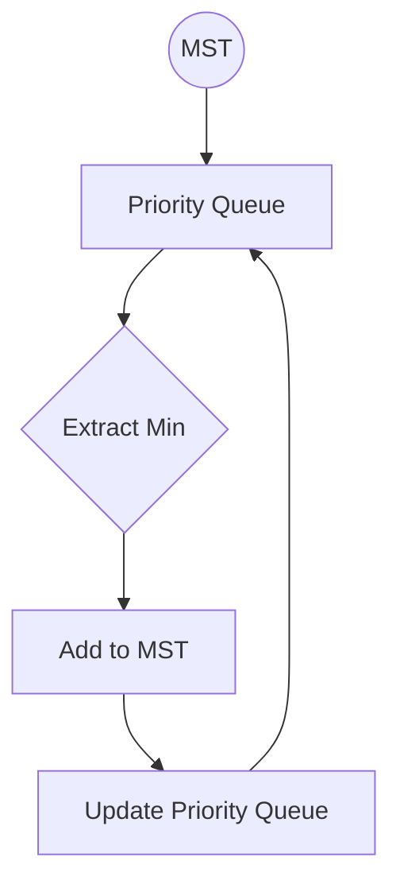

# 🔑 The Priority Queue: Powering Prim's Algorithm

One of the most crucial data structures for an efficient implementation of Prim's algorithm is the **priority queue** (often implemented as a min-heap). Let's understand why it's so important and how we use it.

## 🤔 What is a Priority Queue?

A priority queue is a data structure that:
- Maintains elements in order based on their priority
- Always gives access to the highest (or lowest) priority element
- Efficiently supports operations like insertion and extraction

> [!NOTE]
> In Prim's algorithm, we use a min-priority queue where the **edge with the smallest weight** has the highest priority.

## 💻 Priority Queue in Python

In Python, we can implement a priority queue using the `heapq` module:

```python
import heapq

# Create an empty priority queue
priority_queue = []

# Add items (weight, from_vertex, to_vertex)
heapq.heappush(priority_queue, (4, 0, 1))  # Edge from vertex 0 to 1 with weight 4
heapq.heappush(priority_queue, (2, 0, 2))  # Edge from vertex 0 to 2 with weight 2

# Get the minimum weight edge
min_weight, from_vertex, to_vertex = heapq.heappop(priority_queue)
print(f"Minimum weight edge: {from_vertex} -> {to_vertex} with weight {min_weight}")
# Output: Minimum weight edge: 0 -> 2 with weight 2
```

## 🧩 How It Fits Into Prim's Algorithm

The priority queue in Prim's algorithm acts like a "frontier" that keeps track of all possible next edges we could add to our growing MST:



1. We start with a single vertex in our MST
2. We add all edges from this vertex to the priority queue
3. We extract the minimum weight edge that leads to an unvisited vertex
4. We add the new vertex to our MST
5. We add all edges from this new vertex to the priority queue
6. Repeat steps 3-5 until we've visited all vertices

## ⚡ Why It's Efficient

The priority queue gives us significant performance benefits:

1. **Quick Access to Minimum Edge**: Finding the next edge to add takes O(log n) time instead of O(n)
2. **Organized Frontier**: We don't need to scan all edges in the graph at each step
3. **Dynamic Updates**: We can easily add new edges as we explore the graph

> [!TIP]
> The heap-based priority queue is what allows Prim's algorithm to achieve its O((V + E) log V) time complexity rather than a slower O(V²) implementation.

## 🚫 Common Pitfalls

<details>
<summary>Potential mistakes when using priority queues in Prim's algorithm</summary>

1. **Not checking if a vertex is already visited**: You might extract an edge leading to a vertex already in the MST
2. **Forgetting to add all edges from newly added vertices**: This can lead to an incomplete MST
3. **Using incorrect priority ordering**: Make sure your priority queue is a min-heap if you're looking for minimum weight edges
4. **Not handling duplicate edges**: In some implementations, you might need to handle the case where multiple edges connect the same vertices

</details>

## 🔄 Priority Queue Operations in Prim's Algorithm

Let's see how we use the priority queue throughout Prim's algorithm:

| Operation | Description | When It Happens |
|-----------|-------------|----------------|
| Initialize | Create an empty priority queue | At the start of the algorithm |
| Push | Add edge (weight, from_vertex, to_vertex) | When we explore a new vertex |
| Pop | Extract the minimum weight edge | When selecting the next edge to add to MST |
| Check | Verify destination vertex isn't visited | Before adding an edge to the MST |

## 💡 Visualizing the Priority Queue in Action

Imagine we're processing this graph:


Starting at vertex 0:
1. Add edges (0,1,4) and (0,7,8) to the priority queue
2. Extract min: (0,1,4) - Add vertex 1 to MST
3. Add edges from vertex 1: (1,2,8) and (1,7,11)
4. Priority queue now contains: (0,7,8), (1,2,8), (1,7,11)
5. And so on...

---

**Think about:** How would the algorithm behave differently if we used a max-heap instead of a min-heap? What would happen? 