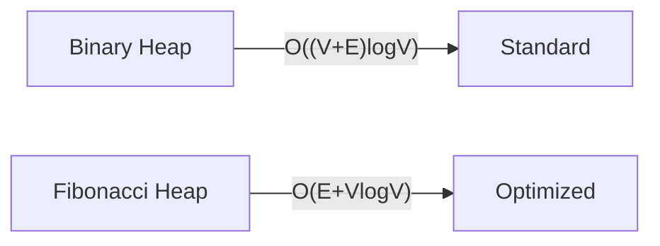

# 🚀 Optimization Techniques for Prim's Algorithm

While our implementation of Prim's algorithm is efficient, there are several ways to optimize it further. Let's explore some optimization techniques that can make Prim's algorithm even faster or more memory-efficient.

## 🔍 Current Implementation Analysis

Our current implementation has:
- **Time Complexity**: O((V + E) log V)
- **Space Complexity**: O(V + E)

Let's see how we can improve this.

## 🔄 Optimization 1: Improved Priority Queue

The standard implementation uses a priority queue to store edges. However, we can optimize by storing vertices instead of edges.

> [!TIP]
> By storing vertices with their minimum connection cost to the MST, we can reduce the size of the priority queue from O(E) to O(V).

```python
def prims_algorithm_optimized(graph: Graph) -> Tuple[int, List[Tuple[int, int]]]:
    vertices = list(graph.keys())
    if not vertices:
        return 0, []
    
    n = len(vertices)
    mst_edges = []
    mst_weight = 0
    visited = set()
    
    # Use a key value for each vertex representing its minimum connection cost to MST
    # Initialize all keys as infinity except the starting vertex
    key = {v: float('inf') for v in vertices}
    parent = {v: None for v in vertices}  # To track the MST edges
    
    start_vertex = vertices[0]
    key[start_vertex] = 0
    
    # Priority queue contains (key value, vertex)
    pq = [(0, start_vertex)]
    
    while pq:
        # Extract minimum key vertex
        min_key, u = heapq.heappop(pq)
        
        if u in visited:
            continue
        
        visited.add(u)
        
        # Add edge to MST (except for the starting vertex)
        if parent[u] is not None:
            mst_edges.append((parent[u], u))
            mst_weight += min_key
        
        # Update key values of adjacent vertices
        for neighbor, weight in graph.get(u, []):
            if neighbor not in visited and weight < key[neighbor]:
                key[neighbor] = weight
                parent[neighbor] = u
                heapq.heappush(pq, (weight, neighbor))
    
    return mst_weight, mst_edges
```

This optimization reduces:
- The number of items in the priority queue (from O(E) to O(V))
- The number of decrease-key operations

## 💡 Optimization 2: Fibonacci Heap

For large graphs, using a Fibonacci heap instead of a binary heap for the priority queue can improve the theoretical time complexity:

- **Binary Heap**: O((V + E) log V)
- **Fibonacci Heap**: O(E + V log V)



> [!NOTE]
> In practice, the overhead of Fibonacci heaps often outweighs their theoretical advantage unless the graph is extremely large.

## ⚙️ Optimization 3: Lazy Deletion

Instead of removing outdated entries from the priority queue, we can use a "lazy deletion" approach:

```python
def prims_algorithm_lazy(graph: Graph) -> Tuple[int, List[Tuple[int, int]]]:
    # Similar to our original implementation, but instead of checking if
    # a vertex is already in the MST before adding it to the priority queue,
    # we check when we pop from the queue
    
    vertices = list(graph.keys())
    if not vertices:
        return 0, []
    
    mst_edges = []
    mst_weight = 0
    visited = set()
    pq = []  # Priority queue: (weight, from_node, to_node)
    
    # Start from the first vertex
    start_vertex = vertices[0]
    visited.add(start_vertex)
    
    # Add all edges from the start vertex to the priority queue
    for neighbor, weight in graph[start_vertex]:
        heapq.heappush(pq, (weight, start_vertex, neighbor))
    
    while pq:
        weight, from_node, to_node = heapq.heappop(pq)
        
        # Lazy deletion - skip if destination already in MST
        if to_node in visited:
            continue
        
        visited.add(to_node)
        mst_weight += weight
        mst_edges.append((from_node, to_node))
        
        # Add all edges from the new vertex (even to visited nodes)
        for neighbor, weight in graph.get(to_node, []):
            heapq.heappush(pq, (weight, to_node, neighbor))
    
    return mst_weight, mst_edges
```

This approach:
- Simplifies the code
- May add more items to the priority queue (potentially worsening space complexity)
- But potentially improves overall performance by avoiding checks during insertion

## 🔬 Optimization 4: Memory Efficiency for Dense Graphs

For dense graphs where E is close to V², an adjacency matrix representation may be more appropriate:

```python
def prims_algorithm_matrix(graph_matrix: List[List[int]]) -> Tuple[int, List[Tuple[int, int]]]:
    n = len(graph_matrix)
    if n == 0:
        return 0, []
    
    mst_edges = []
    mst_weight = 0
    
    # Use a simple array for faster lookups in dense graphs
    key = [float('inf')] * n
    parent = [-1] * n
    in_mst = [False] * n
    
    # Start from vertex 0
    key[0] = 0
    
    for _ in range(n):
        # Find minimum key vertex not yet included in MST
        min_key = float('inf')
        min_vertex = -1
        
        for v in range(n):
            if not in_mst[v] and key[v] < min_key:
                min_key = key[v]
                min_vertex = v
        
        if min_vertex == -1:  # Disconnected graph
            break
        
        # Add to MST
        in_mst[min_vertex] = True
        
        if parent[min_vertex] != -1:
            mst_edges.append((parent[min_vertex], min_vertex))
            mst_weight += min_key
        
        # Update key values
        for v in range(n):
            if (graph_matrix[min_vertex][v] > 0 and 
                not in_mst[v] and 
                graph_matrix[min_vertex][v] < key[v]):
                key[v] = graph_matrix[min_vertex][v]
                parent[v] = min_vertex
    
    return mst_weight, mst_edges
```

This matrix-based approach:
- Eliminates the need for a priority queue
- Works better for dense graphs
- Has O(V²) time complexity (which is better than O((V + E) log V) when E is close to V²)

## 🔌 Optimization 5: Parallel Implementation for Large Graphs

For extremely large graphs, consider parallel implementations:

<details>
<summary>Parallel Prim's Algorithm Approach</summary>

1. **Partition the graph** into subgraphs
2. **Run modified Prim's algorithm** on each subgraph in parallel
3. **Merge the resulting MSTs** carefully to ensure no cycles are created

This approach can significantly reduce runtime on multi-core systems for very large graphs.
</details>

## 📊 Optimization Summary

| Optimization | Best For | Time Complexity | Space Complexity |
|--------------|----------|----------------|------------------|
| Standard Prim's | General use | O((V + E) log V) | O(V + E) |
| Vertex-based PQ | Any graph | O((V + E) log V) | O(V) |
| Fibonacci Heap | Very large graphs | O(E + V log V) | O(V + E) |
| Lazy Deletion | Sparse graphs | O((V + E) log V) | O(E) potentially higher |
| Matrix-based | Dense graphs | O(V²) | O(V²) |
| Parallel | Extremely large graphs | Depends on implementation | Depends on implementation |

## 🧠 Choosing the Right Optimization

The best optimization depends on:

1. **Graph Density**: Is your graph sparse or dense?
2. **Graph Size**: How many vertices and edges?
3. **Available Memory**: Can you afford increased space complexity?
4. **Implementation Complexity**: Are you willing to implement more complex data structures?

> [!TIP]
> For most practical applications, the standard implementation with a binary heap is sufficient. Only optimize further if profiling indicates a bottleneck.

---

**Think about:** What other algorithms could benefit from similar optimization techniques? How might the choice of data structures affect other graph algorithms? 