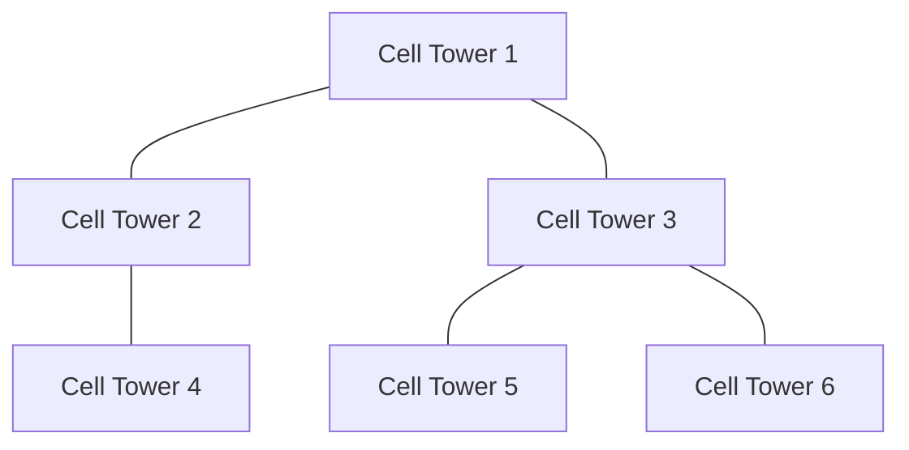

# 🌍 Real-World Applications of Prim's Algorithm

Prim's algorithm isn't just an interesting theoretical concept—it has numerous practical applications across various fields. Let's explore how this elegant algorithm helps solve real-world problems.

## 🏗️ Network Design and Infrastructure Planning

### Telecommunications Networks

Telecom companies use Prim's algorithm to design cost-effective networks that connect all required points while minimizing the total cable length.



> [!NOTE]
> In telecommunications, the weights might represent costs that depend on distance, terrain difficulty, or right-of-way expenses.

### Electrical Grid Design

Power companies utilize MST algorithms to design electrical distribution networks that minimize the amount of power lines needed while ensuring all locations receive service.

<details>
<summary>Case Study: Rural Electrification</summary>

A power company needed to connect 50 rural villages to the electrical grid. By modeling the problem as a graph where:
- Vertices represented villages and existing substations
- Edges represented potential power line routes
- Weights represented construction costs

Using Prim's algorithm, they reduced the total power line length by 18% compared to their initial plan, saving millions in construction costs.
</details>

## 🚌 Transportation Planning

### Road Network Optimization

City planners use MST algorithms to determine the minimal set of roads needed to connect all parts of a city or region.

### Public Transit Routes

Transit authorities apply these algorithms to design efficient bus or subway routes that connect all stations with minimal track length.

> [!TIP]
> In transportation planning, the weights often incorporate multiple factors beyond just distance, such as construction costs, expected traffic volume, and environmental impact.

## 💻 Computer Science Applications

### Network Routing Protocols

Some network routing protocols use MST concepts to avoid loops while ensuring all nodes remain connected.

### Clustering Algorithms

Prim's algorithm serves as a building block for various clustering methods in machine learning:

```python
def mst_based_clustering(points, k):
    """
    Cluster points using MST-based approach.
    
    Args:
        points: List of data points
        k: Number of clusters to create
    
    Returns:
        List of cluster assignments
    """
    # 1. Build a complete graph where vertices are points
    graph = build_complete_graph(points)
    
    # 2. Find the MST using Prim's algorithm
    _, mst_edges = prims_algorithm(graph)
    
    # 3. Sort edges by weight (descending)
    mst_edges.sort(key=lambda edge: graph[edge[0]][edge[1]], reverse=True)
    
    # 4. Remove the k-1 heaviest edges to create k clusters
    for i in range(k-1):
        if i < len(mst_edges):
            remove_edge(mst_edges[i])
    
    # 5. Assign cluster labels
    return assign_cluster_labels(points, mst_edges)
```

## 🎮 Computer Graphics and Game Development

### Character Navigation

Game developers use MST algorithms to create efficient navigation meshes for characters to move through complex environments.

### Procedural Generation

In procedural content generation, Prim's algorithm helps create maze-like structures:

```python
def generate_maze(width, height):
    """Generate a maze using a modified Prim's algorithm."""
    # Initialize grid with walls
    maze = [['#' for _ in range(2*width+1)] for _ in range(2*height+1)]
    
    # Start with a random cell
    start_x, start_y = random.randint(0, width-1), random.randint(0, height-1)
    cells_in_maze = {(start_x, start_y)}
    walls = []
    
    # Add walls of the starting cell
    add_walls(start_x, start_y, walls)
    
    # Prim's algorithm for maze generation
    while walls:
        # Select a random wall
        wall_index = random.randint(0, len(walls)-1)
        wall_x, wall_y = walls[wall_index]
        
        # Check the cells on both sides of the wall
        if is_valid_wall(wall_x, wall_y, cells_in_maze):
            # Add the new cell to the maze
            new_x, new_y = get_cell_beyond_wall(wall_x, wall_y)
            cells_in_maze.add((new_x, new_y))
            
            # Carve a passage through the wall
            maze[wall_y][wall_x] = ' '
            
            # Add walls of the new cell
            add_walls(new_x, new_y, walls)
        
        # Remove the processed wall
        walls.pop(wall_index)
    
    return maze
```

## 🧬 Scientific and Research Applications

### Phylogenetic Tree Construction

Biologists use MST algorithms to construct phylogenetic trees that represent evolutionary relationships between species.

### Protein Interaction Networks

In bioinformatics, Prim's algorithm helps analyze protein interaction networks to identify core functional modules.

## 📱 Mobile App Development

### Location-Based Services

Apps that need to efficiently connect multiple user locations (like ride-sharing or delivery services) often use MST algorithms to optimize routes.

## 🖼️ Image Processing

### Image Segmentation

In computer vision, MST-based algorithms help divide images into distinct regions:

```python
def mst_image_segmentation(image):
    """Segment an image using MST-based approach."""
    height, width = image.shape[:2]
    
    # Build a graph where each pixel is a vertex
    graph = {}
    
    for y in range(height):
        for x in range(width):
            vertex = y * width + x
            graph[vertex] = []
            
            # Connect to neighboring pixels
            for nx, ny in get_neighbors(x, y, width, height):
                neighbor = ny * width + nx
                weight = calculate_pixel_difference(image[y,x], image[ny,nx])
                graph[vertex].append((neighbor, weight))
    
    # Run Prim's algorithm
    _, mst_edges = prims_algorithm(graph)
    
    # Process MST to form segments
    segments = form_segments(mst_edges, width, height, threshold=30)
    
    return segments
```

## 💡 Optimize Your Thinking with MST Concepts

The principles behind Prim's algorithm can also help us optimize how we approach problems in general:

1. **Start Small**: Begin with a minimal solution and expand gradually
2. **Be Greedy (Wisely)**: Sometimes the locally optimal choice leads to a globally optimal solution
3. **Avoid Cycles**: Don't revisit solved problems unnecessarily
4. **Stay Connected**: Ensure all components of your solution work together

> [!TIP]
> The next time you face a problem involving connecting points with minimal resources, consider whether it might be modeled as a Minimum Spanning Tree problem!

## 🤝 Prim's vs. Kruskal's in Practice

While both Prim's and Kruskal's algorithms solve the MST problem, they have different strengths:

| Aspect | Prim's Algorithm | Kruskal's Algorithm |
|--------|-----------------|-------------------|
| Best for | Dense graphs | Sparse graphs |
| Approach | Grows a single tree | Merges forest of trees |
| Implementation | Priority queue based | Union-find based |
| Parallelization | Harder to parallelize | Easier to parallelize |
| Real-world use | Network design, where building from a central point | Distributed systems, where connections can form anywhere |

---

**Think about:** Can you identify a problem in your field of interest that could be modeled as a Minimum Spanning Tree problem? How would you apply Prim's algorithm to solve it? 