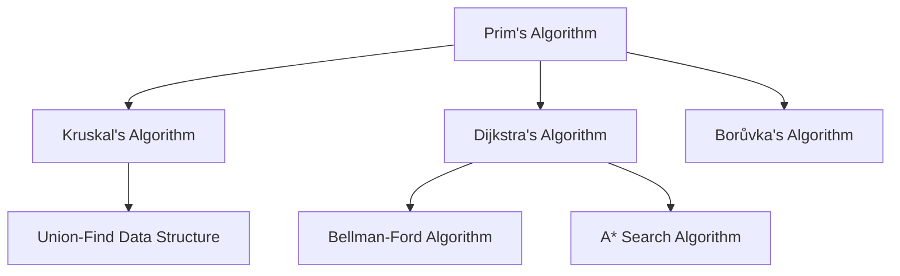

# 🎯 Conclusion: Mastering Prim's Algorithm

Congratulations! You've completed our comprehensive guide to Prim's algorithm. Let's take a moment to review what we've learned and explore where you can go from here.

## 📋 Summary of What We've Covered

Throughout this series, we've explored:

1. **The Minimum Spanning Tree Problem**: Understanding what MSTs are and why they're important
2. **Graph Representation**: Using adjacency lists to represent weighted, undirected graphs
3. **The Core Intuition**: Grasping the fundamental greedy approach of Prim's algorithm
4. **Priority Queues**: Using this crucial data structure to efficiently select minimum-weight edges
5. **Implementation Details**: Building a step-by-step implementation of Prim's algorithm
6. **Working with Examples**: Seeing the algorithm in action on various graph types
7. **Optimization Techniques**: Learning how to make Prim's algorithm even more efficient
8. **Real-World Applications**: Discovering where Prim's algorithm is used in practice
9. **Common Pitfalls**: Understanding mistakes to avoid and best practices to follow

## 🔑 Key Takeaways

As you continue your algorithmic journey, remember these essential insights:

1. **Greedy Can Be Good**: Prim's algorithm demonstrates that sometimes, making the locally optimal choice at each step leads to a globally optimal solution.

2. **Data Structures Matter**: The choice of data structures (like priority queues) can dramatically impact an algorithm's efficiency.

3. **Algorithm Design Patterns**: The techniques used in Prim's algorithm (like the Cut Property) appear in many other graph algorithms.

4. **Implementation Variations**: There are multiple ways to implement even a well-defined algorithm, each with different trade-offs.

5. **Real-World Relevance**: Graph algorithms like Prim's have significant practical applications across various fields.

> [!NOTE]
> The principles you've learned here extend far beyond just this single algorithm. The insights about greedy algorithms, graph processing, and efficient data structure usage will serve you well across many programming challenges.

## 🌟 Beyond Prim's Algorithm: Where to Go Next

Your journey doesn't end here! Here are some natural next steps to continue building your graph algorithm expertise:

### 🧩 Related Algorithms to Study

1. **Kruskal's Algorithm**: Another approach to finding MSTs, using a different strategy
2. **Dijkstra's Algorithm**: For finding shortest paths in weighted graphs (very similar to Prim's!)
3. **Borůvka's Algorithm**: An alternative MST algorithm that can be parallelized effectively
4. **Floyd-Warshall Algorithm**: For finding all pairs of shortest paths
5. **Network Flow Algorithms**: Like Ford-Fulkerson or Edmonds-Karp

### 🛠️ Advanced Topics to Explore

Deeper Graph Theory Concepts

1. **Cut Properties**: Explore how graph cuts relate to various optimization problems
2. **Matroid Theory**: The mathematical foundation behind why greedy algorithms like Prim's work
3. **Approximation Algorithms**: When problems become NP-hard, algorithms like MST can provide approximations
4. **Dynamic Graphs**: How to update MSTs efficiently when the graph changes
5. **Euclidean MSTs**: Special properties when vertices are points in Euclidean space

Practical Applications to Try

1. **Network Design Tool**: Build a small application that uses Prim's algorithm to design optimal networks
2. **Clustering Implementation**: Implement MST-based clustering for a machine learning dataset
3. **Game Map Generator**: Create procedurally generated maps using modified MST algorithms
4. **Visual MST Explorer**: Build an interactive visualization to help others understand MSTs
5. **Image Segmentation**: Apply MST techniques to segment images in computer vision

## 💭 Reflection Questions

To solidify your understanding, consider these reflection questions:

1. How would you explain Prim's algorithm to someone who has never studied graph theory?
2. What similarities and differences do you see between Prim's algorithm and Dijkstra's algorithm?
3. In what situation might Kruskal's algorithm be preferable to Prim's?
4. How could you adapt Prim's algorithm for a directed graph?
5. What would happen if a graph had multiple edges with the same weight? How might this affect the MST?

## 🏆 Challenge Problems

Ready to test your skills? Try these challenge problems:

1. **MST Uniqueness**: Modify Prim's algorithm to detect whether a graph has a unique MST or multiple possible MSTs.
2. **K-MST Problem**: Implement an algorithm to find the minimum spanning tree that includes exactly K vertices.
3. **Maximum Bottleneck Spanning Tree**: Find a spanning tree where the maximum edge weight is minimized.
4. **MST with Constraints**: Find an MST where certain edges must be included or excluded.
5. **Dynamic MST**: Efficiently update an MST when a single edge weight changes.

> [!TIP]
> When solving these challenges, start by thinking about how the core principles of Prim's algorithm might be adapted or extended to address the new problem constraints.

## 📚 Recommended Resources

To deepen your understanding, check out these resources:

### Books
- "Introduction to Algorithms" by Cormen, Leiserson, Rivest, and Stein
- "Algorithm Design" by Kleinberg and Tardos
- "Algorithms" by Robert Sedgewick and Kevin Wayne

### Online Courses
- [Algorithms Specialization (Stanford)](https://www.coursera.org/specializations/algorithms)
- [Graph Theory and Algorithms (MIT OpenCourseWare)](https://ocw.mit.edu/courses/electrical-engineering-and-computer-science/6-042j-mathematics-for-computer-science-fall-2010/readings/MIT6_042JF10_chap05.pdf)
- [Advanced Algorithms (Harvard)](https://www.youtube.com/playlist?list=PL2SOU6wwxB0uP4rJgf5ayhHWgw7akUWSf)

### Interactive Tools
- [VisuAlgo - MST Visualization](https://visualgo.net/en/mst)
- [Algorithm Visualizer](https://algorithm-visualizer.org/)
- [Graph Editor](https://csacademy.com/app/graph_editor/)

## 🎉 Final Thoughts

Mastering Prim's algorithm is a significant achievement! You now understand not just how to implement this algorithm but also why it works, when to use it, and how to optimize it for different scenarios.

Remember that algorithmic thinking is a skill that improves with practice. Continue to solve problems, implement algorithms, and deepen your understanding of the underlying principles.

As you encounter graphs in your programming journey—whether designing networks, analyzing data, developing games, or solving optimization problems—you'll now have a powerful tool in your algorithmic toolkit.

Happy coding!

---

**Think about:** What aspect of graph algorithms are you most interested in exploring next? How might you apply what you've learned about Prim's algorithm to solve real-world problems in your field of interest? 