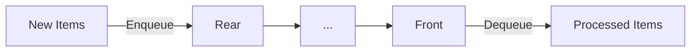

# 🧩 What is a Queue?

A queue is a fundamental data structure that follows the **First-In-First-Out (FIFO)** principle. This means that the first element added to the queue will be the first one to be removed—just like people waiting in line for service.

## 🌎 Queues in Everyday Life

Before we dive into code, let's recognize queues in the world around us:

- People waiting in line at a ticket counter
- Cars at a toll booth
- Customers on hold for customer service

> [!info]
> The word "queue" comes from British English and literally means "a line of people waiting for something."

## 🎯 Why Queues Matter in Computing

Queues solve important problems across computing:

- **Process scheduling**: Operating systems use queues to determine which programs get CPU time
- **Resource allocation**: Managing access to shared resources like printers
- **Data buffering**: Handling data that arrives faster than it can be processed
- **Message passing**: Communication between different parts of a system

## 🧠 Building Your Mental Model

Visualize a queue as a pipe where items enter from one end (the rear) and exit from the other (the front):

The crucial property is that the first item to enter will be the first one to exit.

## 🤔 Think About It

<quiz-question>
{
  "question": "Which real-world scenario best represents a queue data structure?",
  "options": ["A stack of books where you take from the top", "A line of people waiting for a bus", "A random selection from a bag of items", "A sorted list of names"],
  "hint": "Think about the order in which items are processed.",
  "explanation": "A line of people waiting for a bus follows the First-In-First-Out principle, where the first person to arrive is the first to board the bus.",
  "answer": "A line of people waiting for a bus"
}
</quiz-question>

> [!question]- Can you think of three examples of queues in your daily life?
>
> > [!example] Some possibilities include:
> >
> > - Waiting in line at a coffee shop
> > - Email inbox (oldest emails typically addressed first)
> > - Tasks in a to-do list (when completed in order)
> > - Videos in a streaming queue

In the next lesson, we'll explore the fundamental operations that make queues work.
