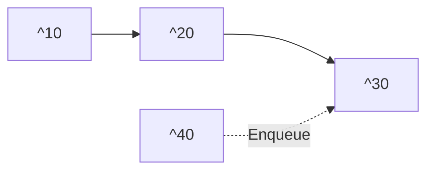
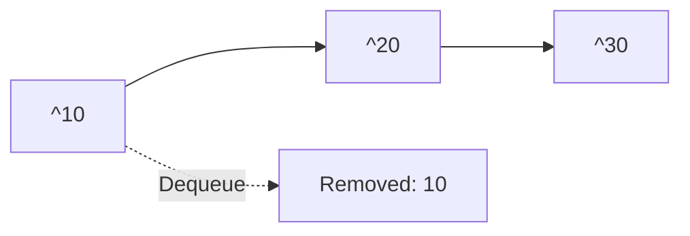
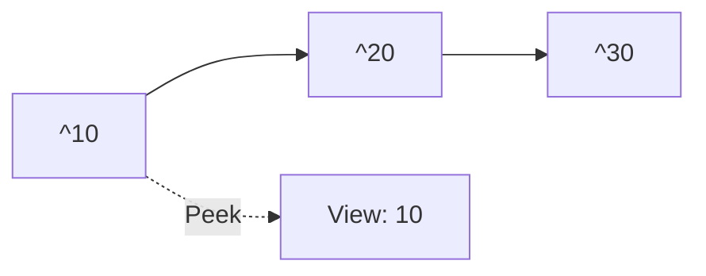

# 🔄 Core Queue Operations

Every queue implementation supports these fundamental operations:

### Enqueue 🔼

Adds an element to the rear (back) of the queue.



### Dequeue 🔽

Removes and returns the element from the front of the queue.



### Peek 👀

Returns the element at the front without removing it.



## 📏 Helper Operations

These additional operations help manage the queue:

```js
// Check if queue is empty
isEmpty() {
  return this.count === 0;
}

// Check if queue is full (for bounded queues)
isFull() {
  return this.count === this.capacity;
}

// Get the number of elements
size() {
  return this.count;
}
```

## 🚦 Queue States

A queue can exist in several states:

1. **Empty**: No elements (front and rear pointers may be at special values)
2. **Partially Filled**: Contains some elements
3. **Full**: No more elements can be added (in bounded queues)

> [!warning]
> Two common errors in queue operations:
>
> - **Queue Overflow**: Trying to enqueue when the queue is full
> - **Queue Underflow**: Trying to dequeue or peek when the queue is empty

### 🧪 Interactive Example

Let's trace through operations on a queue:

Initial state: `[]` (empty queue)

1. `enqueue(10)` → ``
2. `enqueue(20)` → ``
3. `enqueue(30)` → ``
4. `dequeue()` → Returns `10`, queue becomes ``
5. `peek()` → Returns `20`, queue remains ``
6. `enqueue(40)` → ``
7. `dequeue()` → Returns `20`, queue becomes ``

<quiz-question>
{
"question": "What would be the state of a queue after the operations: enqueue(5), enqueue(10), dequeue(), enqueue(15)?",
"options": ["[5]", "[5, 15]", "[10, 15]", "[5, 10, 15]"],
"hint": "Remember that dequeue removes from the front of the queue.",
"explanation": "Starting with an empty queue, we add 5, then 10. Then dequeue() removes 5, leaving [10]. Finally, we add 15, resulting in [10, 15].",
"answer": "[10, 15]"
}
</quiz-question>

> [!question]- What happens if you try to dequeue from an empty queue?
>
> > [!example] In a well-designed implementation, you would:
> >
> > - Return a special value (like `undefined` or `null`)
> > - Throw an exception
> > - Return an error code
> >
> > The specific behavior depends on the implementation, but it should be handled gracefully.

In the next lesson, we'll implement a queue using arrays.
