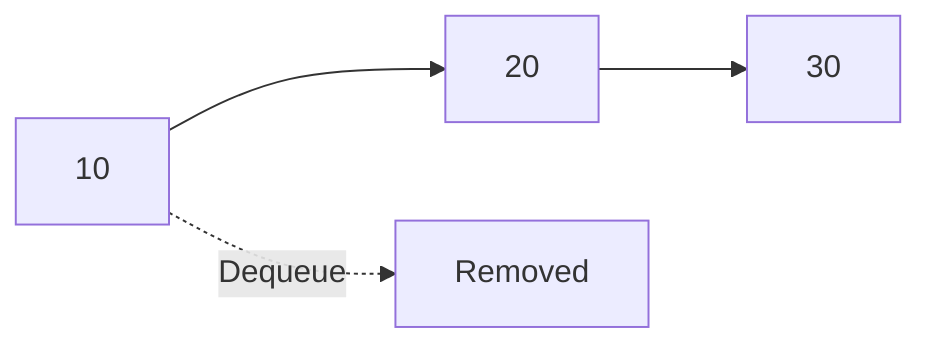
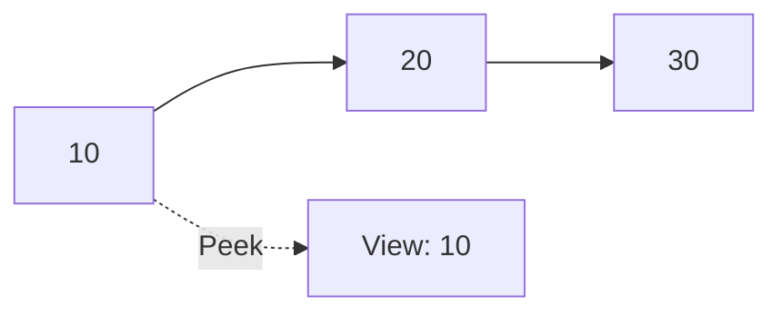

# 🔄 Basic Queue Operations

A queue supports several core operations that enable it to function as a First-In-First-Out (FIFO) data structure. Let's understand each operation and its purpose.

## 📋 Core Queue Operations

### 1. **Enqueue** 🔼

The enqueue operation adds an element to the rear (back) of the queue.


> [!TIP]
> Think of enqueue as joining the end of a line at a ticket counter. You always go to the back of the line!

### 2. **Dequeue** 🔽

The dequeue operation removes and returns the element at the front of the queue.



> [!TIP]
> Dequeue is like being served at the ticket counter - once you're done, you leave the front of the line.

### 3. **Peek** 👀

The peek operation returns the element at the front of the queue without removing it.



> [!NOTE]
> Peeking lets you see who's next in line without actually serving them.

### 4. **isEmpty** 🤔

Checks if the queue has no elements.

```js
isEmpty() {
  // Returns true if the queue contains no elements
  return this.count === 0;
}
```

### 5. **isFull** 📏

Checks if the queue has reached its maximum capacity (for bounded queues).

```js
isFull() {
  // Returns true if the queue is at maximum capacity
  return this.count === this.capacity;
}
```

### 6. **size** 📊

Returns the current number of elements in the queue.

```js
size() {
  // Returns the number of elements in the queue
  return this.count;
}
```

## 🚦 Queue State Transitions

As we perform operations on a queue, it transitions between different states:

1. **Empty Queue**: Front and rear pointers might be initialized to special values (like -1).
2. **Single Element**: Front and rear point to the same position.
3. **Multiple Elements**: Front points to the oldest element, rear to the newest.
4. **Full Queue**: No more elements can be added (in bounded queues).

<details>
<summary>🧐 When operations fail</summary>

- **Enqueue fails** when the queue is full (Queue Overflow)
- **Dequeue and Peek fail** when the queue is empty (Queue Underflow)

Good implementations should handle these edge cases gracefully!
</details>

## 🤔 Thinking Exercise

Consider a queue with elements [10, 20, 30]:

1. What would the queue look like after `enqueue(40)`?
2. What would be returned by `dequeue()`?
3. After the dequeue, what would `peek()` return?

<details>
<summary>✅ Solutions</summary>

1. After `enqueue(40)`: [10, 20, 30, 40]
2. `dequeue()` would return 10
3. After dequeue, `peek()` would return 20
</details>

In the next section, we'll explore concrete implementations of these operations using different underlying data structures. 