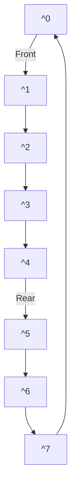

# 🧱 Array-Based Queue Structure

To implement a queue using an array, we need:

1. **An array** to store elements
2. **Front pointer** indicating the position of the first element
3. **Rear pointer** indicating the position of the last element
4. **Count** tracking the number of elements
5. **Capacity** defining the maximum size

```js
class Queue {
  constructor(capacity) {
    this.items = new Array(capacity);
    this.capacity = capacity;
    this.front = 0;
    this.rear = -1;
    this.count = 0;
  }
}
```

## 🔄 The Circular Array Approach

A naive array implementation would waste space as elements are dequeued. Instead, we use a **circular array** where the rear wraps around to the beginning:



This circular design allows us to reuse space at the beginning of the array after elements are dequeued.

## ⚙️ Implementing Core Operations

### Enqueue Operation

```js
enqueue(item) {
  if (this.isFull()) {
    throw new Error('Queue Overflow');
  }
  this.rear = (this.rear + 1) % this.capacity;
  this.items[this.rear] = item;
  this.count++;
}
```

> [!info]
> The modulo operation `% this.capacity` makes the array circular by wrapping around when we reach the end.

### Dequeue Operation

```js
dequeue() {
  if (this.isEmpty()) {
    return undefined;
  }
  const item = this.items[this.front];
  this.items[this.front] = undefined; // Remove reference
  this.front = (this.front + 1) % this.capacity;
  this.count--;
  return item;
}
```

### Peek Operation

```js
peek() {
  if (this.isEmpty()) {
    return undefined;
  }
  return this.items[this.front];
}
```

## 🎯 Visualizing Queue Operations

Let's trace through operations on a queue with capacity 5:

Initial state: `front = 0, rear = -1, count = 0, items = [_, _, _, _, _]`

1. `enqueue(10)`: `front = 0, rear = 0, count = 1, items = [10, _, _, _, _]`
2. `enqueue(20)`: `front = 0, rear = 1, count = 2, items = [10, 20, _, _, _]`
3. `dequeue()`: Returns 10, `front = 1, rear = 1, count = 1, items = [_, 20, _, _, _]`
4. `enqueue(30)`: `front = 1, rear = 2, count = 2, items = [_, 20, 30, _, _]`
5. `enqueue(40)`: `front = 1, rear = 3, count = 3, items = [_, 20, 30, 40, _]`
6. `enqueue(50)`: `front = 1, rear = 4, count = 4, items = [_, 20, 30, 40, 50]`
7. `enqueue(60)`: `front = 1, rear = 0, count = 5, items =`

> [!note]
> Notice how after the array is filled, the rear pointer wraps around to the beginning due to the modulo operation.

## 💡 Advantages and Challenges

**Advantages:**

- Fixed memory allocation (predictable memory usage)
- Fast operations (O(1) time complexity)
- Good cache locality (elements are stored contiguously)

**Challenges:**

- Fixed size (cannot grow dynamically)
- Wasted space if the queue is not full
- Requires careful index management with the circular approach

<quiz-question>
{
  "question": "What is the purpose of using the modulo operator (%) in a circular array queue implementation?",
  "options": ["To check if the queue is empty", "To calculate the average of all elements", "To wrap around to the beginning of the array when reaching the end", "To compare elements for equality"],
  "hint": "Think about what happens when you reach the end of the array.",
  "explanation": "The modulo operator allows the front and rear pointers to wrap around to the beginning of the array when they reach the end, creating a circular behavior that efficiently reuses space.",
  "answer": "To wrap around to the beginning of the array when reaching the end"
}
</quiz-question>

> [!question] How would you modify this implementation to automatically resize the array when it becomes full?
>
> > [!example] A resizable array queue would:
> >
> > 1. Create a new array with larger capacity (typically double)
> > 2. Copy all elements from the old array to the new array, starting from front
> > 3. Reset front to 0 and rear to count-1
> > 4. Update the capacity
> >
> > This approach combines the efficiency of arrays with the flexibility of dynamic sizing.

In the next lesson, we'll explore implementing queues using linked lists.
