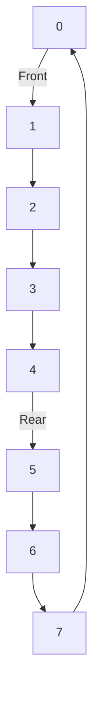

# 📊 Array-Based Queue Implementation

One common way to implement a queue is using an array as the underlying data structure. Let's explore how we can build an efficient queue using arrays.

## 🧱 Basic Structure

For an array-based queue, we need:

1. **An array** to store the elements
2. **Front pointer** indicating the position of the first element
3. **Rear pointer** indicating the position of the last element
4. **Count** to track the number of elements
5. **Capacity** to define the maximum size of the queue

```js
constructor(capacity) {
  this.items = new Array(capacity);
  this.capacity = capacity;
  this.front = 0;
  this.rear = -1;
  this.count = 0;
}
```

## ⚙️ Implementing Core Operations

### 🔼 Enqueue Operation

```js
enqueue(item) {
  if (this.isFull()) {
    throw new Error('Queue Overflow');
  }
  this.rear = (this.rear + 1) % this.capacity;
  this.items[this.rear] = item;
  this.count++;
}
```

> [!NOTE]
> Notice the `% this.capacity` operation. This creates a **circular array** implementation, allowing us to reuse space at the beginning of the array when elements are dequeued.

### 🔽 Dequeue Operation

```js
dequeue() {
  if (this.isEmpty()) {
    return undefined;
  }
  const item = this.items[this.front];
  this.front = (this.front + 1) % this.capacity;
  this.count--;
  return item;
}
```

### 👀 Peek Operation

```js
peek() {
  if (this.isEmpty()) {
    return undefined;
  }
  return this.items[this.front];
}
```

### 📏 Helper Methods

```js
isEmpty() {
  return this.count === 0;
}

isFull() {
  return this.count === this.capacity;
}

size() {
  return this.count;
}
```

## 🔄 The Circular Queue Concept

A key aspect of an efficient array-based queue is implementing it as a **circular queue**:



The circular design allows us to:
1. Reuse space at the beginning of the array after elements are dequeued
2. Avoid unnecessary shifting of elements
3. Utilize the array's full capacity

> [!WARNING]
> Without the circular approach, you'd eventually run out of space even if elements are being dequeued, as the rear pointer would keep moving forward.

## 🎯 Example Walk-Through

Let's trace through operations on an array-based queue with capacity 5:

1. **Initial State**: `front = 0, rear = -1, count = 0, items = [_, _, _, _, _]`
2. **enqueue(10)**: `front = 0, rear = 0, count = 1, items = [10, _, _, _, _]`
3. **enqueue(20)**: `front = 0, rear = 1, count = 2, items = [10, 20, _, _, _]`
4. **dequeue()**: Returns 10, `front = 1, rear = 1, count = 1, items = [_, 20, _, _, _]`
5. **enqueue(30)**: `front = 1, rear = 2, count = 2, items = [_, 20, 30, _, _]`
6. **enqueue(40)**: `front = 1, rear = 3, count = 3, items = [_, 20, 30, 40, _]`
7. **enqueue(50)**: `front = 1, rear = 4, count = 4, items = [_, 20, 30, 40, 50]`
8. **enqueue(60)**: `front = 1, rear = 0, count = 5, items = [60, 20, 30, 40, 50]`

> [!TIP]
> Notice how after the array is filled, the rear pointer wraps around to the beginning due to the modulo operation.

## 💡 Advantages and Disadvantages

**Advantages:**
- Fixed memory allocation
- Fast operations (O(1) time complexity)
- Simple implementation

**Disadvantages:**
- Fixed size (cannot grow dynamically)
- Wasted space if the queue is not full
- Overflow can occur if not handled properly

## 🤔 Thinking Exercise

1. What happens if we try to enqueue an element when the queue is full?
2. How would you modify this implementation to automatically expand the capacity when needed?
3. Can you identify any potential issues with the circular queue approach?

In the next section, we'll explore another common implementation: the linked list-based queue. 