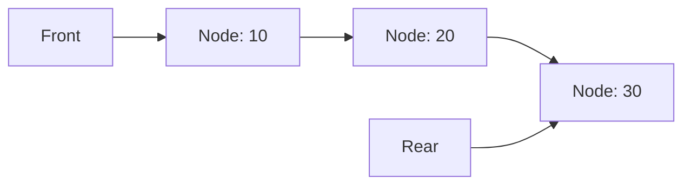

# 🔗 Linked List-Based Queue Structure

A linked list implementation uses nodes that reference each other:

```js
class Node {
  constructor(data) {
    this.data = data;
    this.next = null;
  }
}

class Queue {
  constructor(capacity = Infinity) {
    this.front = null; // Points to first node
    this.rear = null; // Points to last node
    this.count = 0;
    this.capacity = capacity;
  }
}
```

> [!info]
> With linked lists, we can easily create unbounded queues by setting capacity to `Infinity`.

## 🖼️ Visual Representation

A linked list queue with elements looks like:



## ⚙️ Implementing Core Operations

### Enqueue Operation

```js
enqueue(item) {
  if (this.count >= this.capacity) {
    throw new Error('Queue Overflow');
  }

  const newNode = new Node(item);

  if (this.isEmpty()) {
    // If queue is empty, both front and rear point to new node
    this.front = newNode;
    this.rear = newNode;
  } else {
    // Add to the end and update rear
    this.rear.next = newNode;
    this.rear = newNode;
  }

  this.count++;
}
```

### Dequeue Operation

```js
dequeue() {
  if (this.isEmpty()) {
    return undefined;
  }

  const item = this.front.data;
  this.front = this.front.next;
  this.count--;

  // If queue becomes empty, update rear as well
  if (this.isEmpty()) {
    this.rear = null;
  }

  return item;
}
```

### Peek Operation

```js
peek() {
  if (this.isEmpty()) {
    return undefined;
  }
  return this.front.data;
}
```

## 🎯 Tracing Operations

Let's trace through operations on a linked list queue:

1. **Initial state**: `front = null, rear = null, count = 0`
2. **enqueue(10)**:
   - Create new node with data 10
   - `front` and `rear` both point to this node
   - `count = 1`
3. **enqueue(20)**:
   - Create new node with data 20
   - Connect from rear node: `rear.next = newNode`
   - Update `rear` to this new node
   - `count = 2`
4. **dequeue()**:
   - Return the data from `front` (10)
   - Update `front` to `front.next` (the node with 20)
   - `count = 1`

## 🔍 Key Edge Cases

1. **Empty Queue**: Both `front` and `rear` are `null`
2. **Single Element**: `front` and `rear` point to the same node
3. **Removing the Last Element**: Must set `rear = null` when queue becomes empty

## 💡 Advantages and Challenges

**Advantages:**

- Dynamic size (can grow as needed)
- Memory efficient (only allocates what's needed)
- No need for circular logic
- Easy to implement

**Challenges:**

- Extra memory overhead for node pointers
- No direct access to elements in the middle
- Potentially worse cache performance due to non-contiguous memory

<quiz-question>
{
  "question": "What special case must be handled when dequeuing the last element from a linked list queue?",
  "options": ["Incrementing the count", "Setting front to null", "Setting rear to null", "Creating a new node"],
  "hint": "Think about what happens to both pointers when the queue becomes empty.",
  "explanation": "When dequeuing the last element, the queue becomes empty. While front naturally becomes null, we must also explicitly set rear to null to properly represent an empty queue.",
  "answer": "Setting rear to null"
}
</quiz-question>

> [!question]- How would you implement a method to display all elements in the queue without removing them?
>
> > [!example] A display method could:
> >
> > ```js
> > display() {
> >   if (this.isEmpty()) {
> >     console.log("Queue is empty");
> >     return;
> >   }
> >
> >   let current = this.front;
> >   let queueItems = [];
> >
> >   while (current) {
> >     queueItems.push(current.data);
> >     current = current.next;
> >   }
> >
> >   console.log(queueItems.join(" <- "));
> > }
> > ```
> >
> > This traverses the list from front to rear without modifying the queue.

In the next lesson, we'll compare these implementations to understand their tradeoffs.
