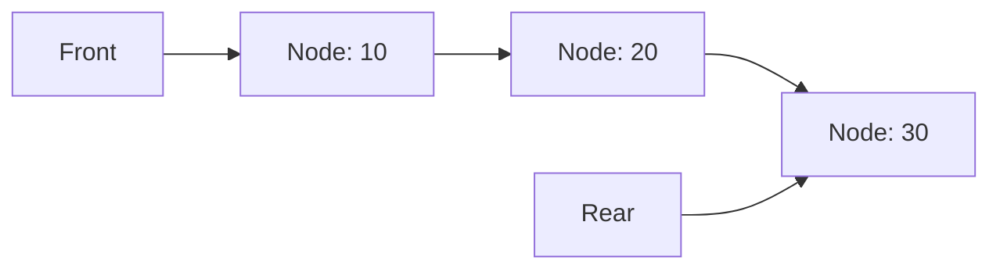

# 🔗 Linked List-Based Queue Implementation

Another common approach to implementing a queue is using a linked list as the underlying data structure. This method offers some advantages over arrays, especially when the queue size needs to be dynamic.

## 🧱 Basic Structure

For a linked list-based queue, we need:

1. **Node class** to represent each element in the queue
2. **Front pointer** pointing to the first node
3. **Rear pointer** pointing to the last node
4. **Count** to track the number of elements
5. **Capacity** (optional) to set a maximum size limit

```js
class Node {
  constructor(data) {
    this.data = data;
    this.next = null;
  }
}

class Queue {
  constructor(capacity = Infinity) {
    this.front = null;
    this.rear = null;
    this.count = 0;
    this.capacity = capacity;
  }
}
```

> [!NOTE]
> With linked lists, we can easily set the capacity to `Infinity` to create an unbounded queue that can grow as needed.

## ⚙️ Implementing Core Operations

### 🔼 Enqueue Operation

```js
enqueue(item) {
  if (this.count >= this.capacity) {
    throw new Error('Queue Overflow');
  }

  const newNode = new Node(item);

  if (this.isEmpty()) {
    this.front = newNode;
    this.rear = newNode;
  } else {
    this.rear.next = newNode;
    this.rear = newNode;
  }

  this.count++;
}
```

### 🔽 Dequeue Operation

```js
dequeue() {
  if (this.isEmpty()) {
    return undefined;
  }

  const item = this.front.data;
  this.front = this.front.next;
  this.count--;

  if (this.isEmpty()) {
    this.rear = null;
  }

  return item;
}
```

### 👀 Peek Operation

```js
peek() {
  if (this.isEmpty()) {
    return undefined;
  }
  return this.front.data;
}
```

### 📏 Helper Methods

```js
isEmpty() {
  return this.count === 0 && this.front === null;
}

isFull() {
  return this.count === this.capacity;
}

size() {
  return this.count;
}
```

## 🎯 Visual Representation

A linked list queue with elements [10, 20, 30] would look like:



## 🧠 Understanding the Implementation

The linked list approach offers several unique characteristics:

1. **Dynamic size**: The queue can grow as needed (if capacity allows)
2. **No wasted space**: Memory is allocated only for elements that are actually in the queue
3. **No need for circular logic**: We simply adjust pointers when adding or removing elements

## 🔍 Key Edge Cases to Handle

1. **Empty Queue**: When `front` and `rear` are both `null`
2. **Single Element**: When `front` and `rear` point to the same node
3. **Removing the Last Element**: Make sure to set `rear = null` when the queue becomes empty
4. **Queue Overflow**: Check the count against capacity before adding new elements

## 🎯 Example Walk-Through

Let's trace through operations on a linked list-based queue:

1. **Initial State**: `front = null, rear = null, count = 0`
2. **enqueue(10)**: 
   - Create new node with data 10
   - Set `front` and `rear` to this node
   - `count = 1`
3. **enqueue(20)**: 
   - Create new node with data 20
   - Set `rear.next` to this node
   - Update `rear` to this node
   - `count = 2`
4. **dequeue()**: 
   - Return the data from `front` (10)
   - Update `front` to `front.next`
   - `count = 1`
5. **peek()**: 
   - Return the data from `front` (20)

## 💡 Advantages and Disadvantages

**Advantages:**
- Dynamic size (can grow and shrink)
- Efficient memory usage (only allocates what's needed)
- No need for circular logic
- Easy to implement

**Disadvantages:**
- Extra memory overhead for node pointers
- No direct access to elements in the middle
- Potential for memory leaks if nodes aren't properly dereferenced

## 🤔 Thinking Exercise

1. How would the linked list implementation handle an enqueue operation when the queue is empty?
2. What could happen if you fail to update the `rear` pointer after a dequeue that empties the queue?
3. How might you implement a method to view all elements in the queue without dequeuing them?

<details>
<summary>💡 Tips for Implementation</summary>

- Always check if the queue is empty before dequeuing or peeking
- Remember to handle the special case of removing the last element
- Keep track of the count to easily check if the queue is empty or full
- Consider using a sentinel node in some implementations to simplify edge case handling

</details>

In the next section, we'll compare these two implementations and discuss when to use each approach. 