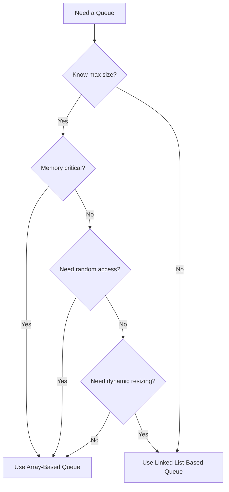
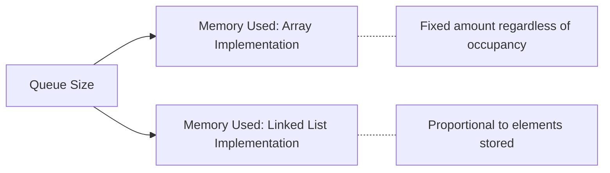

# 🔍 Comparing Queue Implementations

Now that we've explored both array-based and linked list-based queue implementations, let's compare them to understand when to use each approach.

## ⚖️ Side-by-Side Comparison

| Feature | Array-Based Queue | Linked List-Based Queue |
|---------|------------------|------------------------|
| Memory Usage | Fixed allocation (potentially wasteful) | Dynamic allocation (more efficient) |
| Size Flexibility | Fixed size, cannot grow beyond capacity | Can grow dynamically (if unbounded) |
| Implementation Complexity | Requires circular logic | Simpler pointer manipulation |
| Performance: Enqueue/Dequeue | O(1) | O(1) |
| Memory Overhead | Lower per-element overhead | Higher per-element overhead (pointers) |
| Random Access | Supports direct indexing | No direct access to middle elements |
| Cache Efficiency | Better locality of reference | Poorer locality of reference |

## 🏆 When to Choose Array-Based Queues

Use an array-based queue when:

- You know the maximum size in advance
- Memory efficiency is important
- You need predictable memory usage
- Cache performance is critical
- You need to quickly access elements by index (though this violates queue principles)



## 🏆 When to Choose Linked List-Based Queues

Use a linked list-based queue when:

- The maximum size is unknown or highly variable
- You want to avoid overflow issues
- Frequent resizing would be inefficient
- Memory allocation should be proportional to queue size
- You need to easily merge or split queues

## 🔄 Common Variations

### 1. Resizable Array Queue

A hybrid approach where the array automatically resizes when it becomes full:

```js
enqueue(item) {
  if (this.isFull()) {
    // Create a new array with double capacity
    const newItems = new Array(this.capacity * 2);
    
    // Copy elements from old array to new array
    for (let i = 0; i < this.count; i++) {
      newItems[i] = this.items[(this.front + i) % this.capacity];
    }
    
    // Reset pointers
    this.items = newItems;
    this.front = 0;
    this.rear = this.count - 1;
    this.capacity *= 2;
  }
  
  // Regular enqueue logic
  this.rear = (this.rear + 1) % this.capacity;
  this.items[this.rear] = item;
  this.count++;
}
```

> [!TIP]
> This approach combines the efficiency of arrays with the flexibility of linked lists, but resizing operations can be costly.

### 2. Double-Ended Queue (Deque)

A queue that allows insertion and deletion at both ends:

```js
// Adds to front
addFront(item) {
  if (this.isFull()) {
    throw new Error('Queue Overflow');
  }
  this.front = (this.front - 1 + this.capacity) % this.capacity;
  this.items[this.front] = item;
  this.count++;
}

// Removes from rear
removeRear() {
  if (this.isEmpty()) {
    return undefined;
  }
  const item = this.items[this.rear];
  this.rear = (this.rear - 1 + this.capacity) % this.capacity;
  this.count--;
  return item;
}
```

## 🚀 Performance Considerations

### Time Complexity

Both implementations have similar time complexity for basic operations:

- **Enqueue**: O(1) for both
- **Dequeue**: O(1) for both
- **Peek**: O(1) for both
- **isEmpty/isFull**: O(1) for both

### Space Complexity

- **Array-Based**: O(n) where n is the capacity (fixed)
- **Linked List-Based**: O(n) where n is the current size (dynamic)

### Memory Usage Patterns



## 🧪 Real-World Implementation Choices

Here are some examples of how queues are implemented in real-world scenarios:

1. **Operating System Process Queues**: Often array-based for predictable memory usage
2. **Web Server Request Queues**: Often linked list-based for handling variable load
3. **In-Memory Message Brokers**: Hybrid approaches with adaptive sizing
4. **JavaScript Event Loop**: Linked list-based for flexibility

## 🤔 Decision Framework

To decide which implementation to use, ask yourself:

1. Do I know the maximum size of the queue?
2. Is memory optimization critical?
3. Will the queue size vary widely during operation?
4. Do I need direct access to queue elements?
5. Is frequent resizing acceptable?

Your answers to these questions should guide your implementation choice.

In the next section, we'll explore common applications of queues in real-world programming scenarios. 