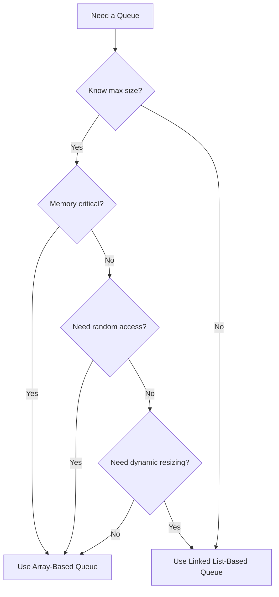

# Comparing Queue Implementations

## ⚖️ Side-by-Side Comparison

| Feature          | Array-Based Queue       | Linked List-Based Queue      |
| :--------------- | :---------------------- | :--------------------------- |
| Memory Usage     | Fixed allocation        | Dynamic allocation           |
| Size Flexibility | Fixed size              | Can grow dynamically         |
| Implementation   | Requires circular logic | Simpler pointer manipulation |
| Performance      | O(1) operations         | O(1) operations              |
| Memory Overhead  | Lower per-element       | Higher (pointers)            |
| Random Access    | Supports indexing       | No direct access             |
| Cache Efficiency | Better locality         | Poorer locality              |
| Resizing         | Expensive operation     | Natural growth               |

## 🔍 Choosing the Right Implementation



## 🏆 When to Choose Array-Based Queues

Use an array-based queue when:

- You know the maximum size in advance
- Memory efficiency is important
- You need predictable memory usage
- Cache performance is critical
- You need random access to elements (though this violates queue principles)

## 🏆 When to Choose Linked List-Based Queues

Use a linked list-based queue when:

- The maximum size is unknown or variable
- You want to avoid overflow issues
- Memory allocation should be proportional to queue size
- You need to easily merge or split queues
- You need to insert or remove elements from the middle (with modifications)

## 🔄 Hybrid Approaches

### Resizable Array Queue

```js
enqueue(item) {
  if (this.isFull()) {
    // Create a new array with double capacity
    const newItems = new Array(this.capacity * 2);

    // Copy elements from old array to new array
    for (let i = 0; i < this.count; i++) {
      newItems[i] = this.items[(this.front + i) % this.capacity];
    }

    // Reset pointers
    this.items = newItems;
    this.front = 0;
    this.rear = this.count - 1;
    this.capacity *= 2;
  }

  // Regular enqueue logic
  this.rear = (this.rear + 1) % this.capacity;
  this.items[this.rear] = item;
  this.count++;
}
```

This approach combines the efficiency of arrays with the flexibility of dynamic sizing.

## 🚀 Performance Considerations

Both implementations have similar time complexity for basic operations:

- **Enqueue**: O(1) for both
- **Dequeue**:
