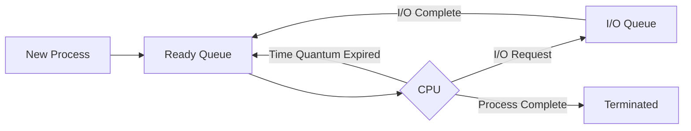
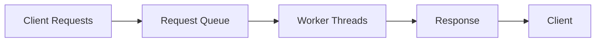
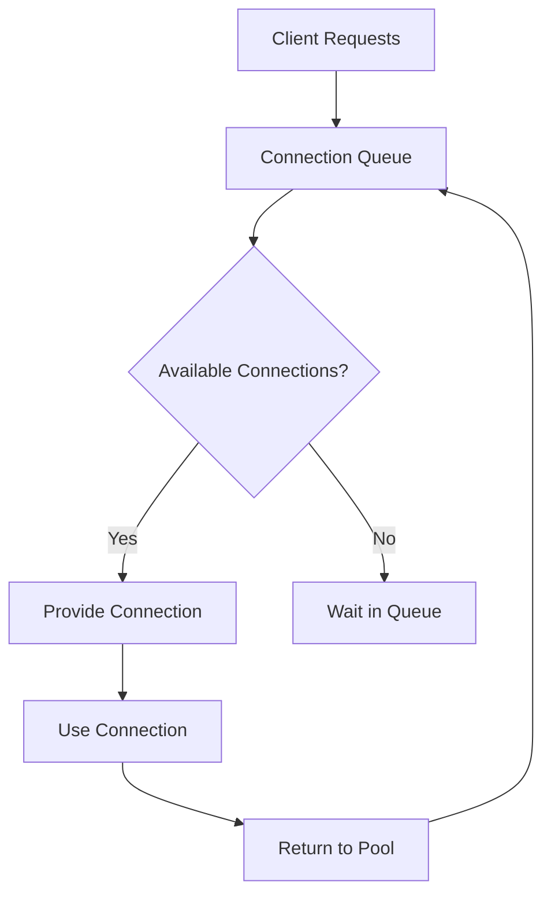

# 🌟 Practical Applications of Queues

Queues are fundamental data structures that find numerous applications in real-world computing. Let's explore how queues are used to solve various practical problems.

## 🖥️ Operating Systems

### Process Scheduling

Operating systems use queues to manage which processes get CPU time:



> [!NOTE]
> Round-robin scheduling algorithms use queues to give each process a fair slice of CPU time.

### Printer Spooling

When multiple documents are sent to a printer, a queue ensures they're printed in order:

```js
class PrintQueue {
  constructor() {
    this.queue = new Queue();
  }
  
  addDocument(doc) {
    this.queue.enqueue(doc);
    console.log(`Document ${doc.name} added to print queue`);
  }
  
  printNext() {
    if (!this.queue.isEmpty()) {
      const doc = this.queue.dequeue();
      console.log(`Printing document: ${doc.name}`);
      return doc;
    }
    console.log("No documents in queue");
    return null;
  }
}
```

## 🌐 Web Development

### Request Processing

Web servers use queues to handle incoming HTTP requests:



### Message Brokers

Systems like RabbitMQ, Kafka, and Amazon SQS implement queue-like structures for asynchronous communication:

```js
// Publishing a message
messageQueue.send({
  topic: "user.registration",
  data: { userId: 123, email: "user@example.com" }
});

// Consuming messages
messageQueue.receive("user.registration", (message) => {
  sendWelcomeEmail(message.data.email);
});
```

## 📱 Mobile Applications

### UI Event Handling

The event loop in mobile applications uses a queue to process user interactions:

```js
// Simplified event loop
class EventLoop {
  constructor() {
    this.eventQueue = new Queue();
  }
  
  addEvent(event) {
    this.eventQueue.enqueue(event);
  }
  
  processEvents() {
    while (!this.eventQueue.isEmpty()) {
      const event = this.eventQueue.dequeue();
      handleEvent(event);
    }
  }
}
```

### Background Tasks

Mobile apps use task queues for operations like uploading photos, syncing data, etc.:

```swift
let uploadQueue = OperationQueue()
uploadQueue.maxConcurrentOperationCount = 2

// Add image uploads to queue
for image in selectedImages {
    let uploadOperation = UploadOperation(image: image)
    uploadQueue.addOperation(uploadOperation)
}
```

## 📊 Data Processing

### Breadth-First Search (BFS)

BFS uses a queue to explore nodes in a graph level by level:

```js
function breadthFirstSearch(graph, startNode) {
  const queue = new Queue();
  const visited = new Set();
  
  queue.enqueue(startNode);
  visited.add(startNode);
  
  while (!queue.isEmpty()) {
    const currentNode = queue.dequeue();
    console.log(currentNode);
    
    // Add unvisited neighbors to queue
    for (const neighbor of graph[currentNode]) {
      if (!visited.has(neighbor)) {
        queue.enqueue(neighbor);
        visited.add(neighbor);
      }
    }
  }
}
```

This approach ensures we visit all nodes at a given distance from the start before moving further.

### Stream Processing

Systems that process data streams often implement queues to buffer incoming data:

```js
class DataStream {
  constructor(batchSize) {
    this.buffer = new Queue();
    this.batchSize = batchSize;
  }
  
  addData(data) {
    this.buffer.enqueue(data);
    if (this.buffer.size() >= this.batchSize) {
      this.processBatch();
    }
  }
  
  processBatch() {
    const batch = [];
    for (let i = 0; i < this.batchSize; i++) {
      if (!this.buffer.isEmpty()) {
        batch.push(this.buffer.dequeue());
      }
    }
    console.log(`Processing batch of ${batch.length} items`);
    // Process the batch...
  }
}
```

## 🌉 Networking

### Connection Pooling

Databases and servers use queues to manage connection pools:



### Rate Limiting

APIs use queue-like structures to implement rate limiting:

```js
class RateLimiter {
  constructor(maxRequests, timeWindow) {
    this.requestTimestamps = new Queue();
    this.maxRequests = maxRequests;
    this.timeWindow = timeWindow; // in milliseconds
  }
  
  allowRequest() {
    const now = Date.now();
    
    // Remove timestamps outside the window
    while (!this.requestTimestamps.isEmpty() && 
           now - this.requestTimestamps.peek() > this.timeWindow) {
      this.requestTimestamps.dequeue();
    }
    
    // Check if we can allow another request
    if (this.requestTimestamps.size() < this.maxRequests) {
      this.requestTimestamps.enqueue(now);
      return true;
    }
    
    return false;
  }
}
```

## 🎮 Game Development

### Animation and Rendering Queues

Game engines use queues to manage rendering tasks:

```js
class RenderQueue {
  constructor() {
    this.queue = new Queue();
  }
  
  addObject(gameObject) {
    this.queue.enqueue({
      object: gameObject,
      priority: gameObject.zIndex
    });
    // Sort by z-index to render in proper order
  }
  
  render() {
    while (!this.queue.isEmpty()) {
      const item = this.queue.dequeue();
      item.object.draw();
    }
  }
}
```

### Path Finding

Algorithms like A* use priority queues (a specialized form of queue) for pathfinding:

```js
function findPath(grid, start, end) {
  const frontier = new PriorityQueue();
  frontier.enqueue(start, 0);
  
  const cameFrom = new Map();
  const costSoFar = new Map();
  
  cameFrom.set(start, null);
  costSoFar.set(start, 0);
  
  while (!frontier.isEmpty()) {
    const current = frontier.dequeue();
    
    if (current === end) break;
    
    for (const next of getNeighbors(grid, current)) {
      const newCost = costSoFar.get(current) + getCost(current, next);
      if (!costSoFar.has(next) || newCost < costSoFar.get(next)) {
        costSoFar.set(next, newCost);
        const priority = newCost + heuristic(next, end);
        frontier.enqueue(next, priority);
        cameFrom.set(next, current);
      }
    }
  }
  
  return reconstructPath(cameFrom, start, end);
}
```

## 🛠️ Building Your Own Queue Applications

When might you need to implement a queue in your own projects? Consider these scenarios:

1. **Job schedulers** for processing tasks in order
2. **Caching systems** with LRU (Least Recently Used) policies
3. **Chat applications** for message delivery
4. **Download managers** for sequencing file operations
5. **Multi-step form processing** in web applications

In the next section, we'll conclude our exploration of queues and summarize the key points we've learned. 