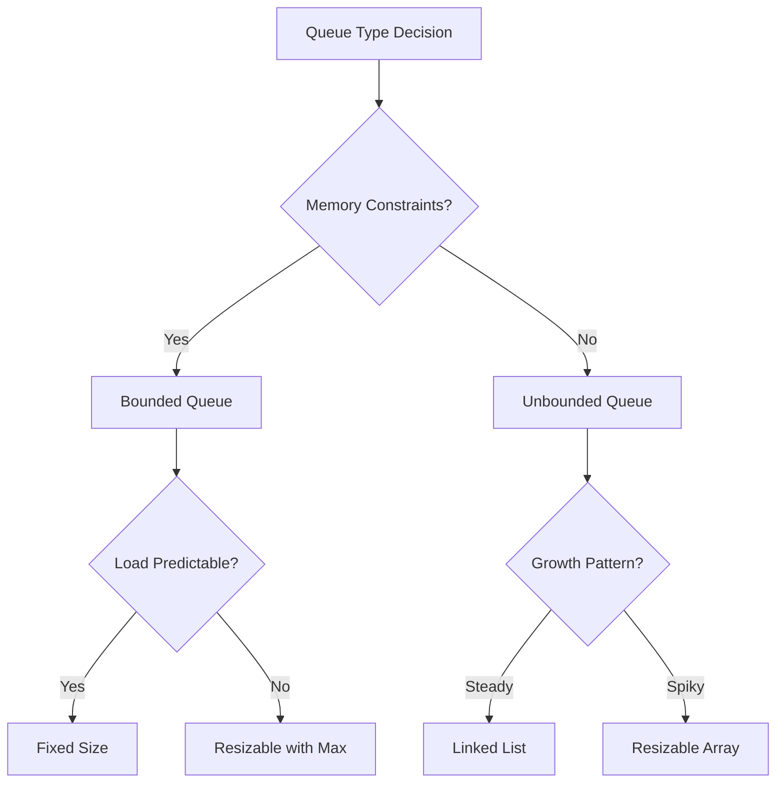

# ⚠️ Common Challenges and Pitfalls

When implementing and using queues, certain challenges and pitfalls often arise. Understanding these challenges can help you create more robust and efficient queue implementations.

## 🐞 Common Implementation Bugs

### 1. Forgetting Edge Cases

Many bugs occur when handling edge cases:

```js
// INCORRECT implementation of dequeue
dequeue() {
  const item = this.items[this.front];  // 🐞 No check if queue is empty!
  this.front = (this.front + 1) % this.capacity;
  this.count--;
  return item;
}

// CORRECT implementation
dequeue() {
  if (this.isEmpty()) {
    return undefined;  // ✅ Handle empty queue
  }
  const item = this.items[this.front];
  this.front = (this.front + 1) % this.capacity;
  this.count--;
  return item;
}
```

> [!WARNING]
> Always test your queue implementation with these scenarios:
> - Empty queue operations (dequeue, peek)
> - Single element queue operations
> - Full queue operations (enqueue)
> - Operations that cause the queue to become empty

### 2. Circular Array Logic Errors

The modulo arithmetic in circular arrays can be tricky:

```js
// INCORRECT increment of rear pointer
this.rear = this.rear + 1;  // 🐞 Will eventually overflow!

// CORRECT increment using modulo
this.rear = (this.rear + 1) % this.capacity;  // ✅ Wraps around
```

### 3. Pointer Management in Linked Lists

With linked list implementations, a common error is not updating both front and rear pointers correctly:

```js
// INCORRECT dequeue implementation
dequeue() {
  if (this.isEmpty()) return undefined;
  
  const item = this.front.data;
  this.front = this.front.next;
  this.count--;
  
  // 🐞 Missing code to update rear when queue becomes empty
  
  return item;
}

// CORRECT implementation
dequeue() {
  if (this.isEmpty()) return undefined;
  
  const item = this.front.data;
  this.front = this.front.next;
  this.count--;
  
  if (this.isEmpty()) {
    this.rear = null;  // ✅ Update rear when queue becomes empty
  }
  
  return item;
}
```

## 🚧 Performance Traps

### 1. Inefficient Resizing

When implementing resizable array queues, naively copying elements can be inefficient:

```js
// INEFFICIENT resizing
resize() {
  const newArray = new Array(this.capacity * 2);
  
  // 🐞 Inefficient: Always copying from index 0, regardless of front
  for (let i = 0; i < this.count; i++) {
    newArray[i] = this.items[i];
  }
  
  this.items = newArray;
  this.capacity *= 2;
}

// EFFICIENT resizing
resize() {
  const newArray = new Array(this.capacity * 2);
  
  // ✅ Copy elements starting from front, wrapping around if needed
  for (let i = 0; i < this.count; i++) {
    newArray[i] = this.items[(this.front + i) % this.capacity];
  }
  
  this.items = newArray;
  this.front = 0;
  this.rear = this.count - 1;
  this.capacity *= 2;
}
```

### 2. Memory Leaks

In JavaScript, failing to remove references can lead to memory leaks:

```js
// POTENTIAL memory leak
dequeue() {
  const item = this.items[this.front];
  this.front = (this.front + 1) % this.capacity;
  this.count--;
  return item;
  // 🐞 Reference to item still exists in the array
}

// BETTER practice
dequeue() {
  const item = this.items[this.front];
  this.items[this.front] = undefined;  // ✅ Remove reference
  this.front = (this.front + 1) % this.capacity;
  this.count--;
  return item;
}
```

### 3. Unnecessary Checks

Too many redundant checks can degrade performance:

```js
// INEFFICIENT with redundant checks
isEmpty() {
  return this.size() === 0;  // 🐞 Calls another method
}

size() {
  let count = 0;
  let current = this.front;
  
  while (current) {
    count++;
    current = current.next;
  }
  
  return count;
}

// EFFICIENT with direct checks
isEmpty() {
  return this.count === 0;  // ✅ Direct property check
}

size() {
  return this.count;  // ✅ Simply return the tracked count
}
```

## 🧩 Architectural Challenges

### 1. Bounded vs. Unbounded Queues

Choosing between bounded and unbounded queues presents tradeoffs:



**Key considerations:**
- Bounded queues prevent memory overflow but may reject elements when full
- Unbounded queues are flexible but may consume excessive memory

### 2. Concurrency Issues

In multi-threaded environments, queues need synchronization:

```js
// UNSAFE for concurrent access
enqueue(item) {
  // 🐞 Race condition: Multiple threads could update rear at the same time
  this.rear = (this.rear + 1) % this.capacity;
  this.items[this.rear] = item;
  this.count++;
}

// In a thread-safe implementation, you'd need locks or atomic operations
// Example (pseudocode):
enqueue(item) {
  lock.acquire();  // ✅ Prevent concurrent access
  try {
    this.rear = (this.rear + 1) % this.capacity;
    this.items[this.rear] = item;
    this.count++;
  } finally {
    lock.release();  // ✅ Release the lock
  }
}
```

### 3. Queue Overflow and Underflow

Handling overflow and underflow gracefully:

```js
// Options for handling overflow:

// 1. Throw an exception
enqueue(item) {
  if (this.isFull()) {
    throw new Error("Queue Overflow");
  }
  // enqueue logic...
}

// 2. Return a status code
enqueue(item) {
  if (this.isFull()) {
    return false;  // Enqueue failed
  }
  // enqueue logic...
  return true;  // Enqueue succeeded
}

// 3. Overwrite oldest element (circular buffer behavior)
enqueue(item) {
  if (this.isFull()) {
    this.dequeue();  // Make room by removing oldest item
  }
  // enqueue logic...
}
```

## 🛠️ Debugging Queue Implementations

When your queue isn't working as expected, try these debugging strategies:

### 1. Visual Tracing

Create a visual representation of queue state after each operation:

```
Initial state: front=0, rear=-1, items=[]
After enqueue(10): front=0, rear=0, items=[10]
After enqueue(20): front=0, rear=1, items=[10, 20]
After dequeue(): front=1, rear=1, items=[_, 20]
```

### 2. Invariant Checking

Add assertions to verify queue invariants:

```js
// Add after every operation to verify consistency
function checkInvariants() {
  if (this.isEmpty()) {
    assert(this.count === 0, "Empty queue should have count 0");
  } else {
    assert(this.count > 0, "Non-empty queue should have count > 0");
  }
  
  assert(this.count <= this.capacity, "Count should never exceed capacity");
  
  if (this.count === this.capacity) {
    assert(this.isFull(), "Queue should be full when count equals capacity");
  }
}
```

### 3. Unit Testing Edge Cases

Create tests for all edge cases:

```js
test("Dequeue from empty queue returns undefined", () => {
  const queue = new Queue(5);
  expect(queue.dequeue()).toBeUndefined();
});

test("Enqueue to full queue throws error", () => {
  const queue = new Queue(2);
  queue.enqueue(1);
  queue.enqueue(2);
  expect(() => queue.enqueue(3)).toThrow("Queue Overflow");
});

test("Dequeue until empty correctly updates state", () => {
  const queue = new Queue(3);
  queue.enqueue(1);
  queue.enqueue(2);
  queue.dequeue();
  queue.dequeue();
  expect(queue.isEmpty()).toBe(true);
  // For linked list implementation, also check that rear is null
});
```

## 🚀 Beyond Basic Queues

As you become comfortable with basic queue implementations, consider exploring these advanced queue variations:

1. **Priority Queue**: Elements with higher priority are dequeued first
2. **Double-Ended Queue (Deque)**: Allow adding and removing from both ends
3. **Blocking Queue**: Wait when the queue is empty or full
4. **Delay Queue**: Elements can only be taken when their delay has expired
5. **Concurrent Queue**: Optimized for multi-threaded access

Each of these variations builds on the fundamental queue concept but adds specific features for different use cases.

In the final section, we'll conclude our exploration of queues and summarize what we've learned. 